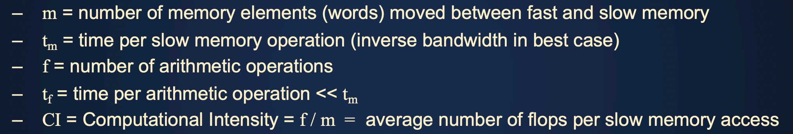
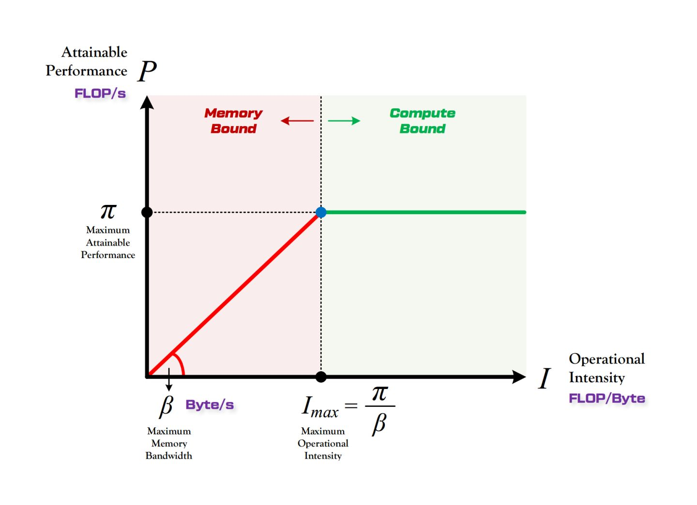

## Basic Knowlege

#### Impediments to speedup

> Reference
> 
> 1. MIT 6.172 lecture15

1. insifficient parallesim
2. scheduling overhead 
3. lack of memory bandwidth
4. true/false sharing

#### Computation Intensity

> Reference
> 
> 1. CMU 15.418 L2
> 2. Berkeley CS267 L2

计算访存比

ratio of math operations to data access operations in a instruction stream. 

因为parallel program的时候，bandwidth是critical resource。大部分cpu op都是bandwidth bound application。

actual time to run program
$$
f * t_f + m * t_m = f * t_f * (1 + t_m / t_f * 1 / CI)
$$
larger CI意味着time closer to $f * t_f$ (也就是纯计算的时间)

machine balance $t_m/t_f$ (一个硬件限制) 定义了machine的boundary

#### Parallel Program Process

> Reference
> 
> 1. CMU 15.418 l4

* Four phases
1. decomposition : divide problem into subproblems
   1. identify dependency
   2. create **at least enouh tasks** to keep all execution unit on machine busy. 
   3. **paralel slack**: 一般创建的task数量是execution capacity的4/8/10倍，为了使更充分的利用硬件资源（thread scheduling)
   4. 但是也不希望创建过多的task，因为过多的task有较多的overhead（steal，queue）
   5. programmer负责
2. Assignment : assign aubproblem to workers ( parallel threads )
   1. goal: Balance workload, reduce communication cost
   2. static assignment, dynamic assignment
   3. programmer/compiler负责
   4. 更多信息见【work assignment部分】
3. Orchestration: coordinate between worker, communication between thread，atomic，synchronization
4. mapping: map worker to hardware

#### Amdahl's law

> Reference
>
> 1. CMU 15.418 l4
> 1. Berkelet CS267 l1

dependency limit max speedup due to parallisim

speed up will be limited by the fraciton that's not able to parallel

S = fraction of sequential execution

max speed up < $1 \over S$

#### fork-join model

> Reference
> 
> 1. CMU 15.418 l6

 

* 实现

使用thread pool的方法实现。create exactly as many worker threads as execution contexts in the machine. 

实际的runtime会在第一次调用cilk_spwan的时候启动对应数量的thread。是一种lazy initialization

会先run child，然后再run parent(cilk的实现方法)，这样能够避免for loop里启动很多的child，让processor0的queue包含全部的task，其余processor都需要从processor0里steal

cilk plus runtime always run spwawned child. 

#### Parallel  & Other

> Berkeley CS 267 L1

##### Concurrent & Parallel

concurrent : 多个任务逻辑上（编程抽象上）平行运算，但是实际上可能只是serial exec (multi thread on single core single thread block)

parallel : 多个任务在物理硬件上同时active

##### Distributed & Parallel

distributed : 一个master，多个client，一起工作。但是client并不一定一起计算

#### Supercomputer Today

现在的大多是petaflop，正在努力搭建exaflop

#### Moore's Law

2x transistors/chip every 1.5 years

clock rate goes up by x -> raw computing power goes up by $x^4$

但是增加transistor是有限的，因为有物理限制，还有heat density限制

唯一可行的方案是增加parallel

#### Roofline Model

> 1. Berkeley CS 267 L3
> 2. 知乎 https://zhuanlan.zhihu.com/p/34204282 
> 3. Roofline An Insightful Visual Performance Model for Floating-Point Programs and Multicore Architectures

Developed by Sam Williams @ Berkeley, lots of citations, become a verb `rooflien that model`

Idea: application is limited by (1) computation (2) memory bandwidth

##### Arithmetic Performance

Y-axis 是 floating point performance

* 多个roof

1. 告知了应该如何优化代码才能获得最大的improvement
2. ILP 和SIMD带来提升
3. add multiply balance带来提升

##### machine balance

X axis 是 operational intensity

machine balance的数值越低，同样的算法适配到硬件上就更容易memory bound

machine balance是computration intensity的threshold

横轴是computational intensiry. 

一般是 5-10 FLops/Bytes

Haswell : 10 Flops/Byte

KNL : 7 Flops/Bytes

* data movement

使用compulsory data movement，也就是size of input output作为datam ovement, 不管reuse的问题

是一个upper bound not to exceed

##### CI

各个操作理论最高CI (assume infinite cache)

##### memory bandwidth

bandwidth使用左边的斜线表达，斜线总是45 degree slope。bandwidth决定了斜线与横线相交的地方。

* 多个roof

1. ensure memory affinity : 一个thread的数据都对应processor上（也就是充分利用NUMA结构）
2. software prefetch
3. restructure code从而better hardware prefetch

##### Roofline

当处于memory bound的时候，CI告诉我们一个bytes的内存访问我们做多少个arithmetic计算。所以当bandwidth增加（斜率增加），单位时间内能够做的总arithmetic计算就增加了。

在蓝色的区域的时候，优化computation

在绿色的区域的时候，优化computation或者memory

在黄色的区域的时候，优化memory

##### common result

下面这几个例子都是memory bound的

#### Theory Peak Performence

performence in GFlops = cpu speed in GHz * number of cpu core * CPU instructions per cycle * number of double float operation per FMA instruction.

Flops : floating point operation, usually double precision. 也就是 number of operations

Flop/s : floating point operations per second.

Bytes : size of data ( double precision float is 8 bytes )

* KNL Cori

1.4 GHz per core

2 512 bits vector unit ( 2 instrction per cycle )

GFlops = 1.4 (GHz) * 2 (instruction per cycle) * 8 (8 double float per instriction) * 2 (fma count as 2 instruction)

#### Common Computational Methods

> Berkeley CS267 L1

