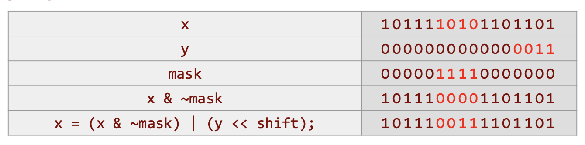

## Common Algorithm


### Sharks and Fish Model

* rules
  * Sharks and fish live in a 2D ocean, moving, breeding, eating and dying.
  * The ocean is square and periodic, so fish swimming out to the left reenter at the right, and so on.
  * The ocean may either be discrete, where sharks and fish are constrained to move from one grid point to a neighboring grid point, or the ocean may be continuous.
  * In all cases, the sharks and fish move according to a "force law" which may be written

```shell
   force on a shark (or fish) =   force_External 
                                     (a current, felt independently by each 
                                      shark or fish, including a random component)
                                + force_Nearest_Neighbors 
                                     (sharks are strongly attracted by nearby fish)
                                + force_"Gravity"  
                                     (sharks are attracted to fish, and 
                                      fish repelled by sharks)
```

These three kinds of forces are parallelized in different ways: The external force can be computed independently for each fish, and will be the easiest force to parallelize. Forces which only depend on the nearest neighbors, or very close neighbors, require relatively little cooperation between processors and are next easiest to parallelize. Forces which depend on all other fish, like gravity, require the cleverest algorithms to compute efficiently (in serial or parallel).


### Discrete Events System (Simulation)

> Ref
>
> 1. Berkeley CS 267 Lecture 5
> 2. UCSB CS 240A


* 特点

1. model of world is discrete: time and space are discrete
2. finite set of variables
3. set of all variable at time t is called state
4. each var update by computing transition function depend on othe rvaraibles


* 分类


asynchronize可以再细分


#### Synchronous

##### Game of Life / S&F 3

fish的情况取决于neighbours


每一个位置只依赖neighbour位置叫做stencil


对domain decomposition切分的方法是square，而不是panel。square能最小process之间的comm

这里的切分相对简单，因为ocean是regular data structure

注意locality是通过分配每一个processor一大片相邻的ocean来处理的。


ghost data


##### Circuit Simulation

本质上也是domain decomposition，然后做切分。只不过涉及到多一层的graph partition的问题


#### Asynchronous Conservative Scheduling


容易出现deadlock的问题，因为只有event才能triggerupdate。

一个方法就是发送are you stuck too的信息然后进行验证deadlock，这样是serialized bottoelneck


### Particle Systems (Simulation)

> Ref
>
> 1. Berkeley CS 267 Lecture 5

* 特点

1. finite number of particle 而不是time/space, time and position are contigious 
2. moving in space follow newton's law f = ma


* 例子


#### Forces


##### External Force

* 特点

1. 最简单parallel的force
2. 每一个particle的force是独立的，不需要考虑其余的particle
3. 可以使用简单的distribute particle on processors就可以做到。基于particle（不是domain）做切分


#### Nearby Force

* 特点

1. force 依赖nearby neighour
2. eg collision
3. 通过domain decomposition进行平行。


#### Far-Field Force

* 特点

1. force依赖全部的particle，是all to all interaction
2. Eg gravity, protein folding


##### Simpleest algorithm

O(n^2)

通过把空间切分grid，然后把p个空间进行loop。这样每一个grid pair都会遇到彼此，从而计算对应force


##### Particle-Mesh methods

O(n) / O(n log n)


##### Tree Decomposition


### Lumped System / ODE (Simulation)

> Ref
>
> 1. Berkeley CS 267 Lecture 5


* 特点

1. location and entities are discrete (lumped), time is contigious 
2. system of lumped variables, depends on contigious parameters
   1. Lumped 是因为我们只计算endpoint/lump的值，不计算lump链接的edge


* ODE

ordinary differential equation

differentiated w.r.t time


* 分类 Given a set of ODEs, two kinds of questions are:
  * Compute the values of the variables at some time t
    * Explicit methods
    * Implicit methods
  * Compute modes of vibration
    * Eigenvalue problems


##### Circuit Example


#### Explicit Methods

* Forward Euler's Method

使用当前t的slope进行估算


#### Implicit Methods

* Backward Euler's Method

使用t+1的slope进行估算


* 分类


#### Eigensolver


### Sparse Matrix Multiplication


#### CSR


#### Parallel Sparse Matrix - Vector

* common case

如何切分。

多个threads都会访问紫色的x，因为indirect addressing


* ideal case

processor之间没有沟通。


##### Reordering

通过reordering sparse matrix内部数据，从而减少processor之间的communication


### Continous System / PDE (Simulation)

> Ref
>
> 1. Berkeley CS 267 Lecture 6


* 特点

1. time and space are contigious


* 分类

three kinds of PDE, two way to parallelize it


#### Explicit Methods

* e.g Heat

一些基础的背景知识


把问题转化成为了stencil computation的样子


只不过这个stencil是weighted average of neighbour points


可以转化为 matrix vector multiply。这里的matrix是sparse matrix


explicit approach for parallel 也有问题。当time stamp大的时候就炸了


#### Implicit Methods

* e.g. heat on 1D

使用t+1的slope来进行估计


实际上计算的时候会使用approximate的算法

问题也编程了sparse matrix vector求解的问题


* e.g. 2D implicit 

也就是二维的5 poiny stencil


#### Irregular Mesh

现实中的mesh经常是irregular的。


需要把对应的mesh convert成matrix。然后进行matrix reorder来加速sparese matrix vector的计算


### Stencil

> 参考
> 
> 1. MIT 6.172 Lecture15

stencil computation: update each point in an array by a fixed pattern. 


#### Basic

```cpp
double u[2][N]; // even-odd trick

static inline double kernel(double * w)
{
    return w[0] + ALPHA * (w[-1] – 2*w[0] + w[1]);
}

for (size_t t = 1; t < T-1; ++t) { // time loop
  for(size_t x = 1; x < N-1; ++x)  // space loop
        u[(t+1)%2][x] = kernel( &u[t%2][x] );
```


* cache miss analysis

$Q = \Theta(NT/B)$ if N > M

each row need N/B number of cache miss, total T iterations.

* 为什么loop的效果还可以

prefetching对于loop code的效果比较好。

但是当multi-core的时候，prefetch的效果就不好了，因为多个core都prefetch会导致bandwidth成为瓶颈。


#### Cache oblivious 3-point stencil

recursively travel trapezoidal region. 每一个trapezoid region至于内部的point相关。


* base case

如果height=1， 计算all space-time points in trapezoid


* space cut

如果width >= 2 * height

right part depend on left part. left part not depend on right part


* time cut

如果width < 2 * height

Top part depend on bottom part. 首先便利下面，再便利上面


* cache miss analysis

recursive的调用

每一个leave有$\Theta(hw)$ points

每一个lead产生$\Theta(w/B)$ misses。因为当一行可以放在cache里的时候，往上面计算整个trapezoid都在cache里

$\Theta(NT/hw)$ leaves
$$
\mathrm{Q}=\Theta(\mathrm{NT} / \mathrm{hw}) \cdot \Theta(\mathrm{w} / \mathcal{B})=\Theta\left(\mathrm{NT} / \mathcal{M}^{2}\right) \cdot \Theta(\mathcal{M} / \mathcal{B})=\Theta(\mathrm{NT} / \mathcal{M} \mathcal{B}) \\
Q = \Theta(NT/M^{1/d}B) ~~\text{for d dims}
$$


#### Parallel 3-point stencil

* parallel space cut

黑色的部分可以parallel运算，然后再运算灰色的部分


### Sort

> 参考
> 
> 1. MIT 6.172 Lecture15


#### Merge sort

```cpp
void merge(int* C, int* A, int na, int* B, int nb)
{
  while( na > 0 && nb > 0 )
    if (*A <= *B )
      *C++ = *A++; na--;
    else
      *C++ = *B++; nb--;
  while( na > 0 )
    *C++ = *A++; na--;
  while( nb > 0 )
    *C++ = *B++; nb--;
}

void merge_sort(int* B, int* A, int n)
{
  if (n == 1 )
    B[0] = A[0];
  else
  {
    int C[n];
    cilk_spawn merge_sort( C, A, n/2 );
                       merge_sort( C+n/2, A+n/2, n-n/2);
    cilk_sync;
    merge( B, C, n/2, C+n/2, n-n/2 );
  }
}
```

* work analysis 

$$
\begin{aligned}
W(n) &=2 W(n / 2)+\Theta(n) \\
&=\Theta(n \lg n)
\end{aligned}
$$


* cache miss analysis

$$
Q(n)=\left\{\begin{array}{ll}
\Theta(n / \mathcal{B}) & \text { if } n \leq c \mathcal{M}, \text { constant } c \leq 1 \\
2 Q(n / 2)+\Theta(n / \mathcal{B}) & \text { otherwise. }
\end{array}\right. \\


=\Theta((n / \mathcal{B}) \lg (n / \mathcal{M}))
$$

当leave的时候，$\Theta(n/B)$, 每一次merge会产生$\Theta(n/B)$


#### Multiway merging tournament

> TODO 这个部分还没有总结

* cache miss analysis


### Bit Hack

> 参考
> 
> 1. MIT 6.172 L3
> 2. Stanford Bit Twidding Hack http://graphics.stanford.edu/~seander/bithacks.html

```shell
~x = all bits inverse of x
-x = ~x + 1
   = inverse bit以后更改最后一个0为1
```

* common operation


* set kth bit in a word to 1

```cpp
y = x | (1 << k);
```


* clear kth bit in a word

```cpp
y = x & ~(1 << k);
```


* flip the kth bit

```cpp
y = x ^ (1 << k )
```


* extract a bit field (一串bit)

```cpp
(x & mask) >> shift;
```


* Set a bit field

```cpp
x = (x & ~mask) | ( ( y << shift) & mask );
```



* swap 

原因：xor is its own inverse

但是实际上因为这三行有dependency的关系，速度会比使用tmp variable的swap速度要慢，因为tmp variable swap还会使用到ILP(instruction level parallisim)

```cpp
x = x^y; // mask of which position x,y different
y = x^y; // flip bits of y different of x
x = x^y; // flip bits of x different of y
```

* non-branching min

branching因为有prefetch比较大的overhead，所以不是好事情

在实际代码中使用non-branching min来避免while中的if判断并不一定是好事情，因为compiler能够做更好的优化。很多时候会发成branchless 效果比 branch 的效果差的事情。

```cpp
r = ( x < y ) ? x : y;
r = y ^ ( (x ^ y) & -(x < y));
```

* mode

compute $(x+y)~ mod ~n$，假设x,y都在(0,n)中间

```cpp
r = (x+y) % n;

// 优化版
z = x + y;
r = ( z < n ) ? z : z - n;

// 优化
z = x + y;
r = x - ( n & -(z >= n) );
```

* mask of least significant bit

```cpp
r = x & (-x);
```


* counting number of 1 bits in a word in x

传统方法. O(number of bit) complexity

```cpp
for ( r = 0; x != 0; ++r )
  x &= x - 1;
```

divide and conquer 方法. O(length of word) complexity 


compiler方法：

```cpp
int __buildtin_popcount(unsigned int x);
```


