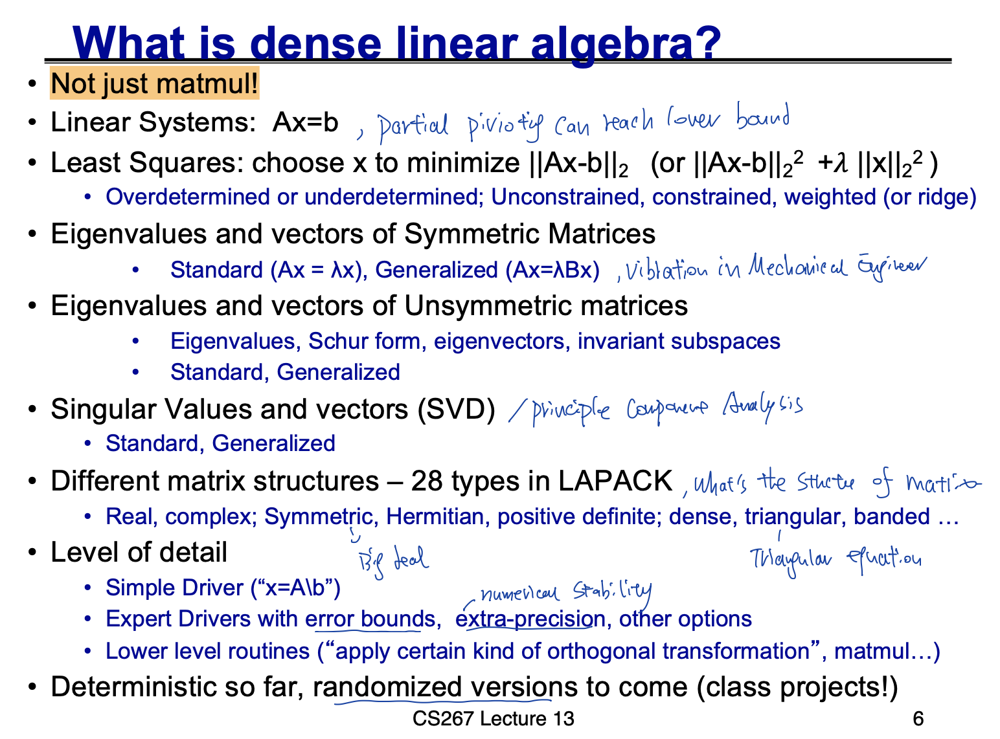
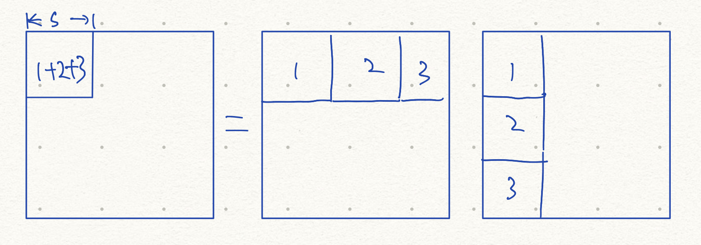
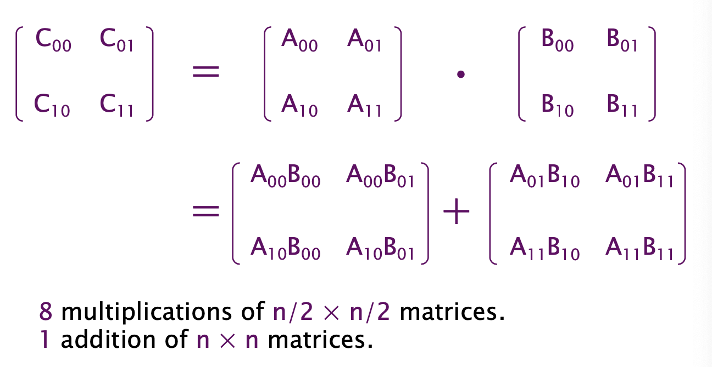

# Dense Linear Algebra and Communication Lower Bound

> .md 文件中更加关注算法的分析角度
>
> 详细算法分析参考对应算法批注文件


## Communication Lower Bound on Nested Loop

> Reference
>
> Berkeley CS 267 Lectuer 6 b

* 是什么

communication = moving data (between main memory and cache, between processor and network)

在nested loop情况下的算法，communication lower bound是什么，在什么情况下才能达到communication lower bound


* 为什么关注

memory movement is the most expensive in terms of enegery and speed in computation.

Data movement 的时间很久

data movement占用chip上的大小很大

data movement consume最多的能量


### N-body

#### 是什么

```cpp
// Force角度
for i = 1 : n
  for j = 1 : n
    F(i) = F(i) + force(A(i), A(j))

// Potential角度
for i = 1 : n
  for j = 1 : n
    e = e + potential( A(i), B(j) )
```

可以简化为two nested loop

```cpp
for i = 1 : n
  for j = 1 : n
    access A(i) and B(j)
```


* 利用cache进行数据reuse

如果有M大小的cache。则可以读取 M/2 的A， M/2的B，计算(M/2)^2 = M^2/4 次iteration


optimal的情况下，读取多个tile，每一个tile都是square


#### communication lower bound

每一次使用cache，可以处理 M^2/4 次iteration。这里的最优解是A B读取的数据一样多，这样映射得到的是square

为了处理 n^2 个iteration，需要读取 n^2 / (M^2/4)  = 4(n/M)^2 次数据从slow memory 到 fast memory

也就需要读取 4(n/M)^2 * M = 4n^2/M 的数据

lower bound = $\Omega (n^2/M) = \Omega( \text{\# loop iterations inside for loop } / M )$


### GEMM

* 对比n-body

在n-body里面，找到了给定cache大小，如何放输入（sqaure的放），能够让cache内数据运行的iteration数量最多。在GEMM里面同样找到如何充分利用cache的方法，从而每一次cache里运行的iteration数量最大，从而达到communication lower bound


#### 从3D的角度理解GEMM

如果要计算一个C(i, j) 则需要对应的全部的 A B block


* 利用cache进行数据reuse

把对应的A B C的一个square都放到cache里

一次cache能够同时处理的iteration/3D空间中的cube大小，upper bound by A B C block的面积的square。右边的图片显示了upper bound，左边的图片是equal


#### communication lower bound

* serial case

假设cache大小为M，对应的A B C block最大为 $M/3$

对应的cube大小最大为 $((M/3)^3)^{1/2} = M^{3/2}/27$

因为是3 nested loop，总的iteration 数量是 $n^3$，也就是需要reload cache $n^3/ (M^{3/2}/27)) $次。

总共需要读取的数据是 $M * n^3/ (M^{3/2}/27)) = n^3 * 27 / M^{1/2}$

lower bound是 $\Omega( n^3  / M^{1/2}) $，这个值与关于matmul comm lower bound Theorem (Hong & Kung 1981) 一致

最优算法对应是cube


* parallel case

需要注意的是，这里假设 M = 3n^2 / p 代表one copy of each matrix

attainable through SUMMA, Cannon's Algorithm


这里对应的number of word moved 代表从slow memory移动到fast memory的数量。也就是从other processor memory移动到当前processor memory数据的数量。

recall, SUMMA里面在每个iteration，每个processor都会给同group的processor发送数据，这个发送数据的总量就是number of word moved. 


### General

#### communication lower bound

不管多少个loop，不管多少个index，只要能找到如下的映射关系就可以。

需要A的读取，B的读取，C的读取是连续的（可能需要reorder loop）


* 是否是实际可行的lower bound

可行，但是取决于loop reorder，loop dependency等性质


### Conv

* 是什么

CNN 可以转化为7 nested loop


* communication lower bound


## Dense Linear Algebra

> Reference
>
> 1. UC Berkeley CS267 Lecture 13
> 2. UC Berkeley CS 267 Lecture 14


### 包含什么




BLAS 1: do O(n) operation on O(n) data

BLAS 2: do O(n^2) operation on O(n^2) data

BLAS 3: do O(n^3) operations on O(n^2) data


LAPACK: linear algebra package, use BLAS3, possible parallel in shared memory =

ScaLAPACK : scalable LAPACK, for distributed memory through MPI


### Communication Lower Bound

#### 2D Matrix Multiplication

这里number of word moved 代表从slow memory移动到fast memory的数据的数量。也就是从ram移动到cache的数据的数量

这里number of message send 代表发送了多少个消息。在这个情况下也就是reload了多少次cache（从slow memory给fast memory发送消息）。

number of word moved = number of message send * number of word per message.


目的：minimize number of words moved & minimize number of message send


带入到GEMM的例子里


#### 2.5D matrix multiplication


#### Strassen's Matrix multiplication

也是可以套用上面的公式，只不过constant改变了


## GEMM GPU

### GEMM GPU UIUC

> 参考
> 
> 1. UIUC ECE 408 Lecture4, lecture5, lecture6


#### Simple C Code

注意下面使用到的变量名，后面会都是用类似的变量名

```cpp
void GEMM(float* M, float* N, float* P, int width)
{
  for ( int i = 0; i < width; ++i )
  {
    for ( int j = 0; j < width; ++j )
    {
      float sum = 0f;
      for ( int k = 0; k < width; ++k )
      {
        float a = M[i * width + k];
        float b = N[k * width + j];
        sum += a * b;
      }
      P[i * width + j] = sum;
    }
  }
}
```


#### Simple CUDA Code

```cpp
__global__ 
void MatrixKernel( float* d_M, float* d_N, float* d_P, int width )
{
  int row = blockIdx.y * blockDim.y + threadIdx.y;
  int col = blockIdx.x * blockDim.x + threadIdx.x;

  if ( ( row < width ) && ( col < width ) )
  {
    float pval = 0;
    for ( int k = 0; k < width; ++k )
    {
      pval += d_M[ row * width + k ] * d_N[ k * width + col ]; // access global memory
    }
    d_P[row * width + col ] = pval; // access global memory
  }
}
```


* bandwidth 分析知道直接访问global memory的话是不够的

Load 1 N 1 M element : 4 bytes each, total 8 bytes

进行一次计算 2 FLOP 

4 bytes memory access / FLOP 


假设GPU计算与内存

1000 GFLOP/s computation power

150 GB/s memory bandwidth

实际computation usage 150 GB/s / (4B/FLOP) = 37.5 GFLOP/s

并没有充分的利用computation

在实际的运算中，memory并不是总busy，所以实际上代码只能运行在25GFLOPs左右


上面的分析其实比较简单，更加通用的分析应该从computation intensity出发，从而知道对于每一个bytes access to global memory, 需要how many flops


#### Tile with shared memory

假设 M N P 是 square matrix

single threads for each P_ij, parallize computation of elements of P

block size in 2D of TILE_WIDTH * TILE_WIDTH

grid size in 2D of ceil( width / TILE_WIDTH ) * ceil( width / TILE_WIDTH )


解决方法：把数据放到shared memory中（速度更快）从而做到数据复用。每一个thread block负责计算seprate ties。


假设square tile + square matrix的情况。每一个thread会负责load 1 M elem，load 1 N elem，write 1 P elem

当使用了shared memory的时候，第一个想法就是注意需要有synchronize

**对于每一个M N中的input数据，通过tile的方法，被复用TILE_WIDTH次。**

```cpp
__global__ void SquareMatrixKernel1( float* d_M, float* d_N, float* d_P, int width )
{
  __shared__ float subTileM[TILE_WIDTH][TILE_WIDTH];
  __shared__ float subTilen[TILE_WIDTH][TILE_WIDTH];

  int bx = blockIdx.x;
  int by = blockIdx.y;
  int tx = threadIdx.x;
  int ty = threadIdx.y;

  // row col 对应着最后的 P 里面的index，也就对应着 M N 里面的Row Col
  int Row = by * TILE_WIDTH + ty;
  int Col = bx * TILE_WIDTH + tx;
  float Pvalue = 0;

    // 一个thread block负责多个tile block
  for ( int q = 0; q < width / TILD_WIDTH; ++q )
  {
    // load data to shared memory
    subTileM[ty][tx] = M[Row * width + q * TILE_WIDTH + tx];
    subTileN[ty][tx] = N[(q * TILE_WIDTH+ty)*Width+Col];

    // barrier, wait for all threads load finish
    __syncthreads();

    // This part require data loaded by other threads
    for ( int k = 0; k < TILE_WIDTH; ++k )
      Pvalue += subTileM[ty][k] * subTileN[k][tx];

    // barrier, wait for all threads load finish
    __syncthreads();
  }

  // write result
  P[Row*Width+Col] = Pvalue;
}
```


* bandwidth 分析

16 * 16 tiles : 对于每一个从global memory读取的数据，复用16次。

可以做到150 GB/s / 4B/FLOP * 6 = 600 GFLOP/s

32 * 32 tiles ： 对于每一个从global memory读取的数据，复用32次。

可以做到150 / 4 * 32 = 1200 GFLOPS > 1000 GFLOPS

内存带宽不再是限制。


##### handle boundary

如果data并不是TILE_WIDTH的整数倍，需要解决boundary的问题


* 两种boundary的问题
1. thread 计算有效的p value，但是load global memory的时候会访问out of data. 这个时候应该假设load上来的数据都为0


2. thread 没有计算有效的p value，而且load global memory的时候会访问out of data.这个时候应该假设load上来的数据都为0，并且不写入无效的output p中


* 解决方法

1. test during tile load

如果target within input matrix, load

如果target outside input matrix, put 0

尽管多了一个branching，但是保证了计算部分的代码不会变得复杂。而且这个branching只会影响到一个warp内的thread，对于大多数thread都是在一个warp内不会导致两个branch都运行


2. test during tile store

如果value p outiside valid range, 则不写入。


* 有关branch divergence

只针对于block on boundary, 因为在非boundary中，尽管代码中有if else，但是依旧全部的thread走一个path

```cpp
__global__ void SquareMatrixKernel1( float* d_M, float* d_N, float* d_P, int width )
{
  __shared__ float subTileM[TILE_WIDTH][TILE_WIDTH];
  __shared__ float subTilen[TILE_WIDTH][TILE_WIDTH];

  int bx = blockIdx.x;
  int by = blockIdx.y;
  int tx = threadIdx.x;
  int ty = threadIdx.y;

    // row 是P M N 对应的index。
  // 所以可以被用于判断写入index，以及load index
  int Row = by * TILE_WIDTH + ty;
  int Col = bx * TILE_WIDTH + tx;
  float Pvalue = 0;

    // 一个thread block负责多个tile block
  for ( int q = 0; q < (width-1) / TILD_WIDTH+1; ++q )
  {
    // load data to shared memory
    if ( Row < )

    subTileM[ty][tx] = M[Row * width + q * TILE_WIDTH + tx];
    subTileN[ty][tx] = N[(q * TILE_WIDTH+ty)*Width+Col];

    // barrier, wait for all threads load finish
    __syncthreads();

    for ( int k = 0; k < TILE_WIDTH; ++k )
      Pvalue += subTileM[ty][k] * subTileN[k][tx];

    // barrier, wait for all threads load finish
    __syncthreads();
  }

  // write result
  P[Row*Width+Col] = Pvalue;
}
```


## GEMM CPU

### GEMM CPU gotoBLAS

> 基于论文 Anatomy of High-Performance Matrix Multiplication
> 
> 具体内容参考论文及批注


### GEMM CPU MIT


#### Loop Reordering

目的是为了更好的使用了cache的spatial locality特点


##### 传统的loop

```cpp
for ( int i = 0; i < n; ++i )
  for ( int j = 0; j < n; ++j )
    for ( int k = 0; k < n; ++k ) // 图对应这行
      C[i][j] += A[i][k] * B[k][j];
```


* cache analysis on matrix B


Case1: $n > c M/B$ (number of rows > number of cache line)

$ Q(n) = \Theta(n^3) $, matrix B misses on every access. 

对于每一行A，都需要读取一遍matrixB，产生$\Theta(n^2)$ 的cache miss

Case2 : $$\mathrm{c}^{\prime} \mathcal{M}^{1 / 2}<\mathrm{n}<\mathrm{c} \mathcal{M} / \mathcal{B}$$ (can fit num row cache line of matrix B in cache)

$Q(n) = n * \Theta(n^2/B) = \Theta(n^3/B)$

对于每一行A，都需要读取一遍matrixB，因为number of row line of cache line可以被保存，也就代表只要读取B bytes matrix B，就可以使用B bytes。每一次读取matrix B的cache miss是$\Theta(n^2/B)$

Case3: $n<C^{\prime} \mathcal{M}^{1 / 2}$ (entire matrix B can fit into cache)

$Q(n)=\Theta\left(n^{2} / \mathcal{B}\right)$

只要读取一次matrixB，就可以把整个matrixB放在cache里，等遇到下一行A的时候可以继续复用cache里的内容。


##### 优化的loop

```cpp
for ( int i = 0; i < n; ++i )
  for ( int k = 0; k < n; ++j )
    for ( int j = 0; j < n; ++k ) // 图对应这行
      C[i][j] += A[i][k] * B[k][j];
```


* cache analysis on matrix B


$Q(n)=n \cdot \Theta\left(n^{2} / \mathcal{B}\right) = \Theta(n^3/B)$

对于matrixA的每一行，会读取整个matrixB。因为改变了内存读取顺序，matrixB会有好的spatial locality。


#### Parallize

一般最常见的是parallize最外面的loop，而不是parallize里面的loop

目的是为了更好的利用每一个cpu core的cache

```cpp
cilk_for ( int i = 0; i < n; ++i )
  for ( int k = 0; k < n; ++k )
    for ( int j = 0; j < n; ++j )
      C[i][j] += A[i][k] * B[k][j];
```

question：如果是在single core cpu上，parallel是否依旧有效


#### Tiling

把数据分块来计算。

目的是为了

1. 让一个block内的A B都在cache里，这样可以reuse data in cache as much as possible。也就是减少了fewer cahe misses(也减少了read from slow memory)
2. 比起没有分块的部分，减少了总的内存访问数量. 也就是减少了cache references

Tunning parameter：涉及到分块的时候怎么分。S的大小是什么


##### Tiling one level cache

```cpp
// 切分为多个tiled
// ih, jh 负责对C的切分
// kh 负责对
cilk_for( int ih = 0; ih < n; ih += s )
  cilk_for( int jh = 0; jh < n; jh += s )
      for ( int kh = 0; kh < n; kh += s )
      // 一个tiled内部的
      for ( int il = 0; il < s; ++il )
        for ( int kl = 0; kl < s; ++kl )
          for ( int jl = 0; jl < s; ++jl )
            C[ih+il][jh+jl] += A[ih+il][kh+kl] * B[kh+kl][jh+jl]
```




* choose block size
1. choose a cache level L1/L2
2. compute total number of double float it can hold $M_{fast}$
3. block mn + mk + nk <= $M_{fast}$


##### Tiling two level cache

需要9个for loop

Multidimensional tuning optimization cannot be done with binary search.

```cpp
// 1st block 
cilk_for( int ih = 0; ih < n; ih += s )
  cilk_for( int jh = 0; jh < n; jh += s )
      for ( int kh = 0; kh < n; kh += s )
     // second block
     for( int im = 0; im < s; im += t )
       for ( int jm = 0; jm < s; jm += t )
         for ( int km = 0; km < s; km += t )
          // micro-kernel, register level
          for ( int il = 0; il < t; ++il )
            for ( int kl = 0; kl < t; ++kl )
              for ( int jl = 0; jl < t; ++jl )
                    C[ih+im+il][jh+jm+jl] += \
                    A[ih+im+il][kh+km+kl] * B[kh+km+kl][jh+jm+jl]
```


##### Analysis

* work anaylsis on tiled 1 level cache

$$
W(n) = \Theta( (n/S)^3 (S^3)) = \Theta(n^3)
$$

一共有 (n/s)^3 次block计算，每次block计算有 3^3


* cache analysis on tiled 1 level cache for matrix B

tunning S s.t. submatrix fit into cache $s = \Theta (M^{1\over2})$
$$
\begin{aligned}
\mathrm{Q}(\mathrm{n}) &=\Theta\left((\mathrm{n} / \mathrm{s})^{3}\left(\mathrm{~s}^{2} / \mathcal{B}\right)\right) \\
&=\Theta\left(\mathrm{n}^{3} /\left(\mathcal{B} \mathcal{M}^{1 / 2}\right)\right)
\end{aligned}
$$
对于每一个submatrix来说，整个submatrix在cahche中，也就会产生$\Theta(s^2/B)$ number of cache misses. 一共会有$( n/s)^3$次submatrix计算


### GEMM CPU Cache-Oblivious

> 1. MIT 6.172
> 2. Berkeley CS267 L2 & L3

recursive的方法也可以很快，但是一般不如blocked的方法快


* square matrices 

dimensions are power of two (shape $2^n$ * $2^n$ ) 

总的work没有改变，依旧是n^3 的work

是一种cache oblivious algorithm, 对于复杂的环境（有其余的程序使用cache等）表现的比较好。因为不需要为了cache的大小进行tunning。

cache oblivious algorithm在multiprogrammed enviroments表现好。

也可以coarsing recursion base cass来减小recursion overhead。这样就需要tunning一个parameter了

是一种可以parallel的算法。因为8个submatrix可以被分别计算

```cpp
void mm_base(double *restrict C, int n_C, \
             double *restrict A, int n_A, \
             double *restrict B, int n_B, \
             int n )
{
  for ( int i = 0; i < n; ++i )
    for ( int k = 0; k < n; ++k )
      for ( int j = 0; j < n; ++j )
        C[i*n_C+j] += A[i*n_A+k] * B[k*n_B+j];
}

void mm_dac(double *restrict C, int n_C, \
            double *restrict A, int n_A, \
            double *restrict B, int n_B )
{
  if ( n <= THRESHOLD )
  {
    mm_base(C, n_C, A, n_A, B, n_B, n);
  }
  else
  {
    // marcro to get C00 C01 C10 C11 start location
    #define X(M, row, ccol) ( M + (row * n__##M + col ) * ( n/2 ))
    // 首先计算出左边的矩阵
    cilk_spawn mm_dac( X(C, 0, 0), n_C, X(A, 0, 0), n_A, X(B, 0, 0), n_B, n/2 );
    cilk_spawn mm_dac( X(C, 0, 1), n_C, X(A, 0, 0), n_A, X(B, 0, 1), n_B, n/2 );
    cilk_spawn mm_dac( X(C, 1, 0), n_C, X(A, 1, 0), n_A, X(B, 0, 0), n_B, n/2 );
                       mm_dac( X(C, 1, 1), n_C, X(A, 1, 0), n_A, X(B, 0, 1), n_B, n/2 );
    cilk_sync;

    // 然后计算出右边的矩阵。
    // 因为mm_dac的base是+=做的，所以会直接对两个矩阵的值进行融合
    cilk_spawn mm_dac( X(C, 0, 0), n_C, X(A, 0, 1), n_A, X(B, 0, 0), n_B, n/2 );
    cilk_spawn mm_dac( X(C, 0, 1), n_C, X(A, 0, 1), n_A, X(B, 0, 1), n_B, n/2 );
    cilk_spawn mm_dac( X(C, 1, 0), n_C, X(A, 1, 1), n_A, X(B, 0, 0), n_B, n/2 );
                       mm_dac( X(C, 1, 1), n_C, X(A, 1, 1), n_A, X(B, 0, 1), n_B, n/2 );
    cilk_sync;
  }
}
```




* variation of non-square matrics

这个算法还有variation。可以用于non-square matrices


* cache miss analysis on matrix B (serialized)

$$
Q(n)=\left\{\begin{array}{l}
\Theta\left(n^{2} / \mathcal{B}\right) \text { if } n^{2}<\mathrm{c} \mathcal{M} \text { for suff. small const } c \leq 1 \\
8 Q(n / 2)+\Theta(1) \text { otherwise. }
\end{array}\right.
$$

对于n^2 < c M, 整个submatrix都可以放在cache里。根据submatrix cahing lemma，cache miss rate是这样的


总的cache miss与tiling是一样的。是一种efficient cache-oblivious algorithm. 


* cache miss analusis on matrix B (parallel)

span of computation: 
$$
\mathrm{T}_{\infty}(n)=2 \mathrm{~T}_{\infty}(\mathrm{n} / 2)+\Theta(1)=\Theta(n)
$$
Cache miss
$$
\begin{aligned}
\mathrm{Q}_{\mathrm{p}} &=\mathrm{Q}_{1}+\mathrm{O}\left(\mathrm{S}_{\mathrm{p}} \mathcal{M} / \mathcal{B}\right) \\
&=\Theta\left(\mathrm{n}^{3} / \mathcal{B} \mathcal{M}^{1 / 2}\right)+\mathrm{O}(\mathrm{Pn} \mathcal{M} / \mathcal{B})
\end{aligned}
$$


#### Data Layout change

改变data layout，使得读取block的时候是连续的


### GEMM CPU Berkeley

> Berkeley CS267 L2


#### Computation Intensity Analysis

下面的分析是为了说明为什么要使用blocking。因为CI会有提升，而CI又影响到整体程序运行时间。


##### Review of CI


* assumption

1. constant peak computation rate
2. fast memory 可以放下需要的数据（不考虑cache不够）
3. cost of fast memory access is 0
4. memory latency is constant and same
5. 写入结果到slow memory中有些时候是忽略的


##### Matrix Vector

matrix vector计算的效率很低，因为CI的理论上线只有2

matrix vector limited by slow memory speed


##### Matrix Matrix

* potential CI

computation的计算是每一个 C = C + A * B 涉及到2个操作，for loop一共运行n^3次

memory的计算是读取C A B一次，也就是3n^2 (忽略写入C)。这里没有考虑fast memory, slow memory。 假设的是读取一次slow memory以后都可以放在fast memory上面

potential CI for GEMM 是 O(n)


* naive

的方法CI=2

computation的值是一样的

memory的计算假设fast memory只能放下3n的数据。

最外面的for loop是关于i，也就是A的，所以读取的每一行A用完以后不需要重新读取

中间的for loop是关于j，也就是B的，因为A便利了n次，所以B整个matrix也需要被读取n次

C(i,j)的读取是在外面两个for loop的里面，所以需要n^2


* blocked

的方法CI=n/N = block size

computation的值是一样的


n是原来matrix的大小

N是block的数量

对于C来说，每一个block使用一次，就不会再使用，所以是2 n^2

对于A B来说，每一个block b^2被读取N^3 (两个来自于iterate C，一个来自于K). N^3 * b^2 = N * n^2

因为CI=b，希望b尽量大，最大被fast memory的大小限制


##### Recursive Matrix Matrix

是一种cache oblivious的算法，这种算法一般不如tilning的效果好


* arithmetic (work)

每一个matrix会分解为8个submatrix计算+divide work的constant

$$
\begin{aligned}
\mathrm{Arith}(\mathrm{n}) &=8 \mathrm{~Arith}(\mathrm{n} / 2)+4 * (n/2)^2 \\
&=2n^3 - n^2 \\
&= 2n^3
\end{aligned}
$$


* memory (data moved)

$$
W(n) = 8 * W(n/2) + 4 * 3(n/2)^2 ~~ \text{if} ~~ 3n^2 > M_{fast} \\ 
= 3n^2 ~~ \text{if fit into cache}\\
= O(n^3 / (M_{fast}^{1/2} + n^2 ))
$$

8是因为memory move被分为8个小块

4是因为有4个Cxx = RMM + RMM pair

3 是因为read 2, write 1在合并C的时候

上面的值是not fit in cache的情况下


3n^2如果fit in cache的话，只用从memory读取一次到cache。


这里的number of words moved 与tilted的效果一样

这里算出来的数值也是符合communication lower bound的


#### Communication Lower Bound

对于matmul来说，有一个computational intensity upper bound, 也就有对应的communication (number of words move between slow and fast memory)的lower bound


#### Auto Tunning

##### PHiPAC

developed at berkeley

是一种portable BLAS implementaiton

beat vendor speed

[link](https://www1.icsi.berkeley.edu/~bilmes/phipac/)


##### ATLAS

是一种portable BLAS implementation


#### Strassen Matmul

基于Strassen's algorithm,  基于divide and conquer，只不过只有7个recursion call

work $O(n^{log_2(7)})$ Where 7 来自于只有7个recursion call


依旧符合communication lower bound，只不过$M_{fast}$上的fraction改变了。

原来是 3 / 2 - 1 = 1/2

现在是 log27 / 2 - 1


#### Fast Matmul


### GEMM CPU Parallel Berkeley

> Berkley CS267 Lecture 13


* 算法 that  attain lower bound 

1. SUMMA
   1. Attains communication lower bounds (within log p)
   2. used in Parallel BLAS implementation
2. Cannon
   1. More assumption
3. 2.5D SUMMA


#### SUMMA Algorithm Overview 


#### Communication Lower Bound 


#### 2.5D SUMMA


## Conv GPU

### Conv GPU UIUC
> Reference
> 1. PMPP Chapter 7
> 2. UIUC 408 Lecture 7,8,9


* Defination

Convolution Masks / Filters (这里不用kernel来避免混淆)


#### Simple 1D Conv

* Math

N 是 input array

M 是mask

P 是output array

如果遇见boundary / ghost element，可以使用zero / padding的方法


* CUDA Code

```c
__global__ 
void convolution_1D_basic_kernel(float *N, float *M, float *P, int Mask_Width, int Width)
{ 
	// every thread in charge of one output element
	int i = blockIdx.x*blockDim.x + threadIdx.x;
	float Pvalue = 0;
	int N_start_point = i - (Mask_Width/2);
	
  // iterate through filter
	for (int j = 0; j < Mask_Width; j++) 
	{
  	if (((N_start_point + j) >= 0) && ((N_start_point + j) < Width)) 
  	{
  		Pvalue += N[N_start_point + j]*M[j];
 	 	} 
 	} 
} 
```


#### Simple 2D Conv

* Math


#### Constant Memory for Filter 

```cpp
// global variable, outside any kernel/function
__constant__ float Mc[MASK_WIDTH][MASK_WIDTH];

// Initialize Mask
float Mask[MASK_WIDTH][MASK_WIDTH];
for(unsigned int i = 0; i < MASK_WIDTH * MASK_WIDTH; i++) {
  Mask[i] = (rand() / (float)RAND_MAX);
  if(rand() % 2) Mask[i] = - Mask[i];
}

// Copy from host to device constant memory
cudaMemcpyToSymbol(Mc, Mask, MASK_WIDTH*MASK_WIDTH*sizeof(float));

// launch kernel
// constant memory is visible to all kernel functions throughout application lifetime
ConvolutionKernel<<<dimGrid, dimBlock>>>(Nd, Pd);
```


#### 3 Strategy for Tile

input数据存在复用，所以可以使用shared memory来减少对global memory的总访问次数


##### Strategy 1 for 1D


* 特点

1. 总thread个数=总output elem个数
2. 多个stage/step来load data
3. halo value放在shared memory中
4. parallel computation of each output element
5. 包含strategy1，下面的三个strategy都没有充分的利用shared memory的大小。在UIUC 408的homework里面涉及到了充分利用shared memory的部分


* adv

1. coalesce global memory access
2. no branch divergence during computation


* disadv

1. 使用更多的shared memory
2. branch divergence during reading data。只有在array两边的warp才会发生divergence的问题


* 算法 & 代码

1. all thread load data from start of input


2. 2 * halo threads load remianing data

只有最后的一个warp才会有divergence，前面array的warp都不会走if，也就没有warp divergence


3. no divergence during computation


* benifit analysis

下面分析了internal tile的影响，对于含有boundary的tile影响是不一样的


reduction ratio for different tile size and tile width


##### Strategy 2 for 2D


* 特点

1. 总thread个数=总input elem个数
2. halo value放在shared memory中
3. some threads (not all) compute output
4. parallel load memory from global memory to shared memory


* adv

1. coalesce global memory access
2. no divergence during read


* disadv

1. branch divergence during computation
2. 使用更多的shared memory


* 算法 & 代码 （2D)


复杂的点在于input coordinate map to output coordinate


* benifit analysis for 2D


##### Strategy 3 for 1D


* 特点

1. 总thread个数=总output elem
2. parallel computation of each output element
3. 只把internal element的部分放在shared memory上。halo value直接从gloabl memory访问 / 从 L2访问


* Caching

总Fermi开始，就提供L1 L2 cache。L1是per sm的，L2是across SM的。

一个tile的ghost cell data对于nbr tile就是internal element。所以如果tile 0 访问ghost cell data from global memory，有很大的程度数据已经在L2 cache上了，因为tile 1做了blocking，数据被放到L2上。


* adv

1. 节省shared memory空间
2. no branch divergence during load memory


* disadv

1. branch divergence during computation。发生在array左右两边的warp上


* 算法/代码


#### Bandwidth Computation

2022年的GPU需要很大的reuse才能克服bandwidth限制利用computation。


需要很大的mask size才能更好的达到peak performence


