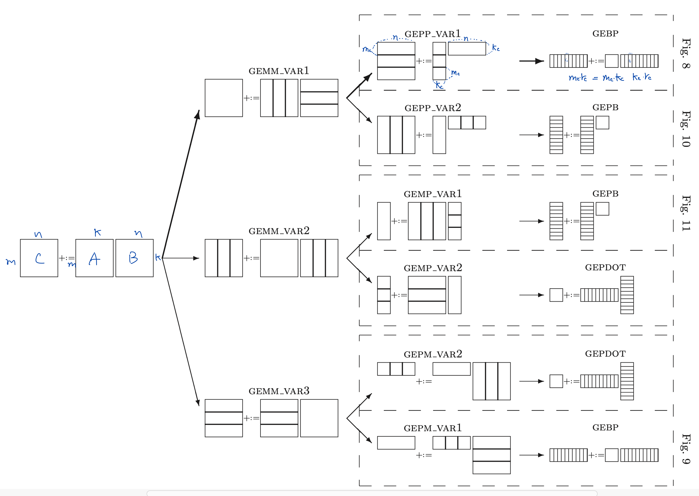
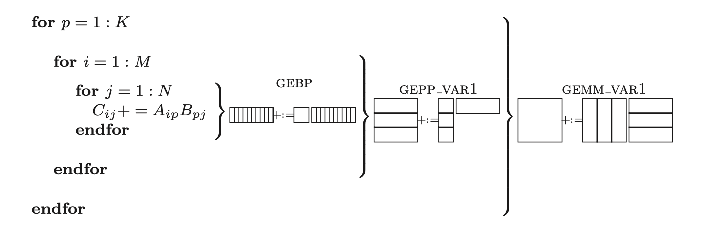
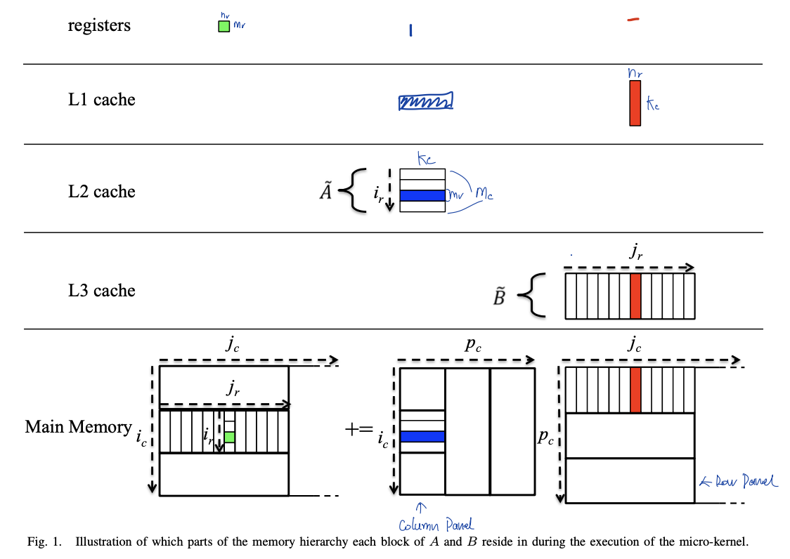
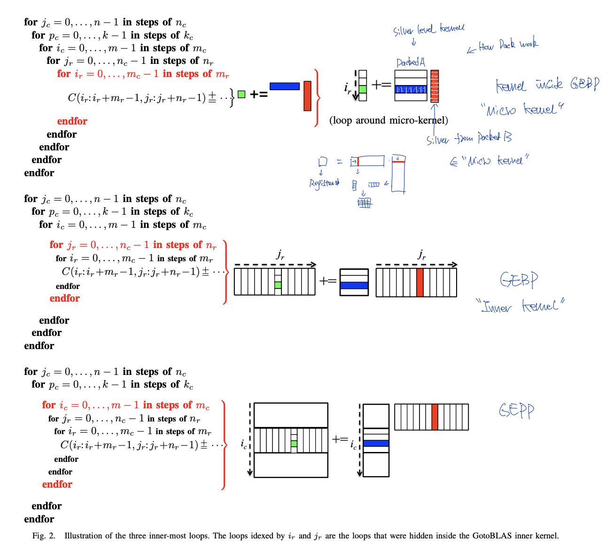
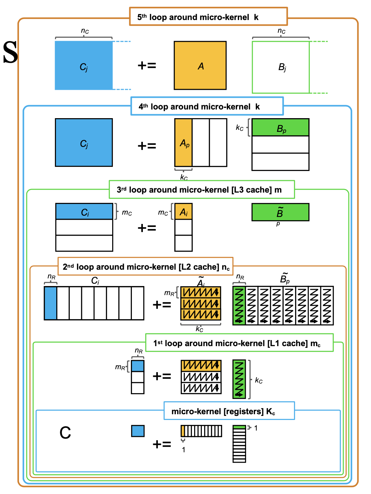
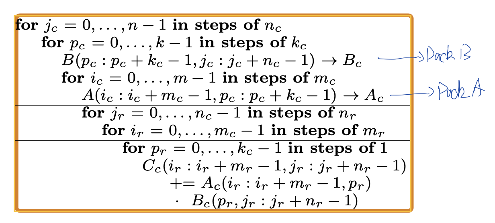
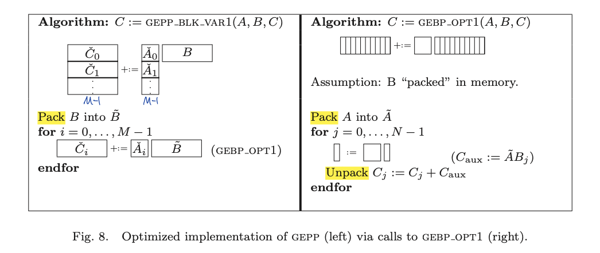

# GEMM

## GEMM GPU

### GEMM GPU UIUC

> 参考
> 
> 1. UIUC ECE 408 Lecture4, lecture5, lecture6


#### Corr C Code

注意下面使用到的变量名，后面会都是用类似的变量名

```cpp
void GEMM(float* M, float* N, float* P, int width)
{
  for ( int i = 0; i < width; ++i )
  {
    for ( int j = 0; j < width; ++j )
    {
      float sum = 0f;
      for ( int k = 0; k < width; ++k )
      {
        float a = M[i * width + k];
        float b = N[k * width + j];
        sum += a * b;
      }
      P[i * width + j] = sum;
    }
  }
}
```


#### Tile

假设 M N P 是 square matrix

single threads for each P_ij

block size in 2D of TILE_WIDTH * TILE_WIDTH

grid size in 2D of ceil( width / TILE_WIDTH ) * ceil( width / TILE_WIDTH )


##### access global memory directly

```cpp
__global__ void SquareMatrixKernel1( float* d_M, float* d_N, float* d_P, int width )
{
  int row = blockIdx.y * blockDim.y + threadIdx.y;
  int col = blockIdx.x * blockDim.x + threadIdx.x;

  if ( ( row < width ) && ( col < width ) )
  {
    float pval = 0;
    for ( int k = 0; k < width; ++k )
    {
      pval += d_M[ row * width + k ] * d_N[ k * width + col ]; // access global memory
    }
    d_P[row * width + col ] = pval; // access global memory
  }
}
```

* bandwidth 分析

Load 1 N 1 M element : 4 bytes each, total 8 bytes

进行一次计算 2 FLOP 

4 bytes memory access / FLOP 

假设GPU计算与内存

1000 GFLOP/s

150 GB/s

实际内存 150 GB/s / 4B/FLOP = 37.5 GFLOP/s

并没有充分的利用computation

在实际的运算中，memory并不是总busy，所以实际上代码只能运行在25GFLOPs左右

##### use shared memory

解决方法：把数据放到shared memory中（速度更快）从而做到数据复用。每一个block负责seprate ties。

每一个thread会负责load 1 M elem，load 1 N elem，write 1 P elem

当使用了shared memory的时候，第一个想法就是注意需要有synchronize

**对于每一个M N中的input数据，通过tile的方法，被复用TILE_WIDTH次。**

```cpp
__global__ void SquareMatrixKernel1( float* d_M, float* d_N, float* d_P, int width )
{
  __shared__ float subTileM[TILE_WIDTH][TILE_WIDTH];
  __shared__ float subTilen[TILE_WIDTH][TILE_WIDTH];

  int bx = blockIdx.x;
  int by = blockIdx.y;
  int tx = threadIdx.x;
  int ty = threadIdx.y;

  // row col 对应着最后的 P 里面的index，也就对应着 M N 里面的Row Col
  int Row = by * TILE_WIDTH + ty;
  int Col = bx * TILE_WIDTH + tx;
  float Pvalue = 0;

    // 一个thread block负责多个tile block
  for ( int q = 0; q < width / TILD_WIDTH; ++q )
  {
    // load data to shared memory
    subTileM[ty][tx] = M[Row * width + q * TILE_WIDTH + tx];
    subTileN[ty][tx] = N[(q * TILE_WIDTH+ty)*Width+Col];

    // barrier, wait for all threads load finish
    __syncthreads();

    for ( int k = 0; k < TILE_WIDTH; ++k )
      Pvalue += subTileM[ty][k] * subTileN[k][tx];

    // barrier, wait for all threads load finish
    __syncthreads();
  }

  // write result
  P[Row*Width+Col] = Pvalue;
}
```


* bandwidth 分析

16 * 16 tiles : 对于每一个从global memory读取的数据，复用16次。

可以做到150 GB/s / 4B/FLOP * 6 = 600 GFLOP/s

32 * 32 tiles ： 对于每一个从global memory读取的数据，复用32次。

可以做到150 / 4 * 32 = 1200 GFLOPS > 1000 GFLOPS

内存带宽不再是限制。

##### handle boundary

如果data并不是TILE_WIDTH的整数倍，需要解决boundary的问题

* 两种boundary的问题
1. thread 计算有效的p value，但是load global memory的时候会访问out of data. 这个时候应该假设load上来的数据都为0


2. thread 没有计算有效的p value，而且load global memory的时候会访问out of data.这个时候应该假设load上来的数据都为0，并且不写入无效的output p中


* 解决方法
1. test during tile load

如果target within input matrix, load

如果target outside input matrix, put 0

尽管多了一个branching，但是保证了计算部分的代码不会变得复杂

2. test during tile store

如果value p outiside valid range, 则不写入。

* 有关branch divergence

只针对于block on boundary, 因为在非boundary中，尽管代码中有if else，但是依旧全部的thread走一个path

```cpp
__global__ void SquareMatrixKernel1( float* d_M, float* d_N, float* d_P, int width )
{
  __shared__ float subTileM[TILE_WIDTH][TILE_WIDTH];
  __shared__ float subTilen[TILE_WIDTH][TILE_WIDTH];

  int bx = blockIdx.x;
  int by = blockIdx.y;
  int tx = threadIdx.x;
  int ty = threadIdx.y;

    // row 是P M N 对应的index。
  // 所以可以被用于判断写入index，以及load index
  int Row = by * TILE_WIDTH + ty;
  int Col = bx * TILE_WIDTH + tx;
  float Pvalue = 0;

    // 一个thread block负责多个tile block
  for ( int q = 0; q < (width-1) / TILD_WIDTH+1; ++q )
  {
    // load data to shared memory
    if ( Row < )

    subTileM[ty][tx] = M[Row * width + q * TILE_WIDTH + tx];
    subTileN[ty][tx] = N[(q * TILE_WIDTH+ty)*Width+Col];

    // barrier, wait for all threads load finish
    __syncthreads();

    for ( int k = 0; k < TILE_WIDTH; ++k )
      Pvalue += subTileM[ty][k] * subTileN[k][tx];

    // barrier, wait for all threads load finish
    __syncthreads();
  }

  // write result
  P[Row*Width+Col] = Pvalue;
}
```


## GEMM CPU

### GEMM CPU gotoBLAS

> 基于论文 Anatomy of High-Performance Matrix Multiplication
> 
> 是一种Tiled的方法 

* Setting

C : M * N (row * col)

A : M * K (row * col)

B : K * N (row * col)

Bj : K * nr (对应多个col)

Cj : 对应多个row

* GEMM 多种拆分方式

如果数据是col major的话，对应Fig8的算法比较好

如果数据是row major的话，对应Fig10的算法比较好


#### Best Algo

在col major的条件下最优算法














#### Process

##### GEBP Simple

* Setting

A : $m_c * k_c$

B : $k_c * n$

C :$m_c * n$

$B_j$ : $k_c * n_r$ 也就是上面的红色的silver

$C_j : m_c * n_r$ 也就是上面多个绿色格子会组成一个silver

* Model


* Algorithm


* Assumptions
1. $m_c$, $k_c$ are small enough
   1. A, $n_r$ col of B ($B_j$), $n_r$ row of C ($C_j$) fit into cache
2. if $A, B_j, C_j$ can fit into cache, then cpu can compute at peak speed
3. if A remain in cache, it remian there until no longer needed
* Computation intensity

$$
{2m_ck_c \over 2m_c + k_c}
$$

这里的A越大，CI越大，amotize memory copy cost越好

##### GEBP Refine

* Settings

T : T TLB entries

$T_a$ number of TLB entries devoted to matrix A

* Model


* cache layer

为了尽量的让A大，从而让上面的computation intensiry大。A 放在L2 cache中，$B_j, C_j$ 在L1 cache中

1. 为了让A从L2到register不是计算的限制 $n_r \geq {R_{comp} \over 2 R_{load}} $, $R_{comp}$ 计算浮点数的速度, $R_{load}$ 数据从L2到register的速度
* TLB constrain
1. no TLB miss when computing GEBP
   1. $A, B_j, C_j$ are small enough
2. if A is address by the TLB, it remains so until no longer needed
* Packing

在GEBP中的A通常是更大的矩阵中的一部分，也就意味着A的内存可能是不连续的。所以要 pack A into $\hat A$

Packing并不产生额外overhead，因为本身把A晕倒L2 cache里面就需要做一样多的内存拷贝。

因为每一个$B_j$都与A进行计算，所以A有很多数据复用，可以进行pack。


A的大小是$m_c k_c$, 被横向切分为多个$m_r k_c$的silver.

pack A的方法是让 $m_r k_c$ submatrix 纵向 contigious in memory （蓝色格子中的白色的线）

pack过的A与GEBP中对应的B进行计算后，不再使用。也就代表着多个pack A可以在一个tmp buffer中。

1. TLB is limited fatcor：GEBP循环一次所计算的大小需要能够放在TLB寻址空间内。
   
   1. $T_{\hat A} + 2 ( T_{B_j} + T_{C_j}) \leq T$ : TLB 需要能放下A以及两个Bj Cj，之所以是两个是为了避免在增加新的的时候把A evict
* Register Blocking


对应GEBP的一个基础计算单元。

A中一个silver的一次读取，以及B(已经是silver)的一次读取，结果应该放在register中。计算出来的$m_r n_r$ 结果

##### GEPP

* Algorithm



* packing B

pack B into $\hat B$ ，因为B被多个$A_x$使用


B的大小是$k_c n$, 被竖向切分为很多个$k_c n_r$的silver

pack B的方法是让$k_c n_r$ submatrix横向contigious in memory(红色格子中白色的线)

pack后的B(k_c * n) 被多个packed A(m_c, k_c)使用。但是当iterate k到下一个B(k_c, n)的时候，上一个pack的B就不再被使用了，所以多个packed B可以放在同一个memory buffer中。

不pack C是可以的，因为C没有在GEPP中被多次使用。但是在GEMM分解为多个GEPP的时候，每一个GEPP都会对整个C进行一次写入。

也就是只pack reuse的数据

之所以对col major友好是因为$C_{aux}$ 在存的时候是竖着的，更能利用col major

* Constrain on $m_r n_r$

> m_r * n_r 占用一半的register，但是一般是4x4, 8x8, 16x8, 16x12， 所以没有关系
> 
> m_r n_r 尽可能一样大
> 
> n_r的最小值受到L2 cache speed的限制，但是由于一般n_r最小是4，所以也没有关系

1. $m_r * n_r$ submatrix (绿色的block)中占用一半的register，剩下的register用于prefetching A silver（蓝色的）和B silver（红色的）
   1. 一般是 $4*4$ 或者$8*8$, 努力用掉尽可能多的寄存器
2. $m_r$ ≈ $n_r$ 最好的amortize cost of loading registers
3. $n_r \geq {R_{comp} \over 2 R_{load}} $ 避免A从L2 cache到register的时间成为阻挡，也就是限制了$n_r$的最小值。
* constrain on $k_c$

> k_c应该尽量大，这是增加IC的方法。有些甚至存在k_c=3k。一般k_c=256
> 
> Bj (nr * kc) 小于 TLB一半
> 
> Bj (nr * kc) 小于 L1cache一半
> 
> k_c 按照经验是page size一半

1. 应该尽量的大
2. $B_j$(红色的格子)需要能够放在L1中（因为A中多个蓝色的格子都会与$B_j$这个红色的格子相乘，所以需要红色的格子靠近register），这受到了L1大小的限制 （因为L1还要存silver A 蓝色的格子，还有C 绿色的格子），以及set associativity的限制。一般 $k_c * n_r (B_j) \leq {1\over2}$ L1 cache 
3. $\hat A (m_c * k_c)$ should occupy considerable fraction of L2 cache 
4. $k_c$ double precision float occupy half of a page
* constrain on $m_c$

> A($m_c * k_c$)应该尽量大，占用L2 cache的一半

1. $\hat A (m_c * k_c)$ should occupy considerable fraction (实际中是一半) of the smaller of
   1. memory addressable by TLB
   2. L2 cache

##### GEMM

> 参考 AHPMM Note.pdf

* Algorithm
1. iterate through K in step k_c.  num k_c 有多少个，C就被重复读取写入多少次


* 整体算法overview

for ( K in step K_C )

pack b

for (M in step M_C)

pack a

for (N in step N_R) : GEBP

for (M_C in step M_R)

iterate through K_C with M_R and N_R : micro kernel


#### BLIS

* difference

对N进行了N_C的切分. 为了让block B(k_c, n_c)相对较小，从而pack B不至于占用太多空间+pack B可以放在L3 cache里面

因为对matrix A进行多次读取（iterate along N的时候），所以pack A可以考虑pack到与A一样大的一块空间，这样第二次read整个A的时候，就是连续内存读取了。

* 整体算法overview

for (N in step N_C)

for ( K in step K_C )

pack b

for (M in step M_C)

pack a

for (N_C in step N_R) : GEBP

for (M_C in step M_R)

iterate through K_C with M_R and N_R : micro kernel


### GEMM CPU MIT

> 参考
> 
> 1. MIT 6.172 Lecture1, algorithm部分
> 2. https://www.cs.mcgill.ca/~pnguyen/251F09/matrix-mult.pdf （非常好，证明+讲的很详细）
> 3. https://en.wikipedia.org/wiki/Matrix_multiplication_algorithm
> 4. MIT 6.172 lecture 14, cache analysis部分
> 5. Berkeley CS 267 L3, divide and conquer分析部分，stranssen algo


#### Loop Reordering

目的是为了更好的使用了cache的spatial locality特点

##### 传统的loop

```cpp
for ( int i = 0; i < n; ++i )
  for ( int j = 0; j < n; ++j )
    for ( int k = 0; k < n; ++k ) // 图对应这行
      C[i][j] += A[i][k] * B[k][j];
```


* cache analysis on matrix B


Case1: $n > c M/B$ (number of rows > number of cache line)

$ Q(n) = \Theta(n^3) $, matrix B misses on every access. 

对于每一行A，都需要读取一遍matrixB，产生$\Theta(n^2)$ 的cache miss

Case2 : $$\mathrm{c}^{\prime} \mathcal{M}^{1 / 2}<\mathrm{n}<\mathrm{c} \mathcal{M} / \mathcal{B}$$ (can fit num row cache line of matrix B in cache)

$Q(n) = n * \Theta(n^2/B) = \Theta(n^3/B)$

对于每一行A，都需要读取一遍matrixB，因为number of row line of cache line可以被保存，也就代表只要读取B bytes matrix B，就可以使用B bytes。每一次读取matrix B的cache miss是$\Theta(n^2/B)$

Case3: $n<C^{\prime} \mathcal{M}^{1 / 2}$ (entire matrix B can fit into cache)

$Q(n)=\Theta\left(n^{2} / \mathcal{B}\right)$

只要读取一次matrixB，就可以把整个matrixB放在cache里，等遇到下一行A的时候可以继续复用cache里的内容。

##### 优化的loop

```cpp
for ( int i = 0; i < n; ++i )
  for ( int k = 0; k < n; ++j )
    for ( int j = 0; j < n; ++k ) // 图对应这行
      C[i][j] += A[i][k] * B[k][j];
```


* cache analysis on matrix B


$Q(n)=n \cdot \Theta\left(n^{2} / \mathcal{B}\right) = \Theta(n^3/B)$

对于matrixA的每一行，会读取整个matrixB。因为改变了内存读取顺序，matrixB会有好的spatial locality。


#### Parallize

一般最常见的是parallize最外面的loop，而不是parallize里面的loop

目的是为了更好的利用每一个cpu core的cache

```cpp
cilk_for ( int i = 0; i < n; ++i )
  for ( int k = 0; k < n; ++k )
    for ( int j = 0; j < n; ++j )
      C[i][j] += A[i][k] * B[k][j];
```

question：如果是在single core cpu上，parallel是否依旧有效


#### Tiling

把数据分块来计算。

目的是为了

1. 让一个block内的A B都在cache里，这样可以reuse data in cache as much as possible。也就是减少了fewer cahe misses(也减少了read from slow memory)
2. 比起没有分块的部分，减少了总的内存访问数量. 也就是减少了cache references

Tunning parameter：涉及到分块的时候怎么分。S的大小是什么

##### Tiling one level cache

```cpp
// 切分为多个tiled
// ih, jh 负责对C的切分
// kh 负责对
cilk_for( int ih = 0; ih < n; ih += s )
  cilk_for( int jh = 0; jh < n; jh += s )
      for ( int kh = 0; kh < n; kh += s )
      // 一个tiled内部的
      for ( int il = 0; il < s; ++il )
        for ( int kl = 0; kl < s; ++kl )
          for ( int jl = 0; jl < s; ++jl )
            C[ih+il][jh+jl] += A[ih+il][kh+kl] * B[kh+kl][jh+jl]
```


* choose block size
1. choose a cache level L1/L2
2. compute total number of double float it can hold $M_{fast}$
3. block mn + mk + nk <= $M_{fast}$


##### Tiling two level cache

需要9个for loop

Multidimensional tuning optimization cannot be done with binary search.

```cpp
// 1st block 
cilk_for( int ih = 0; ih < n; ih += s )
  cilk_for( int jh = 0; jh < n; jh += s )
      for ( int kh = 0; kh < n; kh += s )
     // second block
     for( int im = 0; im < s; im += t )
       for ( int jm = 0; jm < s; jm += t )
         for ( int km = 0; km < s; km += t )
          // micro-kernel, register level
          for ( int il = 0; il < t; ++il )
            for ( int kl = 0; kl < t; ++kl )
              for ( int jl = 0; jl < t; ++jl )
                    C[ih+im+il][jh+jm+jl] += \
                    A[ih+im+il][kh+km+kl] * B[kh+km+kl][jh+jm+jl]
```


##### Analysis

* work anaylsis on tiled 1 level cache

$$
W(n) = \Theta( (n/S)^3 (S^3)) = \Theta(n^3)
$$

一共有 (n/s)^3 次block计算，每次block计算有 3^3

* cache analysis on tiled 1 level cache for matrix B

tunning S s.t. submatrix fit into cache $s = \Theta (M^{1\over2})$
$$
\begin{aligned}
\mathrm{Q}(\mathrm{n}) &=\Theta\left((\mathrm{n} / \mathrm{s})^{3}\left(\mathrm{~s}^{2} / \mathcal{B}\right)\right) \\
&=\Theta\left(\mathrm{n}^{3} /\left(\mathcal{B} \mathcal{M}^{1 / 2}\right)\right)
\end{aligned}
$$
对于每一个submatrix来说，整个submatrix在cahche中，也就会产生$\Theta(s^2/B)$ number of cache misses. 一共会有$( n/s)^3$次submatrix计算

* computation intensity on 1 level cache


#### Divide and conquer

recursive的方法也可以很快，但是一般不如blocked的方法快

* square matrices 

dimensions are power of two (shape $2^n$ * $2^n$ ) 

总的work没有改变，依旧是n^3 的work

是一种cache oblivious algorithm, 对于复杂的环境（有其余的程序使用cache等）表现的比较好。因为不需要为了cache的大小进行tunning。

cache oblivious algorithm在multiprogrammed enviroments表现好。

也可以coarsing recursion base cass来减小recursion overhead。这样就需要tunning一个parameter了

是一种可以parallel的算法。因为8个submatrix可以被分别计算

```cpp
void mm_base(double *restrict C, int n_C, \
             double *restrict A, int n_A, \
             double *restrict B, int n_B, \
             int n )
{
  for ( int i = 0; i < n; ++i )
    for ( int k = 0; k < n; ++k )
      for ( int j = 0; j < n; ++j )
        C[i*n_C+j] += A[i*n_A+k] * B[k*n_B+j];
}

void mm_dac(double *restrict C, int n_C, \
            double *restrict A, int n_A, \
            double *restrict B, int n_B )
{
  if ( n <= THRESHOLD )
  {
    mm_base(C, n_C, A, n_A, B, n_B, n);
  }
  else
  {
    // marcro to get C00 C01 C10 C11 start location
    #define X(M, row, ccol) ( M + (row * n__##M + col ) * ( n/2 ))
    // 首先计算出左边的矩阵
    cilk_spawn mm_dac( X(C, 0, 0), n_C, X(A, 0, 0), n_A, X(B, 0, 0), n_B, n/2 );
    cilk_spawn mm_dac( X(C, 0, 1), n_C, X(A, 0, 0), n_A, X(B, 0, 1), n_B, n/2 );
    cilk_spawn mm_dac( X(C, 1, 0), n_C, X(A, 1, 0), n_A, X(B, 0, 0), n_B, n/2 );
                       mm_dac( X(C, 1, 1), n_C, X(A, 1, 0), n_A, X(B, 0, 1), n_B, n/2 );
    cilk_sync;

    // 然后计算出右边的矩阵。
    // 因为mm_dac的base是+=做的，所以会直接对两个矩阵的值进行融合
    cilk_spawn mm_dac( X(C, 0, 0), n_C, X(A, 0, 1), n_A, X(B, 0, 0), n_B, n/2 );
    cilk_spawn mm_dac( X(C, 0, 1), n_C, X(A, 0, 1), n_A, X(B, 0, 1), n_B, n/2 );
    cilk_spawn mm_dac( X(C, 1, 0), n_C, X(A, 1, 1), n_A, X(B, 0, 0), n_B, n/2 );
                       mm_dac( X(C, 1, 1), n_C, X(A, 1, 1), n_A, X(B, 0, 1), n_B, n/2 );
    cilk_sync;
  }
}
```


* variation of non-square matrics

这个算法还有variation。可以用于non-square matrices

* work analysis of square matrix

每一个matrix会分解为8个submatrix计算+divide work的constant
$$
\begin{aligned}
\mathrm{Arith}(\mathrm{n}) &=8 \mathrm{~Arith}(\mathrm{n} / 2)+4 * (n/2)^2 \\
&=2n^3 - n^2
\end{aligned}
$$

* data move analysis


$$
W(n) = 8 * W(n/2) + 4 * 3(n/2)^2 ~~ \text{if} ~~ 3n^2 > M_{fast} \\ 
= 3n^2 ~~ \text{if fit into cache}\\
= O(n^3 / (M_{fast}^{1/2} + n^2 ))
$$
4是因为有4个Coo = RMM + RMM pair

3 是因为read 2, write 1在合并C的时候

这里的number of words moved 与tilted的效果一样

这里算出来的数值也是符合communication lower bound的

* cache miss analysis on matrix B (serialized)

$$
Q(n)=\left\{\begin{array}{l}
\Theta\left(n^{2} / \mathcal{B}\right) \text { if } n^{2}<\mathrm{c} \mathcal{M} \text { for suff. small const } c \leq 1 \\
8 Q(n / 2)+\Theta(1) \text { otherwise. }
\end{array}\right.
$$

对于n^2 < c M, 整个submatrix都可以放在cache里。根据submatrix cahing lemma，cache miss rate是这样的


总的cache miss与tiling是一样的。是一种efficient cache-oblivious algorithm. 

* cache miss analusis on matrix B (parallel)

span of computation: 
$$
\mathrm{T}_{\infty}(n)=2 \mathrm{~T}_{\infty}(\mathrm{n} / 2)+\Theta(1)=\Theta(n)
$$
Cache miss
$$
\begin{aligned}
\mathrm{Q}_{\mathrm{p}} &=\mathrm{Q}_{1}+\mathrm{O}\left(\mathrm{S}_{\mathrm{p}} \mathcal{M} / \mathcal{B}\right) \\
&=\Theta\left(\mathrm{n}^{3} / \mathcal{B} \mathcal{M}^{1 / 2}\right)+\mathrm{O}(\mathrm{Pn} \mathcal{M} / \mathcal{B})
\end{aligned}
$$


#### Vectorization

这里只涉及到了使用编译器向量化的方法

* Compile

Clang/LLVM 在 -O2 以上自动使用vector instruction

Clang/LLVM 可以产生 vectorization report 

```shell
clang -O3 -std=c++11 test.cpp -o test.out -Rpass=vector
```

可以直接指名使用什么compiler flag

```shell
-mavx
-mavx2
-mfma # multiply-add instruction
-march= # 使用某一个architecture上全部可能的vector instruction
-march=native # 使用当前机器上全部可能的vector instruction
```

对于float来说，compiler默认不使用向量化，因为要保证数值正确。如果想要在float上面使用compiler vectorization，需要

```shell
-ffast-math
```


#### Data Layout change

改变data layout，使得读取block的时候是连续的


#### Strassen's algorithm

基于Strassen's algorithm,  基于divide and conquer，只不过只有7个recursion call

work $O(n^{log_2(7)})$ Where 7 来自于只有7个recursion call


#### Others

还有一些算法上的改变，可以让GEMM做到最优$O(n^{2.32})$,基于类似的divide and conquer想法，只不过分的块数更多

然而很多fast method并不实际，因为需要非常大的n


