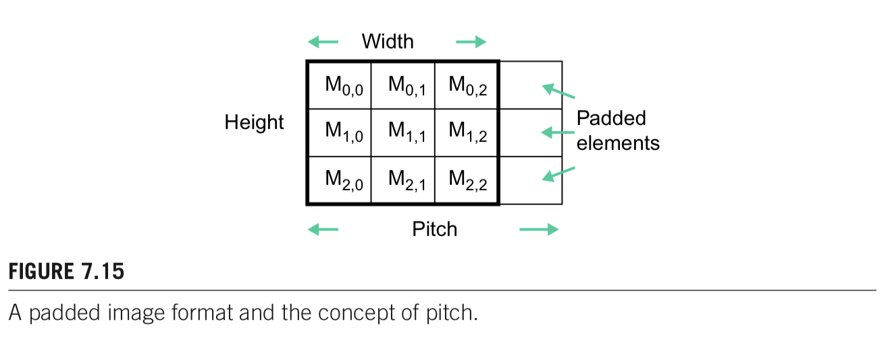
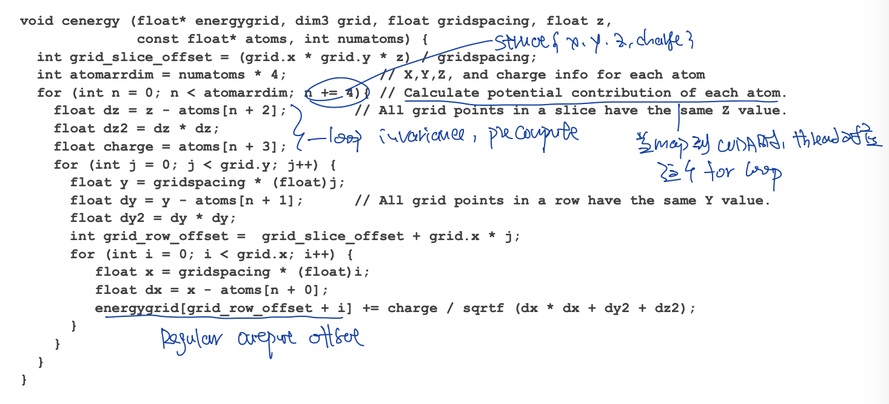

# GPU

## Design Principle

### CPU VS GPU

> Reference
>
> 1. Berkeley CS 267 Lecture 7
>
> 2. UIUC 408 L1
> 3. Programming Massively Parallel Processors 3rd chapter 1


* 什么是GPU

GPU是heterogeneous chip. 有负责不同功能的计算模块


SMs: streaming multiprocessors

SPs: streaming processors : each SM have multiple SP that share control logic and instruction cache


* 为了设么设计

GPU design for high throughput, don't care about throughput so much

CPU design for low latency


* CPU GPU

CPU : multicore system : latency oriented 

GPU : manycore / many-thread system : throughput oriented


#### Idea to design throuput oriented GPU

* Idea 1 ： 去除CPU中让CPU serialize code运行更快的

CPU中包含out of order execution, branch predictor, memory prefetch等机制让CPU运行serialize code fast，但是这些部分占用很大的memory和chip。

GPU去除这些部分。


* Idea 2 ：larger number of smaller simpler core

相比起使用small number of complex core, GPU的工作经常simple core就可以处理。

但也带来了挑战，需要programmer expose large parallel从而充分利用全部的core


* idea 3：让simple core共享instruction stream，减少负责Fetch Decode的芯片面积

因为很多工作都是parallel的，所以多个small simple core共享instruction stream就可以，减少了chip上负责instruction stream的部分。

SIMT single instruction multiple threads. 

SIMT 与 SIMD 有一些不一样。SIMT可以平行thread，而SIMD只可以平行instruction


* idea 4：使用mask来解决branching

在CPU中使用branch prediction

在GPU中，使用mask来解决branching


* idea 5：hide latency instead of reduce latency

CPU通过fancy cache + prefetch logic来avoid stall

GPU通过lots of thread来hide latency。这依赖于fast switch to other threads, 也就需要keep lots of threads alive.


* GPU Register 特点

GPU的register通常很大，在V100里与half L1 cahce+shared memory一样大

经常也被叫做inverted memory hierchy


### Program Model

> 参考
>
> 1. UIUC ECE Lecture 2,3
> 1. Programming Massively Parallel Processors 3rd chapter 2,3

CUDA Threads: SPMD single program multiple data

CPU call GPU kernel function 是 asynchronize 的


#### Kernel function & Block

Grid -> Block -> Warp ( implementation 而不是program model ) -> threads 

每一个kernel function被map到一个grid上

threads in same block "shared memory" & synchronize

block之间的thread只能通过global memory的方法来进行信息交流

Block 被assign 到不同的streamming multi-professor (sm) 上. Threads are assigned to execution resources on a block by block basis.

block & warp execute in arbitary order

maxwell take max 32 blocks per sm

maxwell take max 2048 threads per sm

maxwell take max 1024 threads per block


如果device与host同时被使用，compiler会生成两个版本的代码。


#### SM warp scheduling

warp是sm内部的schedule unit。

size of warp 是取决于硬件的，现在的GPU硬件都是warp size32的，但是以后可能改变

最近的architecture，每一个SM可以同时运行多个warp的instruction。

warp within a block can be execute in any order w.r.t each other


* 为什么使用warp

为了share control unit


* block中thread到warp的映射

如果block是1D的，则每32个映射到一个warp上

如果block是2D/3D的，会先把2D/3D project到1D上，然后每32个thread映射到一个warp上


* 为什么每个SM中需要放多个warp，如果同一时间只能跑有限个warp？

如果一个warp的instruction无法立刻执行（等待前一个instruction的资源），则这个warp not selected for execution.

其余的resident warp nolonger waiting for resources会被运行。如果多个resident warp都可以运行，则会采用latency hiding的priority mechanism来选择先运行谁。

**zero-overhead scheduling** : selection of ready warps for execution avoid introduycing idle or waisting time into execution timeline. 

如果有sufficent resident warp，则hardware will likely find warp to execute at any point in time.

能够切换到其余的warp来hide latency是GPU不需要大的cache，不需要branch prediction等硬件，可以把更多的硬件给floating point operation的原因


#### Handle Corner Case

* handle 1d corner case

```cpp
__global__ void add( int* A, int* B, int* C, int n )
{
        i = blockIdx.x * blockDim.x + threadIdx.x;
      // avoid kernel larger than data
    if ( i < n )
      C[i] = A[i] + B[i];
}
```


* handle 2d corner case


```cpp
__global__ void RGB2GRAY(unsigned char* gray, unsigned char* rgb, int width, int height)
{
  int col = threadIdx.x + blockIdx.x * blockDim.x;
  int row = threadIdx.y + blockIdx.y * blockDim.y;
  if ( col < width && row < height )
  {
    // do computation
  }
}
```


#### Branch Divergence

GPU对于每一个thread使用predicated execution。

如果一个warp内的多个thread会走不同的path，则multiple path被实际运行。

```cpp
if ( threadIdx.x > 2 )
{
  // path 1
}
else
{
  // path 2
}
```

如果代码中有branching (if else)，但是warp内的thread只走一个path(都走了if condition)，不会有branching

一个解决branching的常用方法就是branch granularity是warp的倍数、这样就能保证一个warp内的全部thread都只走一个brach，而且依旧two cotrol path

```cpp
if ( threadIdx.x / WARP_SIZE > 2 )
{
  // path 1
}
else
{
  // path2
}
```


#### Synchronization within block

> Programming Massively Parallel Processors 3rd edition chapter 3

`__syncthreads()` 用来synchronize all threads in block

如果有if else then statement + syncthreads 在branch内部的话，all threads inside block either all run if or all run else. 否则就会wait forever

CUDA runtime只有在确保一个block所需要的全部resource都有的时候才会run block，否则会出现跑到一半发现resource不够，某些thread无法运行，其余的thread因为synchronize等待无法运行的thread。


* transparent scalability

同样的代码，在拥有不同资源的硬件上都可以运行。

blocks can execute in any order relative to each other, which allows for transparent scalability across different devices

CUDA为了保证transparent scalability，所以不允许block之间的synchronize。因为只有block之间不synchonize，block之间没有依赖关系，cuda runtime才可以arbitrary schedule block  on different hardware.


#### Warp shuffle

是什么：使用shuffle指令，threads within single warp can access register of other threads within warp. warp内的thread可以访问其余thread的寄存器。


为什么好

1. 更大的编程flexible
2. 原来thread之间进行数据交换需要使用shared memory，latency以及bandwidth都比register要小。现在在一个warp内部可以使用register，更小的latency以及更大的bandwidth


```cpp
// warp shuffle for reduction
val += __shfl_down_sync(0xffffffff, val, 16);
val += __shfl_down_sync(0xffffffff, val, 8);
val += __shfl_down_sync(0xffffffff, val, 4);
val += __shfl_down_sync(0xffffffff, val, 2);
val += __shfl_down_sync(0xffffffff, val, 1);

// thread 0 have reduction value
```


```cpp
// Use XOR mode to perform butterfly reduction
    for (int i=16; i>=1; i/=2)
        value += __shfl_xor_sync(0xffffffff, value, i, 32);
```


#### Kernel切分决定

kernel之间有implicit barrier （kernel1的代码完全运行结束后，才会运行kernel2的代码）。如果kernel小而多的话，implicit barrier会成为overhead。


#### Get device property

```cpp
cudaDevicePeop dev_prop;
cudaGetDeviceProperties(&dev_prop, 0);

dev_prop.maxThreadsPerBlock;
dev_prop.multiProcessorCount;
dev_prop.clockRate;
dev_prop.maxThreadsDim[0/1/2];
dev_prop.maxGridSize[0/1/2];
dev_prop.warpSize;
dev_prop.regsPerBlock; // 每个sm可以使用的register的个数，通常与算法中总共的thread数量一起使用，从而确定每个thread可以使用多少个register，从而dynamic select which kernel to run。
dev_prop.sharedMemPerBlock; // 每个sm可以使用的shared memory大小。希望host code根据不同的hardware从而使用不同的shared memory大小，从而充分使用硬件。
```


#### Dynamic partition of resource

SM resource是动态分配给每一个block的，resource是有限的，需要决定block大小等来within limit of resource + use as many threads as possible


常见限制

1. num threads per sm
2. Num registers per sm
3. shared memory size per sm


##### 考虑block/sm threads/sm限制

thread到硬件的映射是以block为单位的。一个SM可以包含多个（有最多限制）的block。

如果SM内的一种多种resource不够支持最多block一起运行，cuda runtime则会以block为单位减少同时在一个SM上运行的block，从而保证all resources fall into limit of SM


* 假设 (下面的数据会依据使用的不同硬件改变)
1. SM take 8 blocks 
2. SM take 1536 threads 
3. 三个block分块的方式 $8*8, 16*16, 32*32$


* $8*8$ : 

64 threads per block

each sm can take 1536 / 64 = 24 blocks

但是sm限制最多8个block，也就是最多 8 * 64 = 512 threads ( out of 1536 threads ) go into one sm

这个是不好的，我们希望SM中的thread能够多到足够掩盖memory latency （warp schedule data已经好了的）


* $16 * 16$

256 threads per block

each sm can take 1536 / 256 = 6 blocks (小于block/sm的限制)

可以在硬件上使用full threads & block capacity


* $32 * 32$

1024 threads per block

each sm can take 1 block (小于block/sm的限制)

无法使用full threads


##### 考虑shared memory threads/sm block/sm限制

* 假设
1. 64 kb shared memory per SM
2. 2048 threads / sm
3. 150 GB/s bandwidth
4. 1000 GFlops
5. square matrix computation 使用 simple shared memory 16 / 32 的tile size
6. 使用shared memory进行tilening


* TILE_WIDTH 16

each block 使用 2 (submatrix M and N) * 16 * 16 * 4 bytes (float) = 2048 bytes shared memory

150 / 4 (bytes per float) * 16 = 600 GFlops : not yet fully utilize computation resources

64 kb / 2048 bytes/block = max 32 block per sm due to share memory constrain 

2048 threads / (16*16) = 8 block per sm due to threads limit

每一个时间点会有 2 (two load / threads) * 16*16 * 8 block/sm = 4096 pendig load (通过检查pending load来判断是否有让SM busy)。这个点很重要，因为使用多个thread的目的就是让sm有很多pending load，这样才能swap between warp


* TILE_WIDTH 32

each block 使用 2 * 32 * 32 * 4 bytes (float) = 8kb bytes share memory

150 / 4 (bytes per float) * 32 = 1200 GFlops : have potential to fully utilize computation resource

64/8 = max 8 block per sm due to share memory constrain

2048 / (32*32) = 2 block per sm due to threads limit

每一个时间点会有 2 * 32 * 32 * 2 = 4096 pending loads

同样的memory parallelsim exposed. 

尽管32的复用的内存更大，memory paralle与16一样。可能会存在一些block schedule的问题，因为更少的总block个数。


### Memory Model

> 参考
>
> 1. UIUC ECE Lecture 4
> 1. Berkeley CS 267 Lecture 7 on memory colesing
> 1. PMPP 3rd chapter 5


#### Hierchy of Memory

per thread register

per block shared mempry

per block l1 cache

per grid global memory

per grid l2 cache

per grid constant memory


global memory 是 off chip的

register / shared memory是on chip的


constant memory物理上在global memory上, 但是会cache for efficency 所以正确使用的话会很快

scope of constant varaible 是 across all grids. 是valid throughout program execution.


CUDA中pointer用来指向global memory


* 声明各种memory


如果没有使用 `__device__`, `__shared__`, `__constant__`的话，则是automatic variable。如果是一个变量的话会是register。如果是per thread array的话会是global memory。

per thread array (per thread local memory) 会被储存在 gloabl memory 中，因为compiler不知道这个array会有多长，无法把array拆分后放到regsiter中。


* 为什么使用shared memory & 如何使用shared memory

为了数据复用，就像是CPU里做blocking把数据放到cache上一样。

```cuda
__shared__ mymemory[SIZE];
extern __shared__ mymemory[];
kernelfunc<<<dimgrid, dimblock, sharememsize>>>(params);
```


* within block communication

使用shared memory + barrier


* between block communication

使用atomic, global memory


* register使用的注意

register是有限的，如果使用过多的register，会导致一个SM能够schedule的总block数量减少，减少总的thread数量


#### Memory Coalesing and Burst

* 什么是coalesing

the hardware combines, or *coalesces*, all these accesses into a consolidated access to consecutive DRAM locations / combined multiple request into a single request for consecutive locations。也就是硬件会融合多个临近的访问为一个对DRAM的访问

GPU中的cache主要作用是memory coalesing，来combine access to DRAM into burst to reduce 总的 num access to DRAM


##### DRAM 

* 原理

一个capacitor储存bit

一个select选择读取哪个capacitor

一个bit line read / write数据。每个bit line只读取一个bit的数据，也就是多个select里面只select一个

需要constantly check value / recharge value


* 特点

bit line的capacitance很大，导致速度很慢。

bit的capacitance很小，需要使用sense amplifier来放大信号


##### DRAM BANK

多个bit line组成core array

数据传输分为两个部分。core array -> column latches / buffer -> mux pin interface 

**burst** 当访问一个内存位置的时候，多个bit line的数据都会从core array传输到column latches，然后再使用mux来选择传送给bus interace哪个数据 / one burst of memory access to get data that used by multiple attemps to read.

**burst size** 读取一次memory address，会有多少个数据被放到buffer中。

常见的GPU burst size是 1024 bits / 128 bytes. 这里的burst size经常被叫做**line size**


* 充分利用burst：连续访问内存

第一次访问，全部4个数据都放到buffer里


第二次访问连续的数据，直接从buffer里读取数据，不用再去core array


**bursting** 每一次读取burst of data，读取的数据应该被充分使用，因为读取burst里面的两个数据的时间远远小于读取两个random address/两个burst。


##### Multiple Bank

只用burst并不能实现processor所需要的DRAM bandwidth。

因为bank访问core array cell的时间很长（下图蓝色部分）而实际使用bus interface传输数据时间很短（下图红色部分），通常比例是20:1， 如果只使用一个bank，interface bus会idle。所以需要在一个bus 上使用多个bank，来充分利用bus bandwidth。如果使用多个bank，大家交替使用interface bus，保证bus不会idle

通过多个bank链接到interface bus，从而让interface bus充分的使用，也就保证了每个时间都有数据从interface bus传送过来。


* 一个bus需要多少个bank？

如果访问core array与使用bus传输数据的时间比例是20:1，那么一个bus至少需要21个bank才能充分使用bus bandwidth。


一般bus有更多的bank，不仅仅是ratio+1，原因是

1. 使用更多的bank，更能让data spread out across bank。如果一块data只在一个bank上的话，需要多个burst才能完全访问（时间很久）。如果一块data在多个bank的话，可以overlap core array access time （总时间变短）
2. 每个bank可以存储的诗句有限，否则访问一个bank的latency会很大。


* 实现max bandwidth方法

In order to achieve the memory access bandwidth specified for device, there must be a 

1. sufficient number of threads making simultaneous memory accesses. 
2. Furthermore, these memory accesses must be evenly distributed to the channels and banks. 
3. Of course, each access to a bank must also be a coalesced access,


##### Multiple Channels

modern Double data rate （DDR） bus可以传输two word of data in each clock cycle. 

假设bus clock speed是1GHz， 每秒钟只能传送 8 bytes / words * 2 words per clock * 1 GHz = 16 GB/sec. 但是一般GPU processor要求128GB/s的数据

单独一个channel/一个bus interface不足以达到processor要求DRAM bandwidth，所以需要使用多个channel。


* interleaved data distribution 

是什么：把array spread across banks and channel in the memory system. 这样允许core array acccess time overlap, 减少总access time. 


##### Parallel memory & Parallel therad

1. good utilization of the potential access bandwidth of the DRAM system requires that many threads simultaneously access data that reside in different banks and channels.  
   1. 为了充分利用DRAM带宽，需要让多个thread同时访问DRAM数据，并且这些访问需要连续，需要在DRAM中分散在多个bank和channel上
2. the execution throughput of the device relies on good utilization of the parallel structure of the DRAM system.
   1. 充分利用DRAM贷款，需要访问在不同bank和channel上的的数据 （连续访问一段内存）。如果访问的数据在一个channel上，则无法充分利用带宽


##### Simple CUDA code analysis

对于simple CUDA kernel来说，是使用多个thread+多个iteration的方法来遍历M和N

对于N的访问是coalesced，多个thread在一个step访问的数据是连续的，也就是属于一个burst/充分使用burst


对于M的访问不是coalesced的，每个thread读取的数据都会导致一次memory burst。Step1的4个value需要4个burst。在进行step2的时候，step1的burst被调换，导致memory得重新传输。

需要注意的是，这里使用4个thread+多个iteration来读取数据M，也就对应着simple cuda code


##### Tiling CUDA with shard memory analysis / corner turning

**corner turning** : Use of a transposed thread order to allow memory loads to coalesce when loading global to shared.

当使用tilnig+每个thread读取一个M N到shared memory的时候，读取M也是burst的。这是因为比起上面的simple code使用iteration读取，这里使用多个thread读取，一次burst的数据会被临近的thread使用(M00 M01分别被2个thread读取，每个thread只读取一个M elem)，而不是下一个iteration被清空。

这里对于M没有使用transpose，但是因为使用多个thread读取数据，依旧保证了burst，这与CPU代码需要使用transpose是不一样的。

同时shared memory使用的是SRAM，不像DRAM有burst的问题，所以读取M的shared memory的时候尽管不是连续读取也没有问题。shared memories are implemented as intrinsically high-speed on-chip memory that does not require coalescing to achieve high data access rate.


##### Padded 2D image

> PMPP Chapter 7



当读取image 文件的时候，library经常会padded width = multiply of burst size. 

如果没有padded的话，raw 1的起始位置会是misaligned from DRAM burst，导致读取的时候读取多个burst，让速度变慢

padded info叫做 `pitch` 


#### Shared memory

* 是什么

1. on chip
2. SRAM support random access
3. don't have constrain of burst like DRAM


* 什么时候使用

1. 数据有复用的话，考虑使用shared memory


* 使用时需要注意

1. 使用shared memory一定要注意不要忘记synchronize的使用
2. shared memory时有限的resource，需要考虑使用shared memory以后一个sm能有多少个thread和block


* load from global memory to shared memory 过程

内存拷贝与CPU相似，需要经过register

global memory -> cache L1/L2 -> per thread register -> shared memory

不存在直接从global memory到shared memory的硬件


#### Constant memory

> UIUC 408 Lecture 7


##### cache 是什么

GPU Memory line是1024 bits / 128 bytes

cache由多个cache line组成，每个cache line大小与memroy line大小一致，都是128 bytes


##### cache 与Shared memory比较

* same

1. both on chip. For volta use same physical resources SRAM


* different

1. prigrammer control shared memory 
2. micro-arch determine content of cache


##### Constant cache

CPU中的cache需要保证cache coherence，所以hw上实现恨无杂。

GPU中因为多线程，实现cache coherence。

GPU有两种cache，L1 cache和constant cache。


* 特点

1. cosntant cache read only
2. 被constant memory, texture memory使用
3. 比起L1 cache，有更大的throughput aceess than L1 cache。尽管latency是一样的，都是5 cycle


##### Use constant memory

constant memory物理上在global memory上，是off chip的

使用constant memory主要是为了使用constant cache，从而减少对global memory的访问

```cpp
// constant memory declared outside all function
__constant__ float Mc[MASK_WIDTH][MASK_WIDTH];

// copy from device to constant memory
cudaMemcpyToSymbol(Mc, Mask,, MASK_WIDTH*MASK_WIDTH*sizeof(float));
```


#### Atomic

> UIUC 508 Lecture 2

GPU atomic随着GPU Arch也在改进

atomic on shared memory >> atomic on global memory 


* GT200

atomic is on global memory, no L2 cache 


* Fermi to Kelpler

both atomic on L2 cache

Improve atomic by add more l2 cache buffer 


* kepler to maxwell

improve shared memory atomic through using hardware. 

Kepler use software for shared memory atomic


* after maxwell

atomic is rouphly the same

the flexibility of atomic is changed. now have atomic within warp / block.


#### Cache

##### Control cache behavior

> Reference
>
> 1. Cache behavior when loading global data to shared memory in Fermi [link](https://forums.developer.nvidia.com/t/cache-behavior-when-loading-global-data-to-shared-memory-in-fermi/29259)

load from global memory to register will be cache at L1 at default. 

If you use the inline PTX call “ld.global.cg”, the read will be cached in L2 but not L1. “ld.global.cs” will not cache the read in L1 or L2. Alternatively, you can use a simple NVCC flag to make either of these types of reads the default by using “-Xptxas -dlcm=cg” or “-Xptxas -dlcm=cs”, though of course that then applies to ALL reads in your program.


#### Register

##### Register size

> Reference
>
> 1. Saving registers with smaller data types? [link](https://forums.developer.nvidia.com/t/saving-registers-with-smaller-data-types/7376)

Registers 是 32 bit / 4 bytes 大小的 (same size as int / float)。如果数据类型是double的话，则使用2个register。

可以通过pack small data into a register (e.g. 2 short) and use bitmask + shift 来读取。从而减少register usage per thread


## Common Optimization Techniques

> Reference
>
> 1. Algorithm and Data Optimization Techniques for Scaling to Massively Threaded Systems


### Data Layout Transformation

> Reference
>
> DL A Data Layout Transformation System for Heterogeneous Computing

GPU充分利用burst memory是很重要的优化方法

如果burst内的数据没有立刻被使用的话（DRAM的buffer中存放burst），则会被下一个burst代替，需要重新传输。

对于CPU来说，data layout对程序的影响没有那么显著，因为CPU有large cache per thread，可以cache部分数据，没有那么依赖于DRAM的burst data。下面的array of struct结构中，thread0的cache会储存整个struct的内容。

对于GPU来说，data layout对程序的影响很显著，因为GPU的cache比较小。GPU的cache主要适用于memory coalesing，而不是locality

SoA或者DA(discrete array)的结构对GPU有用，因为充分利用burst 的结果


ASTA array of structures of tiled arrays 是一种 SoA的变体。相当于AoS of mini-SoA(of size coarsening factor)

1. 解决OpenCL需要对不同hw有不同数据结构的kernel的问题
2. 解决`partition camping`，也就是数据集中在某一个bank/channel上，没有充分利用DRAM aggregate bandwidth

通常`coarsening factor` (下面eg是4) at least the number of thread partitioning in memory access (num thread in block)


在NVIDIA的arch下，DA与ASTA的perf相似


### Scatter to Gather

> UIUC ECE 508 Lecture 2

scatter对于编程来说更加直接

GPU应该避免使用scatter，应该使用gather的方法

在GPU上的程序改变scatter为gather可以提升性能


* 是什么

scatter : parallel over input, writing value to non-contigious memory location

gather : parallel over output, reading values from non-contigious memory location。也叫做owner compoutes rules


* scatter 缺点

1. contentious write (write conflict) 需要被hardware serialize。（下图红色的arrow）。当thread多的时候会有很多conflict，write到某一个位置会被serialized
2. random write无法充分利用memory burst
3. atomic的arch直到最近才被支持


* gather 优点

1. write的时候充分利用burst
2. 没有write conflict，不需要serialize write


* 程序特点

1. input一般是irregular的，output一般是regular的。从irregular data映射到regular data是简答的，这也是为什么很多程序是scatter的
   1. input是particle coordinate(x,y,z), output是3d spatial grid
2. 有些时候each input只影响有限个output，所以conflict write的影响没有那么大


* gather缺点

1. 存在overlapping read，但是可以被hardware使用cache/shared memory来缓解


#### Example Direct Coulombs Summation (DCS)

irregular input atom and regular output potential grid. Every input influence every output. Given a input atom array, calculate potential on each output grid location.

DCS是最精确的方法，也可以使用其余的方法从而更快，但是就没有这么精确了


##### Scatter C Code

minimize computation by moving loop invariance out of loop




##### Scatter CUDA Code

替换C code部分的for loop为thread

需要使用CUDA atomic。由于atoimic导致serialization，会慢


##### Gather C Code

存在重复计算varaible

存在重复访问atom array

在C的版本下，比simple scatter版本更慢

对于energygrid的写入更加连续


##### Gather CUDA Code

替换for grid x与for grid y为2d block thread

对于一个warp内的thread来说，同步读取same atom array value，也就只访问一次atom array

写入energygrid充分利用memory burst

对于sequential来说更快的代码（simple scatter），计算量更少的代码，并不一定在parallel上更快


##### Improved Gather C Code

对于CPU代码来说，cache的利用比computation更重要。尽管scatter C code的计算最少，但是并非是对cache利用最好的

问题中energygrid > 20 x atom array。 atom array可以被放在cache里重复读取，但是对energygrid的读取希望只读取一次，因为无法放入在cache里。

C code中更好办法在这个问题里实际上是output oriented的


### Tiling

是什么：buffer input into on-chip storage, to be read multiple times. 

效果：reduce global memory bandwidth pressure


* 为什么有shared memory/scratch pad

on chip storage越大（shared memory越大，tile size越大），越能减少bandwidth的压力

如果on chip storage只可被单独thread可见，则on chip storage会比较小（无法给几千个thread分配大的on chip storage）。解决方法是share on chip storage across thread通过scratchpad/shared memory


* 效果

取决于不适用tiling，只使用cache的效果怎么样。

在modern GPU上，cache相对更加复杂+大，所以使用tiling的效果就没有那么多。UIUC 408 Lecture 14里面的例子里，使用tilning只提升了40%左右的速度，原因是因为绝大多数access to global memory都是通过L1 cache的，cache hit rate有98%。


* 例子

GEMM : `DenseLinearAlgebra-CommunicationLowerBound::GEMM GPU UIUC`

Conv : `DenseLinearAlgebra-CommunicationLowerBound::Conv GPU UIUC` 


#### Example GEMM

> 参考
> 
> 1. UIUC ECE 408 Lecture4, lecture5, lecture6


##### Simple C Code

注意下面使用到的变量名，后面会都是用类似的变量名

```cpp
void GEMM(float* M, float* N, float* P, int width)
{
  for ( int i = 0; i < width; ++i )
  {
    for ( int j = 0; j < width; ++j )
    {
      float sum = 0f;
      for ( int k = 0; k < width; ++k )
      {
        float a = M[i * width + k];
        float b = N[k * width + j];
        sum += a * b;
      }
      P[i * width + j] = sum;
    }
  }
}
```


##### Simple CUDA Code

```cpp
__global__ 
void MatrixKernel( float* d_M, float* d_N, float* d_P, int width )
{
  int row = blockIdx.y * blockDim.y + threadIdx.y;
  int col = blockIdx.x * blockDim.x + threadIdx.x;

  if ( ( row < width ) && ( col < width ) )
  {
    float pval = 0;
    for ( int k = 0; k < width; ++k )
    {
      pval += d_M[ row * width + k ] * d_N[ k * width + col ]; // access global memory
    }
    d_P[row * width + col ] = pval; // access global memory
  }
}
```


* bandwidth 分析知道直接访问global memory的话是不够的

Load 1 N 1 M element : 4 bytes each, total 8 bytes

进行一次计算 2 FLOP 

4 bytes memory access / FLOP 


假设GPU计算与内存

1000 GFLOP/s computation power

150 GB/s memory bandwidth

实际computation usage 150 GB/s / (4B/FLOP) = 37.5 GFLOP/s

并没有充分的利用computation

在实际的运算中，memory并不是总busy，所以实际上代码只能运行在25GFLOPs左右


上面的分析其实比较简单，更加通用的分析应该从computation intensity出发，从而知道对于每一个bytes access to global memory, 需要how many flops


##### Tile with shared memory

假设 M N P 是 square matrix

single threads for each P_ij, parallize computation of elements of P

block size in 2D of TILE_WIDTH * TILE_WIDTH

grid size in 2D of ceil( width / TILE_WIDTH ) * ceil( width / TILE_WIDTH )


解决方法：把数据放到shared memory中（速度更快）从而做到数据复用。每一个thread block负责计算seprate ties。


假设square tile + square matrix的情况。每一个thread会负责load 1 M elem，load 1 N elem，write 1 P elem

当使用了shared memory的时候，第一个想法就是注意需要有synchronize

**对于每一个M N中的input数据，通过tile的方法，被复用TILE_WIDTH次。**

```cpp
__global__ void SquareMatrixKernel1( float* d_M, float* d_N, float* d_P, int width )
{
  __shared__ float subTileM[TILE_WIDTH][TILE_WIDTH];
  __shared__ float subTilen[TILE_WIDTH][TILE_WIDTH];

  int bx = blockIdx.x;
  int by = blockIdx.y;
  int tx = threadIdx.x;
  int ty = threadIdx.y;

  // row col 对应着最后的 P 里面的index，也就对应着 M N 里面的Row Col
  int Row = by * TILE_WIDTH + ty;
  int Col = bx * TILE_WIDTH + tx;
  float Pvalue = 0;

    // 一个thread block负责多个tile block
  for ( int q = 0; q < width / TILD_WIDTH; ++q )
  {
    // load data to shared memory
    subTileM[ty][tx] = M[Row * width + q * TILE_WIDTH + tx];
    subTileN[ty][tx] = N[(q * TILE_WIDTH+ty)*Width+Col];

    // barrier, wait for all threads load finish
    __syncthreads();

    // This part require data loaded by other threads
    for ( int k = 0; k < TILE_WIDTH; ++k )
      Pvalue += subTileM[ty][k] * subTileN[k][tx];

    // barrier, wait for all threads load finish
    __syncthreads();
  }

  // write result
  P[Row*Width+Col] = Pvalue;
}
```


* bandwidth 分析

16 * 16 tiles : 对于每一个从global memory读取的数据，复用16次。

可以做到150 GB/s / 4B/FLOP * 6 = 600 GFLOP/s

32 * 32 tiles ： 对于每一个从global memory读取的数据，复用32次。

可以做到150 / 4 * 32 = 1200 GFLOPS > 1000 GFLOPS

内存带宽不再是限制。


##### handle boundary

如果data并不是TILE_WIDTH的整数倍，需要解决boundary的问题


* 两种boundary的问题
1. thread 计算有效的p value，但是load global memory的时候会访问out of data. 这个时候应该假设load上来的数据都为0


2. thread 没有计算有效的p value，而且load global memory的时候会访问out of data.这个时候应该假设load上来的数据都为0，并且不写入无效的output p中


* 解决方法

1. test during tile load

如果target within input matrix, load

如果target outside input matrix, put 0

尽管多了一个branching，但是保证了计算部分的代码不会变得复杂。而且这个branching只会影响到一个warp内的thread，对于大多数thread都是在一个warp内不会导致两个branch都运行


2. test during tile store

如果value p outiside valid range, 则不写入。


* 有关branch divergence

只针对于block on boundary, 因为在非boundary中，尽管代码中有if else，但是依旧全部的thread走一个path

```cpp
__global__ void SquareMatrixKernel1( float* d_M, float* d_N, float* d_P, int width )
{
  __shared__ float subTileM[TILE_WIDTH][TILE_WIDTH];
  __shared__ float subTilen[TILE_WIDTH][TILE_WIDTH];

  int bx = blockIdx.x;
  int by = blockIdx.y;
  int tx = threadIdx.x;
  int ty = threadIdx.y;

    // row 是P M N 对应的index。
  // 所以可以被用于判断写入index，以及load index
  int Row = by * TILE_WIDTH + ty;
  int Col = bx * TILE_WIDTH + tx;
  float Pvalue = 0;

    // 一个thread block负责多个tile block
  for ( int q = 0; q < (width-1) / TILD_WIDTH+1; ++q )
  {
    // load data to shared memory
    if ( Row < )

    subTileM[ty][tx] = M[Row * width + q * TILE_WIDTH + tx];
    subTileN[ty][tx] = N[(q * TILE_WIDTH+ty)*Width+Col];

    // barrier, wait for all threads load finish
    __syncthreads();

    for ( int k = 0; k < TILE_WIDTH; ++k )
      Pvalue += subTileM[ty][k] * subTileN[k][tx];

    // barrier, wait for all threads load finish
    __syncthreads();
  }

  // write result
  P[Row*Width+Col] = Pvalue;
}
```


#### Example Conv
> Reference
> 1. PMPP Chapter 7
> 2. UIUC 408 Lecture 7,8,9


* Defination

Convolution Masks / Filters (这里不用kernel来避免混淆)


##### Simple 1D Conv

* Math

N 是 input array

M 是mask

P 是output array

如果遇见boundary / ghost element，可以使用zero / padding的方法


* CUDA Code

```c
__global__ 
void convolution_1D_basic_kernel(float *N, float *M, float *P, int Mask_Width, int Width)
{ 
	// every thread in charge of one output element
	int i = blockIdx.x*blockDim.x + threadIdx.x;
	float Pvalue = 0;
	int N_start_point = i - (Mask_Width/2);
	
  // iterate through filter
	for (int j = 0; j < Mask_Width; j++) 
	{
  	if (((N_start_point + j) >= 0) && ((N_start_point + j) < Width)) 
  	{
  		Pvalue += N[N_start_point + j]*M[j];
 	 	} 
 	} 
} 
```


##### Simple 2D Conv

* Math


##### Constant Memory for Filter 

```cpp
// global variable, outside any kernel/function
__constant__ float Mc[MASK_WIDTH][MASK_WIDTH];

// Initialize Mask
float Mask[MASK_WIDTH][MASK_WIDTH];
for(unsigned int i = 0; i < MASK_WIDTH * MASK_WIDTH; i++) {
  Mask[i] = (rand() / (float)RAND_MAX);
  if(rand() % 2) Mask[i] = - Mask[i];
}

// Copy from host to device constant memory
cudaMemcpyToSymbol(Mc, Mask, MASK_WIDTH*MASK_WIDTH*sizeof(float));

// launch kernel
// constant memory is visible to all kernel functions throughout application lifetime
ConvolutionKernel<<<dimGrid, dimBlock>>>(Nd, Pd);
```


##### 3 Strategy for Tile

input数据存在复用，所以可以使用shared memory来减少对global memory的总访问次数


##### Strategy 1 for 1D


* 特点

1. 总thread个数=总output elem个数
2. 多个stage/step来load data
3. halo value放在shared memory中
4. parallel computation of each output element
5. 包含strategy1，下面的三个strategy都没有充分的利用shared memory的大小。在UIUC 408的homework里面涉及到了充分利用shared memory的部分


* adv

1. coalesce global memory access
2. no branch divergence during computation


* disadv

1. 使用更多的shared memory
2. branch divergence during reading data。只有在array两边的warp才会发生divergence的问题


* 算法 & 代码

1. all thread load data from start of input


2. 2 * halo threads load remianing data

只有最后的一个warp才会有divergence，前面array的warp都不会走if，也就没有warp divergence


3. no divergence during computation


* benifit analysis

下面分析了internal tile的影响，对于含有boundary的tile影响是不一样的


reduction ratio for different tile size and tile width


##### Strategy 2 for 2D


* 特点

1. 总thread个数=总input elem个数
2. halo value放在shared memory中
3. some threads (not all) compute output
4. parallel load memory from global memory to shared memory


* adv

1. coalesce global memory access
2. no divergence during read


* disadv

1. branch divergence during computation
2. 使用更多的shared memory


* 算法 & 代码 （2D)


复杂的点在于input coordinate map to output coordinate


* benifit analysis for 2D


##### Strategy 3 for 1D


* 特点

1. 总thread个数=总output elem
2. parallel computation of each output element
3. 只把internal element的部分放在shared memory上。halo value直接从gloabl memory访问 / 从 L2访问
4. 对于recent gpu arch来说，这个方法是prefered的，因为有L2 cache，halo value会被nbr block访问的时候放到L2 cache上


* Caching

总Fermi开始，就提供L1 L2 cache。L1是per sm的，L2是across SM的。

一个tile的ghost cell data对于nbr tile就是internal element。所以如果tile 0 访问ghost cell data from global memory，有很大的程度数据已经在L2 cache上了，因为tile 1做了blocking，数据被放到L2上。


* adv

1. 节省shared memory空间
2. no branch divergence during load memory


* disadv

1. branch divergence during computation。发生在array左右两边的warp上


* 算法/代码


##### Bandwidth Computation

2022年的GPU需要很大的reuse才能克服bandwidth限制利用computation。


需要很大的mask size才能更好的达到peak performence


### Joint Register and Shared Memory Tiling

> Reference
>
> UIUC ECE 508 Lecture 4
>
> Benchmarking GPUs to Tune Dense Linear Algebra


* register 特点

1. low latency 
2. high throughput : per thread per clock cycle可以进行多个register访问与计算
3. load data是serial的
4. private to each thread
5. 进行register tiling需要thread coarsening


* shared memory 特点

1. comparable latency
2. lower throughput compared with register 
3. can be loaded cooperatively by multiple thread


* 为什么joint

1. hardware path是不同的，可以combine tiling for register and shared memory 来增加throughput


#### Source of reuse

在做shared memory tiling的时候，reuse来自于shared memory的数据被多个thread访问，而不是来自于一个thread内部访问一个value多次。

Tile size是T * T的话，每一个thread load一个M，一个N到shared memory，sync（确保数据都在shared memory中），然后遍历一小行M和一小列N来计算一个P，sync（确保shared memory被使用完），然后处理下一个tile

对于每一个M的值，被T（结果P中tile的num col）个thread使用。

对于每一个N的值，被T（结果P中tile的num row）个thread使用。


从上面的分析中知道S的大小是independent of reuse factor, 所以S并不一定要等于T。

同时因为计算P的会有两个sync（load to shared memory, wait for all comp on shared memory finish)， 所以S的大小也不能太小，否则sync会占用主要的时间

同时tile size不一定是square的。

every M value reused U time

every N value reused T time


#### Example GEMM
> Volkov and Demmel SC 08

一个dim进行register tiling。一个dim进行shared memory tiling


1. 对tile of N (S * U)，使用shared memory tiling。thread cooperatively load S*U tile into shared memory

   1. 对于每一个thread，使用S elem of M in reg 以及 S*U shared mem，计算U elem of P
   2. 每一个elem of N被复用T time，因为已经选择了U=16（相对小的val），所以希望T可以大。选择T=64，与之前的32*32的T\*T一致
   3. load of N tile可以被coalsed。可以使用corner-turning ，因为U是16 half warp

2. 对于tile of M (S*T), 使用register tiling。每个thread load S element of M into register

   1. 在shared memory tiling的情况下，S\*T elements是储存在shared memory，可以被多个thread访问的。现在S\*T element是private to each thread (S element for each thread, total T threads)。原来每个thread负责load一个M的elem，现在每个thread负责load 一行M的elem到register

   2. 同时每个thread也需要保存U个element of P来做privitization

      1. GPU普遍有10s reg per thread, 选择U=16

   3. 对于M的访问是不coalsed的，无法进行corner-truning。多个thread同一个时间点访问的内存是不连续的。需要对M进行transpose、。

      

3. sync 来确保tile of N都在shared memory上
4. 每个thread计算出U个P结果，T个thread计算出T*U个P结果。
   1. 不希望U*S (每个thread的工作量)小，否则每两个sync之间的工作就比较少，划不来
   2. 不希望S过于大，否则造成register pressure。而且S的load是到register的，是serialize的，也不希望大。
   3. 因为tile N需要load S * U(16)个数据，一共有T(64)个thread，希望每个thread都有load elem的工作，所以选择S=T/U=4。
5. sync来确保计算都完成，shared memory可以复用
6. 进行下一个tile of M，tile of N, 对同一个T * U的tile of P的计算


### Grid-stride loop / thread granularity / thread coarsening 

> Ref
>
> 1. Berkeley CS 267 Lecture 7
> 2. PMPP Chapter 5
> 3. UIUC 508 Lecture 3


* 是什么

1. 原来需要多个thread完成的工作，现在使用一个thread完成，从而减少redundant work （parallel经常会有redundant computation在不同的thread上）


* 优点

1. Eliminating redundant work can ease the pressure on the instruction processing bandwidth and improve the overall execution speed of the kernel. 对重复工作结果进行复用，从而减少instruction processing stream的贷款限制
   1. 可以理解为一些会重复的computation，现在shared through register。本来register 是local to each thread, 无法shared across thread的
   2. 访问register的throughput很大，per thread per cycle可以访问多个register file
   3. 访问register的latency很小，只有1 clock cycle

2. amortize threads creation/destruction cost


* 缺点

1. 每个thread使用更多的register，可能导致一个sm内总的thread数量减少（因为register constrain）。导致insufficent amount of parallelism。
   1. not enough block per sm to keep sm busy
   2. not enough block to balance across sm (thread合并了以后，总的thread数量减小，总的block数量也就减少了，而且每个block的时间久了，容易导致imbalance)
   3. not enough thread to hide latency。通过warp间swap来hide latency，但是当总thread减少，总warp减少

2. larger computation tiles. 产生more padding and wasted computation，一般通过reduce number of thread per block 解决
   1. 如果一个thread在coarsening以后干了k*k个thread的工作，把原来的block size分别变为width/k和height/k来避免more padding and waste computation


（one output per thread的idle)


(two output per thread的idle，更多idle)


* 为什么使用

increase efficency outweight reduce of parallelism就可以


* 例子1

```cpp
int numSMs;
cudaDeviceGetAttribute(&numSMs, cudaDevAttrMultiProcessorCount, devId);
add<<<32 * numSMs, blockSize>>>(N, x, y);

// GPU function to add two vectors
__global__
void add(int n, float *x, float *y) {
  int index = blockDim.x * blockIdx.x + threadIdx.x;
  int stride = blockDim.x * gridDim.x;
  // 这里通过for loop对thread进行复用
  for (int i = index; i < n; i+=stride)
    y[i] = x[i] + y[i];
}
```


#### Example GEMM

reuse tile from matrix M for multipel tile N

原来每个thread block用一个tile M和一个tile N进行计算。

现在每个thread block用一个tile M和多个tile N进行计算，复用shared memory里面的tile M，让一个thread block进行多次计算。

`DenseLinearAlgebra-CommunicationLowerBound.md::GEMM-UIUC` 没有考虑这个部分。


#### Example DCS

原来：each thread compute one output (见common optimization techiniques - scatter to gather - dcs example )

现在：each thread compute four output


优点

1. reduce number of load of atoms array by factor of 4
2. eliminate redundant computation like dxx, dysqpdzsq


缺点：

1. 使用更多register，现在需要储存4个dxi, 4个energvalxi.


#### Example 7 point Stencil

stencil难点: memory intense & little computation (one fma per load value)


* thread coarsening along Z-axis

原来：每个thread计算一个output

现在：每个thread计算pencil along Z dim

效果：

1. 减少grid index的计算。现在可以 x + 1, y + 1 而不是 thread.x block.x blockdim.x 每次重新计算x y
2. 更少的thread block，更少的thread block scheduling overhead


* register tiling

一个thread计算pencil along z axis，z-axis上的数据复用可以使用register tilning


效果：

原来一个output需要访问7个input through global memory access

现在一个output需要访问5个input through globlal memory access

节省了25%的global memory bandwidth


* shared memory tilning 

对于每一个current，都会被xy dim上的4个nbr thread使用。可以使用shared memory来共享这个部分


对于每一个block来说，现在有4 slices of data 在 on-chip memory 上。这是有限的内存，会限制block 的大小

1. prev, curr, next 的 register slices。每一个thread使用3个register，对于block负责x y dim来说，就是3 slides of memory
2. shared memory of current


对于halo来说，使用与conv strategy3类似的方法，访问global memory。更新的gpu arch有更大的across block L2 cache，这些halo cell会被nbr block放到L2 cache里，所以导致的thread divergence不会太严重


效果：

原来计算一个elem需要访问5个global memory

现在计算一个eleme需要访问1个global memory与4个shared memory

但是由于shared memory与register的限制，block dim不能很大，导致halo的部分影响了reduce ratio


### Privatization

是什么：buffer output into on-chip storage (or even register), to be write multiple times. 

每个thread/group of thread有自己的local copy of output，首先写在local copy里，然后再合并到final output中。下图中显示了privitization at multiple level

效果：避免多个thread通过使用atomic同时写入一个内存地址，使用atomic会drastically decrease memory throughput。


* GPU上使用的缺点

CPU上由于thread的数量较小，private copy of output不会是问题

GPU上由于thread的总数量很多，使用privitization需要注意

1. data foorprint of the copy。使用shared memory或者是register是否会导致 thread  per sm 减少
2. overhead of combining private copy会比较大，因为这里依旧需要atomic


解决方法是one copy for a group/block of thread in scratchpad / shared memory, 这样可以同时兼顾latency (5 cycle)与bandwidth（在shared memory上使用atomic的bandwidth依旧可以）


#### Example Histogram

histogram中有highly contentious output conflict，每个thread都有很多的写

通过让8 thread shared private histogram on shared memory （而不是all thread within block) 来保证atomic bandwidth。

如果使用all thread wihtin block share private copy的话，使用atoimic就会是一个问题

主要高速我们privitization的coarsening是取决于程序的，并不一定总是private to thread / private to block


#### Example Reduction

> Reference
>
> 1. UIUC 408 Lecture 17
> 2. Optimizing parallel reduction in cuda by Mark Harris [link](https://developer.download.nvidia.com/assets/cuda/files/reduction.pdf)
> 4. Faster Parallel Reductions on Kepler NVIDIA Blog [link](https://developer.nvidia.com/blog/faster-parallel-reductions-kepler/)


* 什么是reduction

Reduce a set of input to a single value with binary operator

sequential algorithm take O(n) step

parallel algorithm take O(log n) step with tree

但是使用parallel algorithm经常存在的问题是diminishing parallelisim。对于CUDA来说是不好的，因为CUDA的资源是以block为单位进行分配的。


* work efficency

parallel algorithm 是work efficent的


##### Simple reduction algorithm

* 特点

每个thread load 1 value from global memory to shared memory (will go through register)

使用tree based方法合并

privitization：每个block内有一个output的拷贝，最后一起放到global上


* 缺点

存在branch divergence，没有工作的warp因为divergence的原因依旧activate


##### Reduce branch divergence

* 特点

让activate thread是连续的，上面simple reduce里面activate thread是不连续的(e.g. step2中thread 0 4 8 12)，这样就避免了branch divergence。

在除最后5个iteration（warp内的32thread）以外，没有branch divergence。

需要注意的是， if ( index < blockDim.x ) 为false的warp依旧会被schedule运行，只不过运行完if判断为false以后就让其余的warp运行，所以这里依旧有schedule overhead。


* 缺点

对内存的访问会产生bank conflict，访问是gap of power of 2, 会导致访问的内存都在一个bank上面，无法充分利用aggregated memory bandwidth.


##### Reduce memory bank conflict

* 特点

使用连续的shared memory内存，从而避免bank conflict


##### On-the fly computation

* 特点

上面的kernel中有一半的thread会在load完数据以后就没有工作了，这是很浪费thread的，同时占用了很多shared memory。

每个thread可以load多个element from global memory to register, compute a result, and then put to shared memory.

相比起储存全部的数据到shared memory里，这个kernel可以使用更少的threads block来处理相同的数据/同样大小的thread block处理更多的数据。当threads block大小减小的时候，就减少了diminishing parallelisim的问题。


##### Reduce instruction overhead

* 特点

程序是memory bound的，之所以没有达到memory bandwidth是因为有其余的instruction overhead（也有其余的原因，像是kernel launch overhead等），希望减少其余的instruction 大小，减小instruction pipeline pressure。

因为CUDA有对于threads per block的限制，所以可以completely unroll避免for loop

使用template实现。因为template会给出blocksize的大小，红色的if branch会在compile time决定。


##### Avoid sync in last 5 iteration

> Reference
>
> 1. Volatile - when to use ? [link](https://forums.developer.nvidia.com/t/volatile-when-to-use-regarding-registers/21993/3)


对于最后5个iteration(within warp0)不需要sync，因为warp内的thread是concurrent executed的，所以内部一定是sync的。


* 使用shared memory

这里对shared memory的使用没有用memory fence或者sync，所以需要使用volatile来避免compiler cache shared memory data on register

volitile tells the compiler it is not to optimize variables (especially shared memory) by placing them in registers because another thread may update the variable. (The update would be ignored if the register was used instead).

volatile should be used when the data can be changed outside the current thread without memory fences (for writes) or synchronization (for reads and writes). Otherwise the compiler is free to optimize the reads/writes to the variable by caching the data in a local register.


* 使用warp shuffle

```cpp
  // Use XOR mode to perform butterfly reduction
    for (int i=16; i>=1; i/=2)
        value += __shfl_xor_sync(0xffffffff, value, i, 32);
```


##### Algorithm Cascading

> Reference
>
> 1. Stackoverflow CUDA algorithm cascading [link](https://stackoverflow.com/questions/23232782/cuda-algorithm-cascading)

是什么：结合sequential与parallel reduction。(sequential)每个thread首先从global memory读取多个值，sum up in register, 然后放到shared memory。(parallel) threads within block 从shared memory读取数据，parallel reduction。


为什么：保证了每个thread都有一些work来做(sequential 的部分每个threa都进行相加，相比起完全parallel的情况下只有部分thread相加)，减少shared  memory的使用


##### Compute centric

使用thread block以后，keep thread block active。

如果有thread不再active计算的话，则使用他们load数据。

没有看到有实现使用了这个方法，不是很确定这个方法怎么做


### Binning

> 这个部分不太懂

是什么：create a map from output location to small subset of input location.

sorting of input elements into bins representing a region of space containing those input elements.


### Compaction

是什么：压缩数据中的hole，从而减少memory overhead


### Regularization

是什么：解决thread之间的load imbalance问题


* load imbalance的问题

1. 导致thread divergence
2. 一个block内如果有load imbalance，会导致resource在整个block运行结束之前（也就是imbalance里最多的work）不会释放，导致block占用有限的resource更多的时间（尽管在imbalance的时候，block不需要这么多的resource），导致num thread per SM降低
