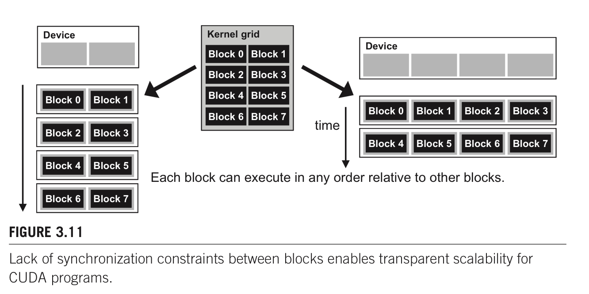

# GPU

* todo 
1. branch divergence
2. GPU 有什么类型的register


## Design Principle

### CPU VS GPU

> Reference
>
> 1. Berkeley CS 267 Lecture 7
>
> 2. UIUC 408 L1
> 3. Programming Massively Parallel Processors 3rd chapter 1


* 什么是GPU

GPU是heterogeneous chip. 有负责不同功能的计算模块


SMs: streaming multiprocessors

SPs: streaming processors : each SM have multiple SP that share control logic and instruction cache


* 为了设么设计

GPU design for high throughput, don't care about throughput so much

CPU design for low latency


* CPU GPU

CPU : multicore system : latency oriented 

GPU : manycore / many-thread system : throughput oriented


#### Idea to design throuput oriented GPU

* Idea 1 ： 去除CPU中让CPU serialize code运行更快的

CPU中包含out of order execution, branch predictor, memory prefetch等机制让CPU运行serialize code fast，但是这些部分占用很大的memory和chip。

GPU去除这些部分。


* Idea 2 ：larger number of smaller simpler core

相比起使用small number of complex core, GPU的工作经常simple core就可以处理。

但也带来了挑战，需要programmer expose large parallel从而充分利用全部的core


* idea 3：让simple core共享instruction stream，减少负责Fetch Decode的芯片面积

因为很多工作都是parallel的，所以多个small simple core共享instruction stream就可以，减少了chip上负责instruction stream的部分。

SIMT single instruction multiple threads. 

SIMT 与 SIMD 有一些不一样。SIMT可以平行thread，而SIMD只可以平行instruction


* idea 4：使用mask来解决branching

在CPU中使用branch prediction

在GPU中，使用mask来解决branching


* idea 5：hide latency instead of reduce latency

CPU通过fancy cache + prefetch logic来avoid stall

GPU通过lots of thread来hide latency。这依赖于fast switch to other threads, 也就需要keep lots of threads alive.


* GPU Register 特点

GPU的register通常很大，在V100里与half L1 cahce+shared memory一样大

经常也被叫做inverted memory hierchy


### Program Model

> 参考
>
> 1. UIUC ECE Lecture 2,3
> 1. Programming Massively Parallel Processors 3rd chapter 2,3

CUDA Threads: SPMD single program multiple data

CPU call GPU kernel function 是 asynchronize 的


#### Kernel function & Block

Grid -> Block -> Warp ( implementation 而不是program model ) -> threads 

每一个kernel function被map到一个grid上

threads in same block "shared memory" & synchronize

block之间的thread只能通过global memory的方法来进行信息交流

Block 被assign 到不同的streamming multi-professor (sm) 上. Threads are assigned to execution resources on a block by block basis.

block & warp execute in arbitary order

maxwell take max 32 blocks per sm

maxwell take max 2048 threads per sm

maxwell take max 1024 threads per block


如果device与host同时被使用，compiler会生成两个版本的代码。


#### SM warp scheduling

warp是sm内部的schedule unit。

size of warp 是取决于硬件的，现在的GPU硬件都是warp size32的，但是以后可能改变

最近的architecture，每一个SM可以同时运行多个warp的instruction。

warp within a block can be execute in any order w.r.t each other


* 为什么使用warp

为了share control unit


* block中thread到warp的映射

如果block是1D的，则每32个映射到一个warp上

如果block是2D/3D的，会先把2D/3D project到1D上，然后每32个thread映射到一个warp上


* 为什么每个SM中需要放多个warp，如果同一时间只能跑有限个warp？

如果一个warp的instruction无法立刻执行（等待前一个instruction的资源），则这个warp not selected for execution.

其余的resident warp nolonger waiting for resources会被运行。如果多个resident warp都可以运行，则会采用latency hiding的priority mechanism来选择先运行谁。

**zero-overhead scheduling** : selection of ready warps for execution avoid introduycing idle or waisting time into execution timeline. 

如果有sufficent resident warp，则hardware will likely find warp to execute at any point in time.

能够切换到其余的warp来hide latency是GPU不需要大的cache，不需要branch prediction等硬件，可以把更多的硬件给floating point operation的原因


#### Handle Corner Case

* handle 1d corner case

```cpp
__global__ void add( int* A, int* B, int* C, int n )
{
        i = blockIdx.x * blockDim.x + threadIdx.x;
      // avoid kernel larger than data
    if ( i < n )
      C[i] = A[i] + B[i];
}
```


* handle 2d corner case


```cpp
__global__ void RGB2GRAY(unsigned char* gray, unsigned char* rgb, int width, int height)
{
  int col = threadIdx.x + blockIdx.x * blockDim.x;
  int row = threadIdx.y + blockIdx.y * blockDim.y;
  if ( col < width && row < height )
  {
    // do computation
  }
}
```


#### Branch Divergence

GPU对于每一个thread使用predicated execution。

如果一个warp内的多个thread会走不同的path，则multiple path被实际运行。

```cpp
if ( threadIdx.x > 2 )
{
  // path 1
}
else
{
  // path 2
}
```

如果代码中有branching (if else)，但是warp内的thread只走一个path(都走了if condition)，不会有branching

一个解决branching的常用方法就是branch granularity是warp的倍数、这样就能保证一个warp内的全部thread都只走一个brach，而且依旧two cotrol path

```cpp
if ( threadIdx.x / WARP_SIZE > 2 )
{
  // path 1
}
else
{
  // path2
}
```


##### 改变algo来减少divergence

* 普通的reduction algorithm

work efficent

但是存在branch divergence


* 更改的reduction algorithm

work efficent

在除最后5个iteration（warp内的32thread）以外，没有branch divergence。

第一个iteration过后，绿色的部分的thread运行就结束了，不会和橙色的部分一起运行，也就避免了branch divergence


#### Synchronization within block

> Programming Massively Parallel Processors 3rd edition chapter 3

`__syncthreads()` 用来synchronize all threads in block

如果有if else then statement + syncthreads 在branch内部的话，all threads inside block either all run if or all run else. 否则就会wait forever

CUDA runtime只有在确保一个block所需要的全部resource都有的时候才会run block，否则会出现跑到一半发现resource不够，某些thread无法运行，其余的thread因为synchronize等待无法运行的thread。


* transparent scalability

同样的代码，在拥有不同资源的硬件上都可以运行。

blocks can execute in any order relative to each other, which allows for transparent scalability across different devices

CUDA为了保证transparent scalability，所以不允许block之间的synchronize。因为只有block之间不synchonize，block之间没有依赖关系，cuda runtime才可以arbitrary schedule block  on different hardware.




#### Grid-stride loop / thread granularity

> Ref
>
> 1. Berkeley CS 267 Lecture 7
> 2. PMPP Chapter 5


* 是什么

1. put more work into each thread and use fewer thread原来需要多个thread，现在使用一个threa实现


* 优点

1. Eliminating redundant work can ease the pressure on the instruction pro- cessing bandwidth and improve the overall execution speed of the kernel. 对重复工作结果进行服用
2. amortize threads creation/destruction cost


* 缺点

1. 每个thread使用更多的register，可能导致一个sm内总的thread数量减少（因为register constrain）。导致insufficent amount of parallelism


* 例子1

```cpp
int numSMs;
cudaDeviceGetAttribute(&numSMs, cudaDevAttrMultiProcessorCount, devId);
add<<<32 * numSMs, blockSize>>>(N, x, y);

// GPU function to add two vectors
__global__
void add(int n, float *x, float *y) {
  int index = blockDim.x * blockIdx.x + threadIdx.x;
  int stride = blockDim.x * gridDim.x;
  // 这里通过for loop对thread进行复用
  for (int i = index; i < n; i+=stride)
    y[i] = x[i] + y[i];
}
```


* 例子2

reuse tile from matrix M for multipel tile N


#### Memory Bandwidth 限制


#### Kernel切分决定

kernel之间有implicit barrier （kernel1的代码完全运行结束后，才会运行kernel2的代码）。如果kernel小而多的话，implicit barrier会成为overhead。


#### Get device property

```cpp
cudaDevicePeop dev_prop;
cudaGetDeviceProperties(&dev_prop, 0);

dev_prop.maxThreadsPerBlock;
dev_prop.multiProcessorCount;
dev_prop.clockRate;
dev_prop.maxThreadsDim[0/1/2];
dev_prop.maxGridSize[0/1/2];
dev_prop.warpSize;
dev_prop.regsPerBlock; // 每个sm可以使用的register的个数，通常与算法中总共的thread数量一起使用，从而确定每个thread可以使用多少个register，从而dynamic select which kernel to run。
dev_prop.sharedMemPerBlock; // 每个sm可以使用的shared memory大小。希望host code根据不同的hardware从而使用不同的shared memory大小，从而充分使用硬件。
```


#### Dynamic partition of resource

SM resource是动态分配给每一个block的，resource是有限的，需要决定block大小等来within limit of resource + use as many threads as possible


常见限制

1. num threads per sm
2. Num registers per sm
3. shared memory size per sm


##### 考虑block/sm threads/sm限制

thread到硬件的映射是以block为单位的。一个SM可以包含多个（有最多限制）的block。

如果SM内的一种多种resource不够支持最多block一起运行，cuda runtime则会以block为单位减少同时在一个SM上运行的block，从而保证all resources fall into limit of SM


* 假设 (下面的数据会依据使用的不同硬件改变)
1. SM take 8 blocks 
2. SM take 1536 threads 
3. 三个block分块的方式 $8*8, 16*16, 32*32$


* $8*8$ : 

64 threads per block

each sm can take 1536 / 64 = 24 blocks

但是sm限制最多8个block，也就是最多 8 * 64 = 512 threads ( out of 1536 threads ) go into one sm

这个是不好的，我们希望SM中的thread能够多到足够掩盖memory latency （warp schedule data已经好了的）


* $16 * 16$

256 threads per block

each sm can take 1536 / 256 = 6 blocks (小于block/sm的限制)

可以在硬件上使用full threads & block capacity


* $32 * 32$

1024 threads per block

each sm can take 1 block (小于block/sm的限制)

无法使用full threads


##### 考虑shared memory threads/sm block/sm限制

* 假设
1. 64 kb shared memory per SM
2. 2048 threads / sm
3. 150 GB/s bandwidth
4. 1000 GFlops
5. square matrix computation 使用 simple shared memory 16 / 32 的tile size
6. 使用shared memory进行tilening


* TILE_WIDTH 16

each block 使用 2 (submatrix M and N) * 16 * 16 * 4 bytes (float) = 2048 bytes shared memory

150 / 4 (bytes per float) * 16 = 600 GFlops : not yet fully utilize computation resources

64 kb / 2048 bytes/block = max 32 block per sm due to share memory constrain 

2048 threads / (16*16) = 8 block per sm due to threads limit

每一个时间点会有 2 (two load / threads) * 16*16 * 8 block/sm = 4096 pendig load (通过检查pending load来判断是否有让SM busy)。这个点很重要，因为使用多个thread的目的就是让sm有很多pending load，这样才能swap between warp


* TILE_WIDTH 32

each block 使用 2 * 32 * 32 * 4 bytes (float) = 8kb bytes share memory

150 / 4 (bytes per float) * 32 = 1200 GFlops : have potential to fully utilize computation resource

64/8 = max 8 block per sm due to share memory constrain

2048 / (32*32) = 2 block per sm due to threads limit

每一个时间点会有 2 * 32 * 32 * 2 = 4096 pending loads

同样的memory parallelsim exposed. 

尽管32的复用的内存更大，memory paralle与16一样。可能会存在一些block schedule的问题，因为更少的总block个数。


### Memory Model

> 参考
>
> 1. UIUC ECE Lecture 4
> 1. Berkeley CS 267 Lecture 7 on memory colesing
> 1. PMPP 3rd chapter 5


#### Hierchy of Memory

per thread register

per block shared mempry

per block l1 cache

per grid global memory

per grid l2 cache

per grid constant memory


global memory 是 off chip的

register / shared memory是on chip的


constant memory物理上在global memory上, 但是会cache for efficency 所以正确使用的话会很快

scope of constant varaible 是 across all grids. 是valid throughout program execution.


CUDA中pointer用来指向global memory


* 声明各种memory


如果没有使用 `__device__`, `__shared__`, `__constant__`的话，则是automatic variable。如果是一个变量的话会是register。如果是per thread array的话会是global memory。

per thread array (per thread local memory) 会被储存在 gloabl memory 中，因为compiler不知道这个array会有多长，无法把array拆分后放到regsiter中。


* 为什么使用shared memory & 如何使用shared memory

为了数据复用，就像是CPU里做blocking把数据放到cache上一样。

```cuda
__shared__ mymemory[SIZE];
extern __shared__ mymemory[];
kernelfunc<<<dimgrid, dimblock, sharememsize>>>(params);
```


* within block communication

使用shared memory + barrier


* between block communication

使用atomic, global memory


* register使用的注意

register是有限的，如果使用过多的register，会导致一个SM能够schedule的总block数量减少，减少总的thread数量


#### Memory Coalesing

* 什么是coalesing

the hardware combines, or *coalesces*, all these accesses into a consolidated access to consecutive DRAM locations / combined multiple request into a single request for consecutive locations。也就是硬件会融合多个临近的访问为一个对DRAM的访问

GPU中的cache主要作用是memory coalesing，来combine access to DRAM into burst to reduce 总的 num access to DRAM


##### DRAM 

* 原理

一个capacitor储存bit

一个select选择读取哪个capacitor

一个bit line read / write数据。每个bit line只读取一个bit的数据，也就是多个select里面只select一个

需要constantly check value / recharge value


* 特点

bit line的capacitance很大，导致速度很慢。

bit的capacitance很小，需要使用sense amplifier来放大信号


##### DRAM BANK

多个bit line组成core array

数据传输分为两个部分。core array -> column latches / buffer -> mux pin interface 

**burst** 当访问一个内存位置的时候，多个bit line的数据都会从core array传输到column latches，然后再使用mux来选择传送给bus interace哪个数据 / one burst of memory access to get data that used by multiple attemps to read.

**burst size** 读取一次memory address，会有多少个数据被放到buffer中。


* 充分利用burst：连续访问内存

第一次访问，全部4个数据都放到buffer里


第二次访问连续的数据，直接从buffer里读取数据，不用再去core array


**bursting** 每一次读取burst of data，读取的数据应该被充分使用，因为读取burst里面的两个数据的时间远远小于读取两个random address/两个burst。


##### Multiple Bank

只用burst并不能实现processor所需要的DRAM bandwidth。

因为bank访问core array cell的时间很长（下图蓝色部分）而实际使用bus interface传输数据时间很短（下图红色部分），通常比例是20:1， 如果只使用一个bank，interface bus会idle。所以需要在一个bus 上使用多个bank，来充分利用bus bandwidth。如果使用多个bank，大家交替使用interface bus，保证bus不会idle

通过多个bank链接到interface bus，从而让interface bus充分的使用，也就保证了每个时间都有数据从interface bus传送过来。


* 一个bus需要多少个bank？

如果访问core array与使用bus传输数据的时间比例是20:1，那么一个bus至少需要21个bank才能充分使用bus bandwidth。


一般bus有更多的bank，不仅仅是ratio+1，原因是

1. 使用更多的bank，更能让data spread out across bank。如果一块data只在一个bank上的话，需要多个burst才能完全访问（时间很久）。如果一块data在多个bank的话，可以overlap core array access time （总时间变短）
2. 每个bank可以存储的诗句有限，否则访问一个bank的latency会很大。


* 实现max bandwidth方法

In order to achieve the memory access bandwidth specified for device, there must be a 

1. sufficient number of threads making simultaneous memory accesses. 
2. Furthermore, these memory accesses must be evenly distributed to the channels and banks. 
3. Of course, each access to a bank must also be a coalesced access,


##### Multiple Channels

modern Double data rate （DDR） bus可以传输two word of data in each clock cycle. 

假设bus clock speed是1GHz， 每秒钟只能传送 8 bytes / words * 2 words per clock * 1 GHz = 16 GB/sec. 但是一般GPU processor要求128GB/s的数据

单独一个channel/一个bus interface不足以达到processor要求DRAM bandwidth，所以需要使用多个channel。


* interleaved data distribution 

是什么：把array spread across banks and channel in the memory system. 这样允许core array acccess time overlap, 减少总access time. 


##### Parallel memory & Parallel therad

1. good utilization of the potential access bandwidth of the DRAM system requires that many threads simultaneously access data that reside in different banks and channels.  
   1. 为了充分利用DRAM带宽，需要让多个thread同时访问DRAM数据，并且这些访问需要连续，需要在DRAM中分散在多个bank和channel上
2. the execution throughput of the device relies on good utilization of the parallel structure of the DRAM system.
   1. 充分利用DRAM贷款，需要访问在不同bank和channel上的的数据 （连续访问一段内存）。如果访问的数据在一个channel上，则无法充分利用带宽


##### Simple CUDA code analysis

对于N的访问是coalesced，多个thread在一个step访问的数据是连续的，也就是属于一个burst/充分使用burst


对于M的访问不是coalesced的，每个thread读取的数据都会导致一次memory burst。Step1的4个value需要4个burst。

需要注意的是，这里使用4个thread+多个iteration来读取数据M，也就对应着simple cuda code


##### Tiling CUDA code analysis

**corner turning** : turned a vertical access pattern into a horizontal access pattern. 

当使用tilnig+每个thread读取一个M N的时候，读取M也是burst的。这是因为比起上面的simple code使用iteration读取，这里使用多个thread读取，一次burst的数据会被临近的thread使用，而不是下一个iteration被清空。

这里对于M没有使用transpose，但是因为使用多个thread读取数据，依旧保证了burst，这与CPU代码需要使用transpose是不一样的。

同时shared memory使用的是SRAM，不像DRAM有burst的问题，所以读取M的shared memory的时候尽管不是连续读取也没有问题。shared memories are implemented as intrinsically high-speed on-chip memory that does not require coalescing to achieve high data access rate.


