## 3 Parallel Models

> Ref
>
> 1. MIT 6.182
> 2. Berkeley CS 267 Lecture 8
> 3. CMU 15.418 l3


1. shared address space 
   1. 线程之间通过共享的内存进行沟通
   2. synchronization primative也是通过shared variable实现的
   3. 是一种logical extension of uniprocessing model。
   4. 早起的超级计算机通过NUMA的方式实现shared address space, 但是现在很多超级计算机不实现shared address space了，因为很cost
   5. 实现：any processor can directly reference any memory location
2. message passing model of communication
   1. thread间通信通过sending/receiving信息。
   2. 从hardware角度更好实现。
   3. 大多数使用MPI message passing interface. 
   4. 实现：机器间通过通信来交流
3. Data-parallel model 
   1. 早期通过SIMD的方法实现
   2. 后面通过map(function, collection)的方法来实现SPMD single program multiple data. 底层通过编译器来转换为SIMD代码。
   3. 常见的两种：gather, scatter


### Shared Address Space: OpenMP

> Berkeley CS267 L4


#### 常用语句

尽管OpenMP变得越来越复杂，但是常用语句只有19个

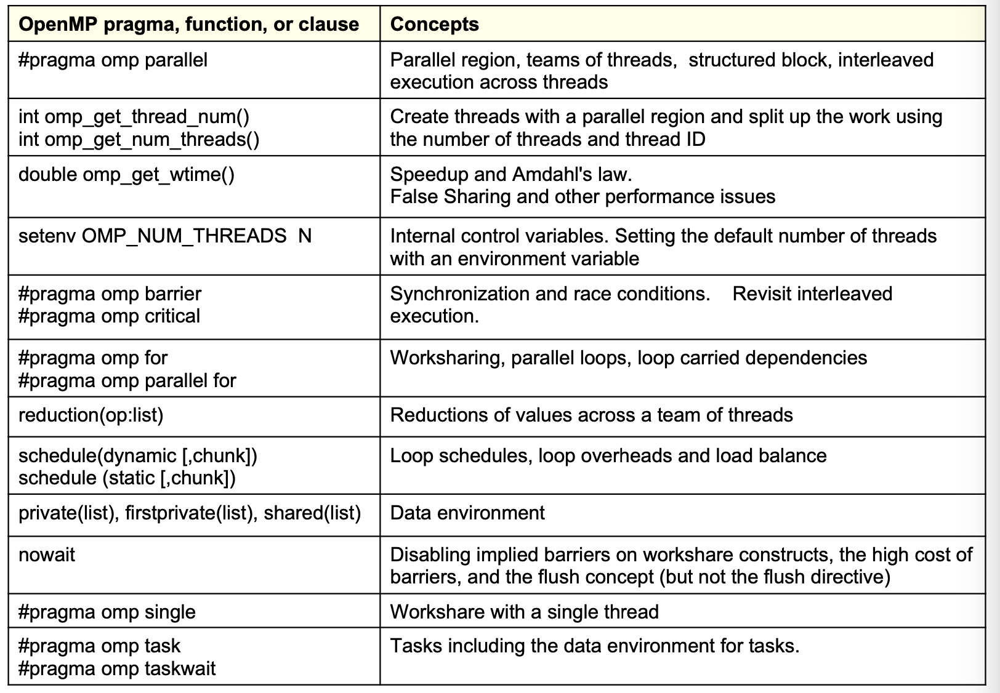


* compile

```shell
gcc -fopenmp // GNU
icc -fopenmp // Intel
```


#### 基础知识

1. 使用fork join parallelsim
2. 使用thread pool避免thread多次create，delete的overhead
3. 底层调用什么thread由compiler决定，openmp定义的只是API，底层的实现可能是不一样的


#### Num thread

openmp允许用户建议创建多少个thread，但是实际上创建多少个thread是由openmp决定的。

openmp内部由max number of thread可以被创建

openmp可能会silently provide to give you less thread

```cpp
omp_set_num_threads(4); // suggest to create 4 threads
#pragma omp parallel
{
  int id = omp_get_thread_num();
  int total = omp_get_num_threads(); // 实际上在运行的总thread个数, 可能不是4
}
```


#### Parallel

##### for

for 带有implicit barrier在后面

for loop内部需要尽量independent，这样才好parallel

把loop independent variable放到loop外面

```cpp
// 第一种方法
#pragma omp parallel
#pragma omp for
for (int i ... )

// 第二种方法
#pragma omp parallel for
for ( int i ... )
```


##### for collapse(k)

同时parallel多个for loop

原因是一个for loop parallel存在not enough parallelsim的情况(e.g. thread 4个，第一个for loop有6个大块，第二个for loop有10个快，这样的情况需要collapse否则会imbalance)

```cpp
#pragma omp parallel for collapse(2)
for( )
  for( )
```


##### for nowait

for loop后面自带implicit barrier，为了避免implicit barrier，可以使用nowait。

一般在后面不依赖for loop的结果使用nowait


##### schedule

当有variable work per each iter的时候，考虑使用dynamic schedule，但也要注意dynamic schedule是有overhead的

如果存在iteration少，但是每一个iteration的work不balance的情况。考虑对每一个iteration做更细粒度的切分，从而允许dynamic scheduler可以balance每一个thread/worker的工作

```cpp
schedule(static, [, chunk]) // static schedule
schedule(dynamic, [, chunk]) // dynamic schedule

#pragma omp parallel schedule(dynamic) for collapse(2)
for( )
  for( )
    function_call()
```


#### Memory Consistency

shared memory模型都有cache coherence问题

详细参考cache部分


##### False Sharing

是什么：两个thread访问不同的数据，但是不同的数据碰巧在一个cache line上面

pad array to avoid false sharing


#### Synchronization

##### critical

only 1 thread at a time can enter a critical region

一般当做atomic使用

```cpp
#pragma omp critical
// some line of code
```


##### barrier

all threads much reach barrier before any threads are allowed to processed

```cpp
#pragma omp barrier
// some line here
```


##### reduction

对于有reduction的var，会有基于op的local initi

update在local copy上

等parallel部分结束以后，再进行reduction

底层实现是hide的，可能底层是使用critical实现的，可能是使用lock实现的

```cpp
reduction(op: list)

double ave = 0.0d;
#pragma omp parallel for reductrion(+:ave)
for( )
  ave += data[i]
print(ave) // ave after reduction
```


##### share/private/firstprivate/default(none)

* default(none)

使用了default(none)以后，所有使用到的var都需要声明是private/share。如果不声明的话compiler会报错。

default(none)是一种好的coding habbit。


* private(list)

create new local copy of var for each thread

private copy是uninitialized的！！！


* firstprivate(list)

create new local copy of var for each thread, based on the old value

initialize local copy with old value。 是存在initialize的


##### single

block of code that is executed by only one thread

implicit barrier at the end


##### Flush

Flush forces data to be updated in memory so other threads see the most recent value

目的是保证内存的view是一致的


#### Task

thread are assigned to perform work of each task

Task: independent set of work that contain (1) code to execute (2) data to compute with

 

TODO: 不太常用，用到的时候再看


### Distributed Memory Architecture

> Ref
>
> Berkeley CS 267 Lecture 9

#### latency & bandwidth


* effective bandwith

bandwith分为理论值和effective bandwith，因为有packet overhead。通常bigger message get better effective bandwith.

effective bandwith很大程度上受到software的影响，因为是sw决定了packet的大小，overhead等等多少。

下面的图展示了使用不同package方法，不同的message size，得到的efficent bandwidth


* bisection bandwith

最小cut把网络分割成两个部分，cut过的bandwidth有多大

对于n 2 n的算法很重要


#### terms


diameter是网络中的longest shortest path


#### Topology


hypercube


* dragonfly

一种混合方法，对于不同层级使用不同的硬件进行链接。


使用random routing来避免对某一个节点带来过多的压力。


### Message Passing Model: MPI

> Ref
>
> Berkeley CS 267 Lecture 9
>
> Berkeley CS 267 Lecture 10
>
> MPI Tutorial [link](https://mpitutorial.com/tutorials/)
>
> 高性能计算之并行编程技术 MPI并行程序设计


* 包含什么

1. communication
   1. point to point send and receive
   2. Collective broadcast, scatter, gather
2. synchronization
   1. barrier
3. enquiries :  how many process, who am i


#### Basic Ideas
* groups

processes belongs to group


* rank

processes在group的什么位置


* message

包含 size, data type, tag(context)

data type 用于标注发送的是什么类型的数据，可以是用户定义的非连续数据。有些实现中PoD的data type会比用户定义的data type要快

tag用于标注数据，从而保持数据的前后顺序。特可以使用MPI_ANY_TAG来不检查tag


* tag

有时候 A 需要传递很多不同的消息给 B。为了让 B 能比较方便地区分不同的消息，MPI 运行发送者和接受者额外地指定一些信息 ID (正式名称是*标签*, *tags*)。当 B 只要求接收某种特定标签的信息的时候，其他的不是这个标签的信息会先被缓存起来，等到 B 需要的时候才会给 B。


##### datatype matching

* 规则


##### timing

```cpp
double MPI_Wtime(void);  // unit in second
double MPI_Wtick(); // second of clock, 也就是对应记时的精度
```


#### Enquiries

##### Who am I

```cpp

#include "mpi.h"
#include <stdio.h>
int main( int argc, char *argv[] )
{
    int rank, size;
    MPI_Init( &argc, &argv );
    MPI_Comm_size( MPI_COMM_WORLD, &size ); // 当前comm一共有多少个process，由cml设定
    MPI_Comm_rank( MPI_COMM_WORLD, &rank ); // 当前process是第几个rank
    printf( "I am %d of %d\n", rank, size );
    MPI_Finalize();
    return 0;
}
```


* MPI_Init

在 `MPI_Init` 的过程中，所有 MPI 的全局变量或者内部变量都会被创建。举例来说，一个通讯器 communicator 会根据所有可用的进程被创建出来（进程是我们通过 mpi 运行时的参数指定的），然后每个进程会被分配独一无二的秩 rank


##### Group

* MPI_Comm_group

```cpp
MPI_Comm_group(
	MPI_Comm comm,
	MPI_Group* group)
```


特点

1. 调用 `MPI_Comm_group`会得到对该组对象的引用。 
2. 组对象的工作方式与通讯器对象相同，不同之处在于您不能使用它与其他秩进行通信（因为它没有附加上下文）。 您仍然可以获取组的秩和大小（分别为 `MPI_Group_rank` 和 `MPI_Group_size`）。
3. 组特有的功能而通讯器无法完成的工作是可以使用组在本地构建新的组。 在此记住本地操作和远程操作之间的区别很重要。 远程操作涉及与其他秩的通信，而本地操作则没有。 
   1. 创建新的通讯器是一项远程操作，因为所有进程都需要决定相同的上下文和组，
   2. 而在本地创建组是因为它不用于通信，因此每个进程不需要具有相同的上下文。 您可以随意操作一个组，而无需执行任何通信。


* MPI_Comm_create_group

```cpp
MPI_Comm_create_group(
	MPI_Comm comm,
	MPI_Group group,
	int tag,
	MPI_Comm* newcomm)
```


特点

1. 这是一个用于创建新communicator的函数，但无需像 `MPI_Comm_split` 之类那样需要进行计算以决定组成，该函数将使用一个 `MPI_Group` 对象并创建一个与组具有相同进程的新通讯器。
   1. MPI_Comm_split(MPI_COMM_WORLD, color, world_rank, &row_comm); 通过首先计算color，然后把color相同的process组成一个新的communicator
   2. 有些时候我们并不希望全部的process都有新的communicator，有些时候我们希望直接使用某几个process创建communicator。


* example

```cpp
// 获取原始通讯器的等级和大小
int world_rank, world_size;
MPI_Comm_rank(MPI_COMM_WORLD, &world_rank);
MPI_Comm_size(MPI_COMM_WORLD, &world_size);

// 获取 MPI_COMM_WORLD 中的进程组
MPI_Group world_group;
MPI_Comm_group(MPI_COMM_WORLD, &world_group);

int n = 7;
const int ranks[7] = {1, 2, 3, 5, 7, 11, 13};

// 构造一个包含 world_group 中所有主要秩的组
MPI_Group prime_group;
MPI_Group_incl(world_group, 7, ranks, &prime_group);

// 根据组创建一个新的通讯器
MPI_Comm prime_comm;
MPI_Comm_create_group(MPI_COMM_WORLD, prime_group, 0, &prime_comm);

int prime_rank = -1, prime_size = -1;
// 如果此秩不在新的通讯器中，则为
// MPI_COMM_NULL。使用 MPI_COMM_NULL 作为 MPI_Comm_rank 或
// MPI_Comm_size 的错误
// At the end, we have to be careful to not use prime_comm on processes which don’t have it, therefore we check to ensure that the communicator is not MPI_COMM_NULL, which is returned from MPI_Comm_create_group on the ranks not included in ranks. 
if (MPI_COMM_NULL != prime_comm) {
	MPI_Comm_rank(prime_comm, &prime_rank);
	MPI_Comm_size(prime_comm, &prime_size);
}

printf("WORLD RANK/SIZE: %d/%d \t PRIME RANK/SIZE: %d/%d\n",
	world_rank, world_size, prime_rank, prime_size);

MPI_Group_free(&world_group);
MPI_Group_free(&prime_group);
MPI_Comm_free(&prime_comm);
```


##### Communicator

* Communicator basic

communicator两个部分组成。

1. context 即区分一个通讯器与另一个通讯器的上下文（或 ID） The context is what prevents an operation on one communicator from matching with a similar operation on another communicator. 上下文阻止了与一个通讯器上的操作匹配的另一通讯器上的类似操作。 MPI 在内部为每个通讯器保留一个 ID，以防止混淆。
2. group 及该通讯器包含的一组进程。group是通讯器中所有进程的集合。 对于 `MPI_COMM_WORLD`，这是由 `mpiexec` 启动的所有进程。 对于其他通讯器，组将有所不同。 


MPI_COMM_WORLD

1. 默认communicator
2. 包含所有threads
2. 一旦MPI_INIT被调用 则会产生一个预定义组内通信域MPI_COMM_WORLD 它包括 所有的进程


程序默认使用default comm。 当程序规模开始变大时，这变得不那么实用了，我们可能只想一次与几个进程进行对话。 在本次教程中，我们将展示如何创建新的通讯器，以便一次与原始线程组的子集进行沟通。

在MPI中，可以与所在communicator中其余所有process进行通信，也就需要以构造不同的communicator。


创建新的comm

1. 创建新的通讯器是一项远程操作，因为所有进程都需要决定相同的上下文和组


* MPI_Comm_CREATE


特点

1. 根据group创建communicator
2. 对于不再group中的进程，返回MPI_COMm_null


* MPI_Comm_split

```cpp
MPI_Comm_split(
	MPI_Comm comm,
	int color,
	int key,
	MPI_Comm* newcomm)
```

目的 : 
* 通过基于输入值 color 和 key 将通讯器“拆分”为一组子通讯器来创建新的通讯器。 在这里需要注意的是，原始的通讯器并没有消失，但是在每个进程中都会创建一个新的通讯器。 
* 第一个参数 comm 是通讯器，它将用作新通讯器的基础。 这可能是 MPI_COMM_WORLD，但也可能是其他任何通讯器。 
* 第二个参数 color 确定每个进程将属于哪个新的通讯器。 为 color 传递相同值的所有进程都分配给同一通讯器 (e.g. 使用 rank % stride 得到新的color)。 如果 color 为 MPI_UNDEFINED，则该进程将不包含在任何新的通讯器中。 
* 第三个参数 key 确定每个新通讯器中的顺序（秩）。 传递 key 最小值的进程将为 0，下一个最小值将为 1，依此类推。 如果存在平局，则在原始通讯器中秩较低的进程将是第一位。 
* 最后一个参数 newcomm 是 MPI 如何将新的通讯器返回给用户。
* comm内每一个process都需要执行color，都会成为新的comm中的一部分。


例子


```cpp
// 获取原始通讯器的秩和大小
int world_rank, world_size;
MPI_Comm_rank(MPI_COMM_WORLD, &world_rank);
MPI_Comm_size(MPI_COMM_WORLD, &world_size);

int color = world_rank / 4; // 根据行确定颜色

// 根据颜色拆分通讯器，然后调用
// 利用原始秩
MPI_Comm row_comm;
MPI_Comm_split(MPI_COMM_WORLD, color, world_rank, &row_comm);
// 我们使用原始秩（world_rank）作为拆分操作的 key。 由于我们希望新通讯器中的所有进程与原始通讯器中的所有进程处于相同的顺序，因此在这里使用原始等级值最有意义，因为它已经正确地排序了。 

int row_rank, row_size;
MPI_Comm_rank(row_comm, &row_rank);
MPI_Comm_size(row_comm, &row_size);

printf("WORLD RANK/SIZE: %d/%d \t ROW RANK/SIZE: %d/%d\n",
	world_rank, world_size, row_rank, row_size);
//  当您在 MPI 程序中显示内容时，每个进程都必须将其输出发回启动 MPI 作业的位置，然后才能将其打印到屏幕上。

MPI_Comm_free(&row_comm);
```


* MPI_Comm_dup

它创建了一个通讯器的副本。 似乎存在一个仅创建副本的函数似乎很奇怪，但这对于使用库执行特殊函数的应用（例如数学库）非常有用。 在这类应用中，重要的是用户代码和库代码不要互相干扰。 为了避免这种情况，每个应用程序应该做的第一件事是创建 `MPI_COMM_WORLD` 的副本，这将避免其他使用 `MPI_COMM_WORLD` 的库的问题


#### Point to Point Communication


##### Blocking Send & Receive

参数讲解

1. 第一个参数是数据缓存。
2. 第二个和第三个参数分别描述了数据的数量和类型。`MPI_send` 会精确地发送 count 指定的数量个元素，`MPI_Recv` 会**最多**接受 count 个元素（之后会详细讲）。
3. 第四个和第五个参数指定了发送方/接受方进程的秩以及信息的标签。
4. 第六个参数指定了使用的 communicator。`MPI_Recv` 方法特有的最后一个参数提供了接受到的信息的状态。


* MPI_SEND

```cpp
MPI_SEND(start, count, datatype, dest:integer rank, tag, comm)
```


特点

1. 方程返回以后，就可以对memory buffer进行复用了（因为是block）. When this function returns, the data has been delivered to the system and the buffer can be reused. 
2. 尽管是block的算法，并不代表rece已经搜到数据，方程返回是因为user data被拷贝到了local buffer中，所以safe to continue。The message may not have been received by the target process.


* MPI_RECV

```cpp
MPI_RECV(start, count, datatype, source, tag, comm, status)
```


特点

1. 方程只有在找到特定的source和tag以后才会返回，否则就会blocking不往下走。Waits until a matching (both source and tag) message is received from the system, and the buffer can be used
2.  status是一个data structure包含很多信息，包括数据真正传输的大小是多少。status contains further information (e.g. size of message)


* sample program

rank 0 发送信息

rank 1 接受信息

发送大小为1的一个int


进程1直接执行接收消息的操作, 这里它使用buf作为接收缓冲区 由此可见 对于同 一个变量 在发送进程和接收进程中的作用是不同的

```cpp
#include “mpi.h”
#include <stdio.h>
int main( int argc, char *argv[]) 
{
  int rank, buf;
  MPI_Status status;
  MPI_Init(&argv, &argc);
  MPI_Comm_rank( MPI_COMM_WORLD, &rank );
  /* Process 0 sends and Process 1 receives */
  if (rank == 0) {
    buf = 123456;
    MPI_Send( &buf, 1, MPI_INT, 1, 0, MPI_COMM_WORLD);
  }
  else if (rank == 1) {
    MPI_Recv( &buf, 1, MPI_INT, 0, 0, MPI_COMM_WORLD,&status );
    printf( “Received %d\n”, buf );
  }
  MPI_Finalize();
  return 0; 
}
```


* comm with buffer

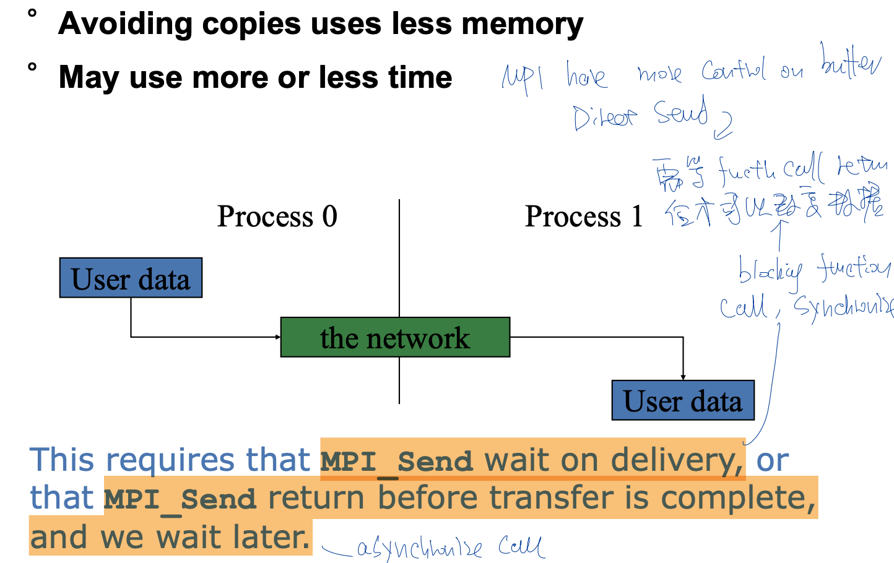

特点

1. 缺点是需要对数据进行二次拷贝
2. 优点事拷贝完数据以后，就可以对locak varaible进行更改了。


##### Blocking Deadlock 触发与避免

* deadlock case 1

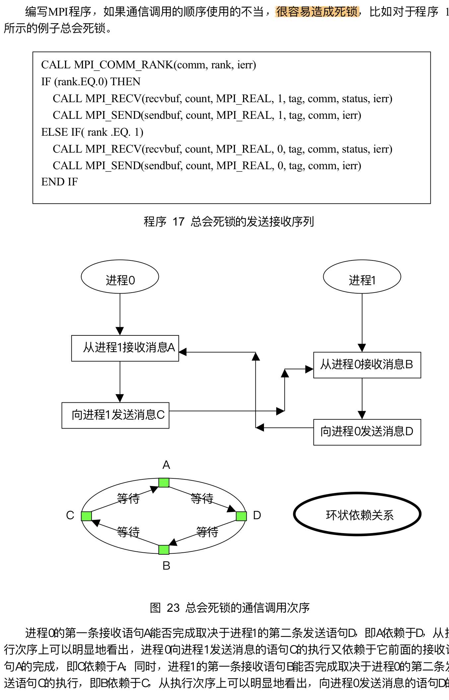


* deadlock case 2

If there is insufficient storage at the destination, the send must wait for the user to provide the memory space (through a receive)

导致两个process都在等待另一个process有空余的buffer出来。


* no deadlock example

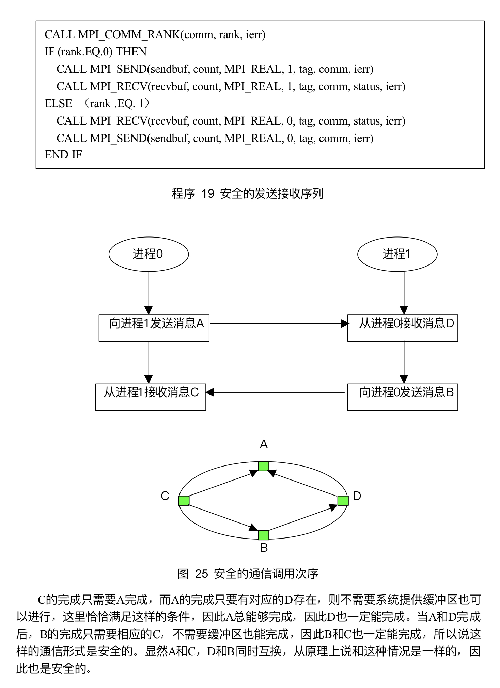


* sample ring program that avoid deadlock

这个环程序在进程0上面初始化了一个值-1，赋值给 token。然后这个值会依次传递给每个进程。程序会在进程0从最后一个进程接收到值之后结束。如你所见，我们的逻辑避免了死锁的发生。具体来说，进程0保证了在想要接受数据之前发送了 token。所有其他的进程只是简单的调用 `MPI_Recv` (从他们的邻居进程接收数据)，然后调用 `MPI_Send` (发送数据到他们的邻居进程)把数据从环上传递下去。`MPI_Send` 和 `MPI_Recv` 会阻塞直到数据传递完成。因为这个特性，打印出来的数据是跟数据传递的次序一样的。用5个进程的话，输出应该是这样的：

```cpp
int token;
if (world_rank != 0) {
    MPI_Recv(&token, 1, MPI_INT, world_rank - 1, 0,
             MPI_COMM_WORLD, MPI_STATUS_IGNORE);
    printf("Process %d received token %d from process %d\n",
           world_rank, token, world_rank - 1);
} else {
    // Set the token's value if you are process 0
    token = -1;
}
MPI_Send(&token, 1, MPI_INT, (world_rank + 1) % world_size,
         0, MPI_COMM_WORLD);

// Now process 0 can receive from the last process.
if (world_rank == 0) {
    MPI_Recv(&token, 1, MPI_INT, world_size - 1, 0,
             MPI_COMM_WORLD, MPI_STATUS_IGNORE);
    printf("Process %d received token %d from process %d\n",
           world_rank, token, world_size - 1);
}
```


##### Blocking SendRecv

* MPI_Sendrecv

特点

1. 一条语句，同时发送与接受数据
2. 与send + recv 相等，但是避免了deadlock。因为MPI系统会决定通信的顺序是什么样子的
3. 不对称的，发送的消息可以被普通recv接受，接受的消息可以被普通send发送
4. send recv buffer不能重叠。


* MPI_Sendrecv_Replace

特点

1. 使用一个buffer，节省了一个buffer


##### Non-Blocking

* comm without buffer


特点

1. 避免把数据需要二次拷贝到local buffer中
2. 多个process之间直接通过user data进行沟通
2. 常用于overlap comp with comm
2. 非阻塞通信调用返回时一般该通信操作还没有完成 因此对于非阻塞的发 送操作 发送缓冲区必须等到发送完成后才能释放
2. return immediately after funciton is called
6. send/recv并不一定立刻开始，在某些imp中，可能在wait调用后才会开始。
7. 需要调用wait以后才能访问数据，否则对数据的访问是undeterinistic的
8. 调用返回并不意味着消息已经成功发送 它只表示该消息可以被发送
9. MPI_WAIT以非阻塞通信对象为参数 一直等到与该非阻塞通信对象相应的非阻塞通信 完成后才返回 同时释放该阻塞通信对象 因此程序员就不需要再显式释放该对象 


* API

```cpp
MPI_Request request; // 初始化request handles
MPI_Status status;
MPI_Isend(start, count, datatype, dest, tag, comm, &request);
MPI_Irecv(start, count, datatype, dest, tag, comm, &request);
MPI_Wait(&request, &status); // 通过request handle进行wait判断

// 等待某一些handler完成
MPI_Waitall(count, array_of_requests, array_of_statuses)
MPI_Waitany(count, array_of_requests, &index, &status)
MPI_Waitsome(count, array_of_requests, array_of indices, array_of_statuses)
```


非阻塞通信与4中mode可以组合


阻塞send可以与非阻塞recv混用，反之也成立。


* overlap comm with comp

原则是尽早开始通信，尽晚完成通信，这样有更多的时间计算和通信可以重叠。


##### Repete Non-Blocking

如果一个通信会被重复执行，MPI提供重复非阻塞通信。将通信参数和MPI的内部对象建立固定联系，然后通过固定联系对象重复任务。


特点

1. 通信的初始化操作并没有启动消息通信 消息真正开始通信是由MPI_START触发的
1. 消息的完成操作并不释放相应的非阻塞通信对象 只是将其状态置为非活动状态 若下面进行重复通信 则再由MPI_START将该对象置为活动状态
1. 当不需要通信的时候再通过MPI_request_free释放


* API


MPI_START 

MPI_START调用 之前 该对象处于非激活状态 一旦使用该调用 该调用成为激活状态

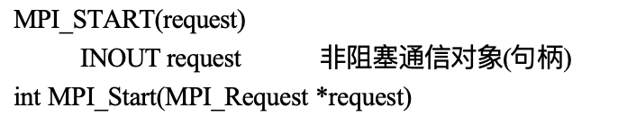


##### order

无论是blocking还是non-blocking，MPI都会保证通信的顺序。

若两个 消息的消息信封都和自己的消息信封吻合 则必须先接收首先发送的消息 哪怕后发送的消息首先到达 该接收操作也必须等待第一个消息

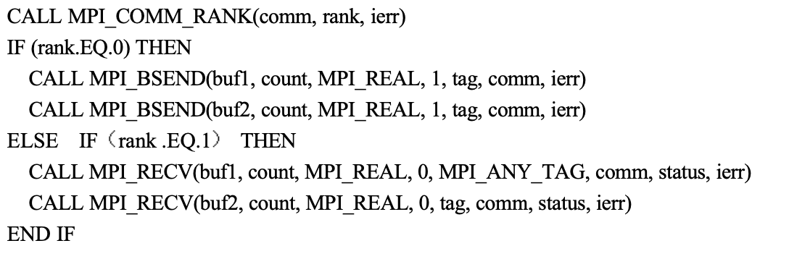

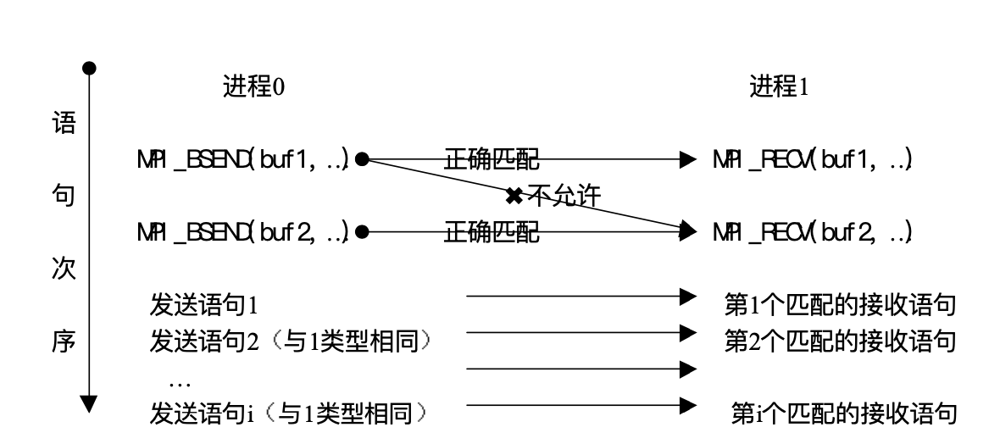


#### 4 Comm Mode

1. stanfard mode
2. buffer mode
3. synchronous mode
4. Ready mode 

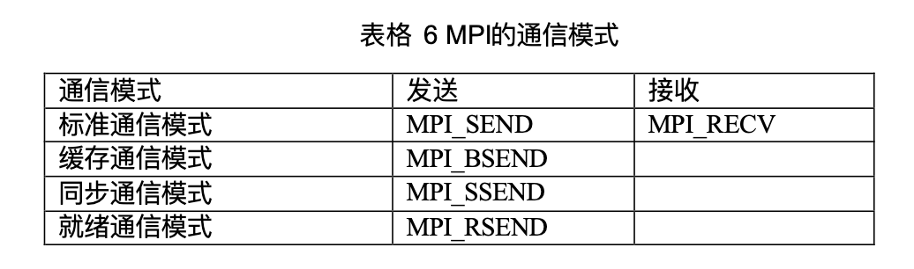

##### Standard

特点

1. 是否对发送的数据进行缓存是由MPI自身决定的
   1. MPI也可以不缓存将要发出的数据 这样只有当相应的接收调用被执行后 并且发送数据完全到达接收缓冲区后 发送操作才算完成
   2. 如果缓存数据的话，数据放到缓存上就会方程返回
2. 发送操作不管接受操作是否执行，都可以执行。


##### Buffer

特点

1. 用户提供buffer让系统来使用。programmer有义务分配足够大的buffer从而避免deadlock的情况。用户自己对缓存区进行申请，使用释放。
1. 不管接受操作是否启动，发送操作都可以执行，但是发送前需要有缓冲区可以用。
1. Non-blocking发送，方程返回不意味着buffer可以被使用。只有当buffer中的消息发送出去后，才可以释放buffer
1. blocking发送，方程返回意味着buffer可以被使用
   1. 两个可能性，一个是拷贝到系统buffer中，一个是已经直接发送


```cpp
MPI_BUFFER_ATTACH();
MPI_BUFFER_DETACH(); // 阻塞，直到buffer可以复用
```


##### Synchronize

特点

1. 发送的开始不依赖于接受是否开始。但是方程返回必须等待对应接受开始后才可以返回
2. 方程返回后，意味着发送缓冲区的数据已经被写入到系统缓冲区，并且已经开始发送（因为已经开始接受了，所以肯定已经开始发送），这样返回后发送缓冲区可以重复使用。


##### Ready

特点

1. 只有当接受进程启动时，才可以在发送进程进行发送操作。
2.  对于non-blocking return，方程返回并不意味着发送已经完成
3. 对于blocking return，发送缓冲区可以重复使用


#### Collective Operators

组通信由哪些进程参加 以及组通信的上下文 都是由该组通信调用的通信域communicator限定的


* 多对一、一对多

Bcast, Gather, Gatherv, Reduce, Reduce_scatter, Scan, Scatter, Scatterv


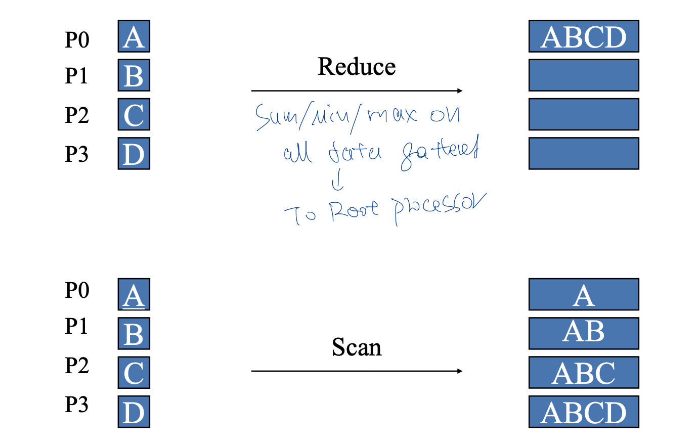


* 多对多

Allgather, Allgatherv, Allreduce, Alltoall, Alltoallv,

结果会被分享到每一个process上，不仅仅是root proces会看到


* v

允许variable size的chunk


* implementation

对于non-communitive operator，会保证计算的order是一致的


##### lower bound

on latency and bandwidth


##### Blocking Broadcast 

```cpp
MPI_Bcast(
    void* data,
    int count,
    MPI_Datatype datatype,
    int root,
    MPI_Comm communicator)
```


特点

1. 每一个process都会运行 `MPI_Bcast` 这行代码。第四个参数用于标注被broadcast的数据是源自哪个process。
   1. 当根节点(在我们的例子是节点0)调用 `MPI_Bcast` 函数的时候，`data` 变量里的值会被发送到其他的节点上。
   1. 当其他的节点调用 `MPI_Bcast`的时候，`data` 变量会被赋值成从根节点接受到的数据。
1. block until everyone receive broadcast information ?? 还是数据到buffer里？？
1. 执行结果是root进程的buffer被拷贝到其余的进程中


* 不高效的使用send recv实现MPI_Bcast

这里的实现只是为了说明一切op都可以使用send recv实现。但是这里的实现并不是最好的。更好的实现参考AllGather的bruck algorithm/Ring algorithm

```cpp
void my_bcast(void* data, int count, MPI_Datatype datatype, int root,
              MPI_Comm communicator) {
  int world_rank;
  MPI_Comm_rank(communicator, &world_rank);
  int world_size;
  MPI_Comm_size(communicator, &world_size);

  if (world_rank == root) {
    // If we are the root process, send our data to everyone
    int i;
    for (i = 0; i < world_size; i++) {
      if (i != world_rank) {
        MPI_Send(data, count, datatype, i, 0, communicator);
      }
    }
  } else {
    // If we are a receiver process, receive the data from the root
    MPI_Recv(data, count, datatype, root, 0, communicator,
             MPI_STATUS_IGNORE);
  }
}
```


##### Blocking Reduce

* MPI_Reduce

```cpp
MPI_Reduce(
    void* send_data,
    void* recv_data,
    int count,
    MPI_Datatype datatype,
    MPI_Op op,
    int root,
    MPI_Comm communicator)
```

特点
1. `send_data` 参数是每个进程都希望归约的 `datatype` 类型元素的数组。
1. `recv_data` 仅与具有 `root` 秩的进程相关。 `recv_data` 数组包含归约的结果，大小为`sizeof（datatype）* count`。 
1. `op` 参数是您希望应用于数据的操作。 MPI 包含一组可以使用的常见归约运算。  
1. 给定op被认为是assotiative + communative
1. 用户自定义op被认为是 assotiative, 但是不communative


操作

1. `MPI_MAX` - 返回最大元素。
2. `MPI_MIN` - 返回最小元素。
3. `MPI_SUM` - 对元素求和。
4. `MPI_PROD` - 将所有元素相乘。
5. `MPI_LAND` - 对元素执行逻辑*与*运算。
6. `MPI_LOR` - 对元素执行逻辑*或*运算。
7. `MPI_BAND` - 对元素的各个位按位*与*执行。
8. `MPI_BOR` - 对元素的位执行按位*或*运算。
9. `MPI_MAXLOC` - 返回最大值和所在的进程的秩。
10. `MPI_MINLOC` - 返回最小值和所在的进程的秩。


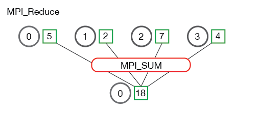

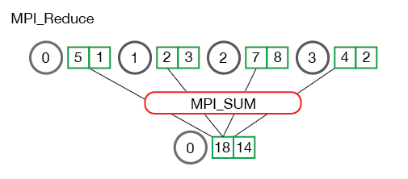

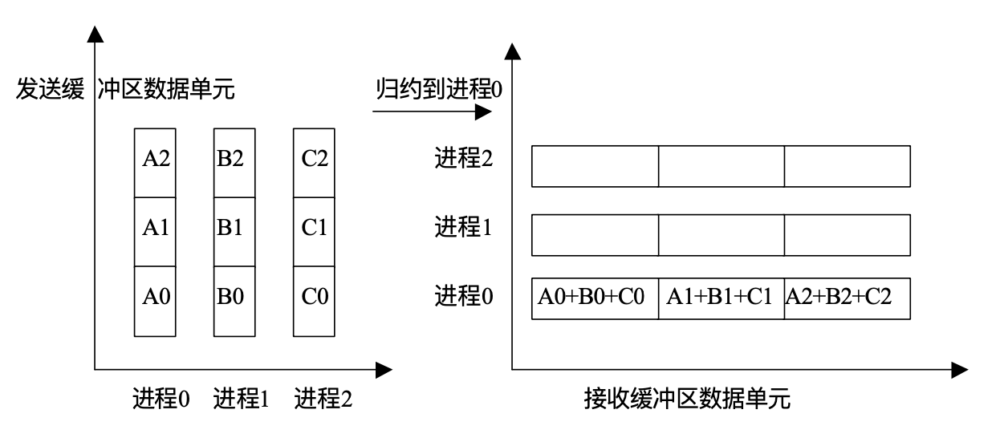

* MPI_Allreduce

```cpp
MPI_Allreduce(
    void* send_data,
    void* recv_data,
    int count,
    MPI_Datatype datatype,
    MPI_Op op,
    MPI_Comm communicator)
```

特点

1. `MPI_Allreduce` 将归约值并将结果分配给所有进程。

2. `MPI_Allreduce` 等效于先执行 `MPI_Reduce`，然后执行 `MPI_Bcast`. 也就是如果原来操作是reduce+bcast的话，最好用allreduce进行替代。
3. allreduce也相当于每一个process都作为root进行了一次reduce


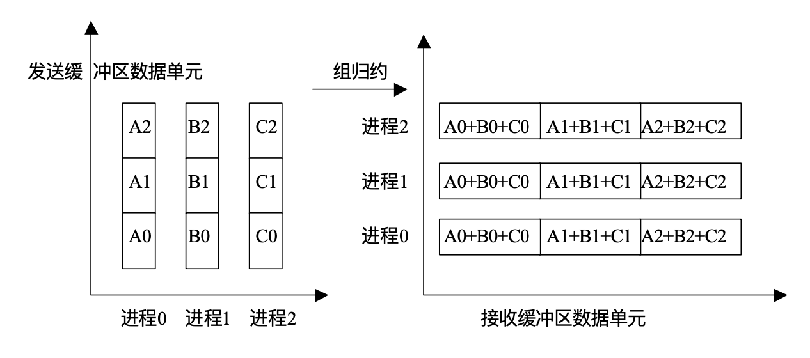

* Allreduce 计算 array std

```cpp
rand_nums = create_rand_nums(num_elements_per_proc);

// Sum the numbers locally
float local_sum = 0;
int i;
for (i = 0; i < num_elements_per_proc; i++) {
  local_sum += rand_nums[i];
}

// Reduce all of the local sums into the global sum in order to
// calculate the mean
float global_sum;
MPI_Allreduce(&local_sum, &global_sum, 1, MPI_FLOAT, MPI_SUM,
              MPI_COMM_WORLD);
float mean = global_sum / (num_elements_per_proc * world_size);

// Compute the local sum of the squared differences from the mean
float local_sq_diff = 0;
for (i = 0; i < num_elements_per_proc; i++) {
  local_sq_diff += (rand_nums[i] - mean) * (rand_nums[i] - mean);
}

// Reduce the global sum of the squared differences to the root
// process and print off the answer
float global_sq_diff;
MPI_Reduce(&local_sq_diff, &global_sq_diff, 1, MPI_FLOAT, MPI_SUM, 0,
           MPI_COMM_WORLD);

// The standard deviation is the square root of the mean of the
// squared differences.
if (world_rank == 0) {
  float stddev = sqrt(global_sq_diff /
                      (num_elements_per_proc * world_size));
  printf("Mean - %f, Standard deviation = %f\n", mean, stddev);
}
```

在上面的代码中，每个进程都会计算元素的局部总和 `local_sum`，并使用 `MPI_Allreduce `对它们求和。 在所有进程上都有全局总和后，将计算均值 `mean`，以便可以计算局部距平的平方 `local_sq_diff`。 一旦计算出所有局部距平的平方，就可以通过使用 `MPI_Reduce` 得到全局距平的平方 `global_sq_diff`。 然后，根进程可以通过取全局距平的平方的平均值的平方根来计算标准差。


* mpi_reduce_scatter


特点

1. 相当于调用reduce后调用scatter

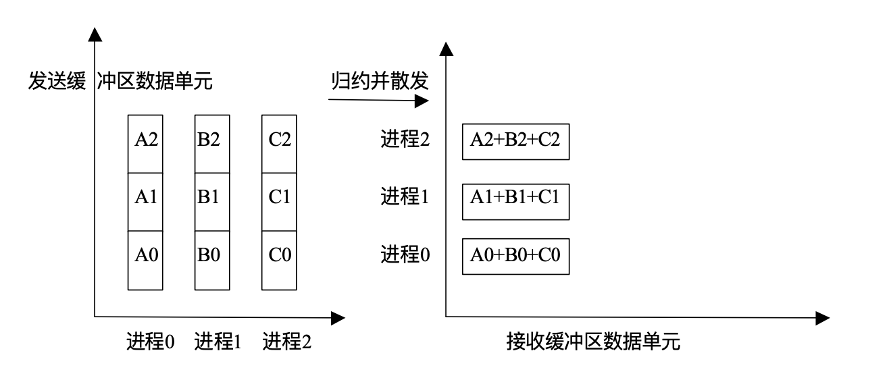

##### Blocking Scatter

* MPI_Scatter

```cpp
MPI_Scatter(
    void* send_data,
    int send_count,
    MPI_Datatype send_datatype,
    void* recv_data,
    int recv_count,
    MPI_Datatype recv_datatype,
    int root,
    MPI_Comm communicator)
```

`MPI_Bcast` 给每个进程发送的是*同样*的数据，然而 `MPI_Scatter` 给每个进程发送的是一个数组的一部分数据

`send_count` 和 `send_datatype` 分别描述了发送给每个进程的数据数量和数据类型。

​		如果 `send_count` 是1，`send_datatype` 是 `MPI_INT`的话，进程0会得到数据里的第一个整数，以此类推。

​		如果`send_count`是2的话，进程0会得到前两个整数，进程1会得到第三个和第四个整数，以此类推

​		一般来说`send_count`会等于数组的长度除以进程的数量

`recv_data` 参数是一个缓存，它里面存了`recv_count`个`recv_datatype`数据类型的元素。


* MPI_SCatterv

特点

1. 向不同process发送长度不同的数据段，指明了dispalcement


##### Blocking Gather

* MPI_Gather

```cpp
MPI_Gather(
    void* send_data,
    int send_count,
    MPI_Datatype send_datatype,
    void* recv_data,
    int recv_count,
    MPI_Datatype recv_datatype,
    int root,
    MPI_Comm communicator)
```


特点

1. `recv_count`参数是从*每个进程*接收到的数据数量，而不是所有进程的数据总量之和
1. 对于所有非根进程 接收消息缓冲区被忽略 但是各个进程必须提供这一参数


* MPI_GatherV


特点

1. 从不同进程接受不同数量的数据
2. 指出了不同进程接受数据元素的个数，以及这些数据在root接收缓冲区存放的起始位置


* MPI_Allgather

```cpp
MPI_Allgather(
    void* send_data,
    int send_count,
    MPI_Datatype send_datatype,
    void* recv_data,
    int recv_count,
    MPI_Datatype recv_datatype,
    MPI_Comm communicator)
```


特点

1. `MPI_Allgather`会收集所有数据到所有进程上。

2. 从最基础的角度来看，`MPI_Allgather`相当于一个`MPI_Gather`操作之后跟着一个`MPI_Bcast`操作
3. Allgather也相当于每一个进程都作为root执行了一次MPI_Allgather调用


* use MPI_Scatter and MPI_Gather to compute avg value of array

```cpp
if (world_rank == 0) {
  rand_nums = create_rand_nums(elements_per_proc * world_size);
}

// Create a buffer that will hold a subset of the random numbers
float *sub_rand_nums = malloc(sizeof(float) * elements_per_proc);

// Scatter the random numbers to all processes
MPI_Scatter(rand_nums, elements_per_proc, MPI_FLOAT, sub_rand_nums,
            elements_per_proc, MPI_FLOAT, 0, MPI_COMM_WORLD);

// Compute the average of your subset
float sub_avg = compute_avg(sub_rand_nums, elements_per_proc);

// Gather all partial averages down to the root process
float *sub_avgs = NULL;
if (world_rank == 0) {
  sub_avgs = malloc(sizeof(float) * world_size);
}
MPI_Gather(&sub_avg, 1, MPI_FLOAT, sub_avgs, 1, MPI_FLOAT, 0,
           MPI_COMM_WORLD);

// Compute the total average of all numbers.
if (world_rank == 0) {
  float avg = compute_avg(sub_avgs, world_size);
}
```


##### Allgather 实现


MPI定义的是API，但是具体的实现方法可能差异性很大。

同样的道理也可以用在其余的comm operator上


Bruck algorithm 解决了node不是power of 2的时候的问题。对比recursive doubling，有些时候perf会将近两倍好


##### Blocking Scan


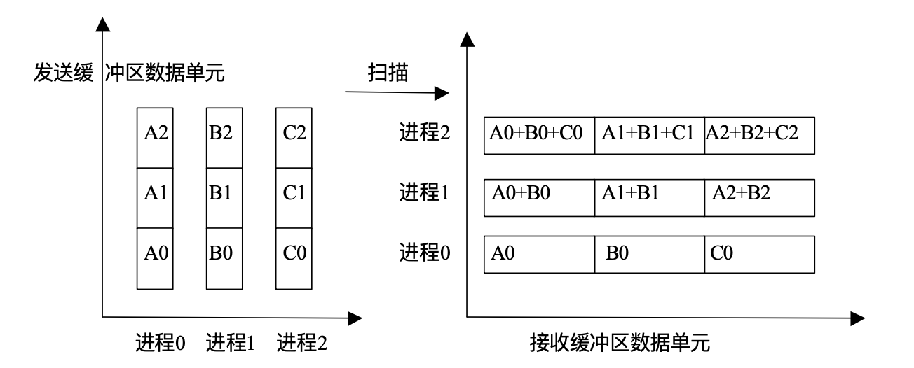


##### Barrier

```cpp
MPI_Barrier( comm ); // block untilallp rocess in t he group of comm call it
```

特点

1. `MPI_Barrier` 在很多时候很有用。其中一个用途是用来同步一个程序，使得分布式代码中的某一部分可以被精确的计时。
2. 阻塞所有调用者，直到所有成员都调用了它

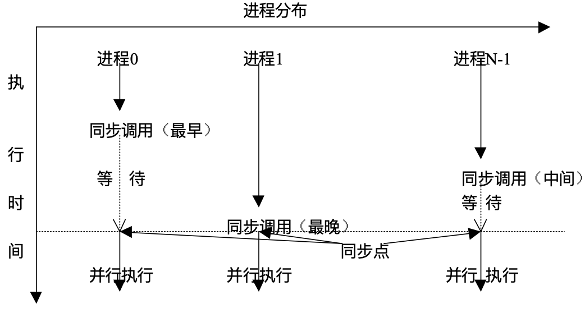


##### Non-Blocking

```cpp
MPI_Ibcast(<bcast args>, MPI_Request *req);
```


特点

1. 用于softwre pipeline。同时comm 与 comp


##### SUMMA Example on Overlap Comm with Comp

一个例子，用于解释collective communicator怎么使用


.png)

步骤

1. 便利多个k
2. 对于每一个k，把A B的数据分别发给行/列的格子
3. 对应的格子进行对C的计算


* simple approach code

```cpp
MPI_Comm_split(); 

void SUMMA(double *mA, double *mB, double *mc, int p_c)
{
	int row_color = rank / p_c; // p_c = sqrt(p) for simplicity 
  MPI_Comm row_comm;
	MPI_Comm_split(MPI_COMM_WORLD, row_color, rank, &row_comm);
  
	int col_color = rank % p_c;
	MPI_Comm col_comm;
	MPI_Comm_split(MPI_COMM_WORLD, col_color, rank, &col_comm);
 
	for (int k = 0; k < p_c; ++k) {
    if (col_color == k) 
       	memcpy(Atemp, mA, size); // 拷贝数据到buffer中
    if (row_color == k) 
      	memcpy(Btemp, mB, size);
		MPI_Bcast(Atemp, size, MPI_DOUBLE, k, row_comm); //broadcast到对应communicator group
    MPI_Bcast(Btemp, size, MPI_DOUBLE, k, col_comm);
		SimpleDGEMM(Atemp, Btemp, mc, N/p, N/p, N/p); } // 每一个block都进行计算
}


```


* overlap comm with comp using non-blocking

```cpp
void SUMMA(double *mA, double *mB, double *mc, int p_c)
{    
  	int row_color = rank / p_c; // p_c = sqrt(p) for simplicity
  	MPI_Comm row_comm;
 		MPI_Comm_split(MPI_COMM_WORLD, row_color, rank, &row_comm);

  	int col_color = rank % p_c;
  	MPI_Comm col_comm;
  	MPI_Comm_split(MPI_COMM_WORLD, col_color, rank, &col_comm);

  	// 切分为两个部分
  	double *mA1, *mA2, *mB1, *mB2;
    colsplit(mA, mA1, mA2); // split mA by the middle column
    rowsplit(mB, mB1, mB2); // split mA by the middle row   

    if (col_color == 0)  memcpy(Atemp1, mA1, size)
    if (row_color == 0)  memcpy(Btemp1, mB1, size);

    MPI_Request reqs1[2];
    MPI_Request reqs2[2];
    MPI_Ibcast(Atemp1, size, MPI_DOUBLE, k, row_comm, &reqs1[0]);
  	MPI_Ibcast(Btemp1, size, MPI_DOUBLE, k, col_comm, &reqs1[1]);


	for (int k = 0; k < p_c-1; ++k) {
		if (col_color == k)  memcpy(Atemp2, mA2, size);
   	if (row_color == k)  memcpy(Btemp2, mB2, size);

      	MPI_Ibcast(Atemp2,size,MPI_DOUBLE,k,row_comm,&reqs2[0]);
      	MPI_Ibcast(Btemp2,size,MPI_DOUBLE,k,col_comm,&reqs2[1]);
				MPI_Waitall(reqs1, MPI_STATUS_IGNORE); // 等待上一轮的comm数据传送
  			SimpleDGEMM (Atemp1, Btemp1, mC, N/p, N/p, N/p); // 与reqs2的comm一起发生

        if (col_color == k)  memcpy(Atemp1, mA1, size);
        if (row_color == k)  memcpy(Btemp1, mB1, size);

      	MPI_Ibcast(Atemp1,size,MPI_DOUBLE,k,row_comm,&reqs1[0]);
      	MPI_Ibcast(Btemp1,size,MPI_DOUBLE,k,col_comm,&reqs1[1]);
				MPI_Waitall(reqs2, MPI_STATUS_IGNORE);
  			SimpleDGEMM (Atemp2, Btemp2, mC, N/p, N/p, N/p);
  }

		if (col_color == p-1)  memcpy(Atemp2, mA2, size);
  	if (row_color == p-1)  memcpy(Btemp2, mB2, size);

  	MPI_Ibcast(Atemp2,size,MPI_DOUBLE,k,row_comm,&reqs2[0]);
  	MPI_Ibcast(Btemp2,size,MPI_DOUBLE,k,col_comm,&reqs2[1]);
  	MPI_Waitall(reqs1, MPI_STATUS_IGNORE);
  	SimpleDGEMM (Atemp1, Btemp1, mC, N/p, N/p, N/p);

		MPI_Waitall(reqs2, MPI_STATUS_IGNORE);
  	SimpleDGEMM (Atemp2, Btemp2, mC, N/p, N/p, N/p);
 }
```


##### Ranking Example

> ref 
>
> MPI Tutorial https://mpitutorial.com/tutorials/performing-parallel-rank-with-mpi/zh_cn/ 

每一个process有一个value，希望知道对应的rank是多少。


定义下方API

```cpp
TMPI_Rank(
    void *send_data,
    void *recv_data,
    MPI_Datatype datatype,
    MPI_Comm comm)
```


MPI要求programmer不要以MPI为开头定义方程，常用的方法是定义TMPI开头的方程用于区分


* 步骤

1. 收集全部的数据到root上，现在是一个array
2. 在root上对全部收集到的结果进行排序，同时维护对应process顺序
3. scatter结果到不同的process内部


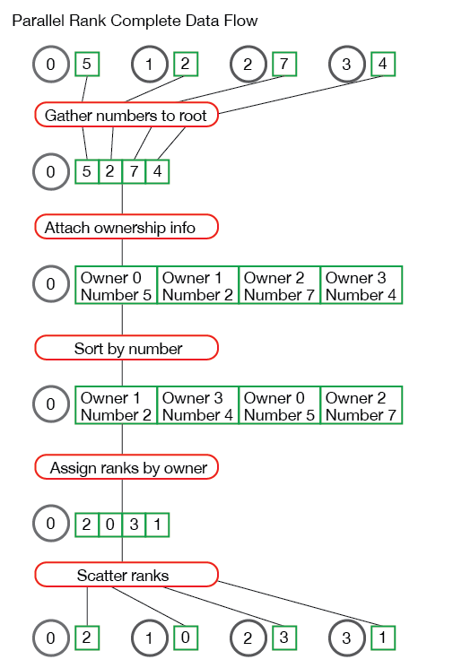


#### Hybrid MPI OpenMP

* four level of thread safety

  - **MPI_THREAD_SINGLE:** only one thread exists in the application

  - **MPI_THREAD_FUNNELED:** multithreaded, but only the main thread makes MPI calls (the one that called MPI_Init_thread)

  - **MPI_THREAD_SERIALIZED:** multithreaded, but only one thread *at a time* makes MPI calls

  - **MPI_THREAD_MULTIPLE**: multithreaded and any thread can make MPI calls at any time (with some restrictions to avoid races – see next slide)


* 现状

1. 很多生成只支持single，但是实际上支持funneled
2. multiple的实现比较复杂，而且很难efficent
3. 一般omp与funneled进行混用就足够了


##### Single

每一个process内没有显性的使用thread，也就是1 thread per process

注意：A program that calls MPI_Init (instead of MPI_Init_thread) should assume that only MPI_THREAD_SINGLE is supported

```cpp
int main(int argc, char ** argv)
{
    int buf[100];
    MPI_Init(&argc, &argv); // 用的是正常的初始化方法
    for (i = 0; i < 100; i++)
        compute(buf[i]);
    /* Do MPI stuff */
    MPI_Finalize();
    return 0; 
}
```


##### Funneled

每一个process内显性使用多个thread，但是只有root thread负责通信

```cpp
int main(int argc, char ** argv)
{
    int buf[100], provided;
    MPI_Init_thread(&argc, &argv, MPI_THREAD_FUNNELED, &provided); 
    if (provided < MPI_THREAD_FUNNELED) // 如果MPI不支持 Funneled 功能
      MPI_Abort(MPI_COMM_WORLD, 1);
    
    #pragma omp parallel for
    for (i = 0; i < 100; i++)
        compute(buf[i]);
    
    /* Do MPI stuff */
    // 这里只有root process才会进行沟通，因为代码已经计入到serialize的部分
  
    MPI_Finalize();
    return 0;
}
```


##### Serialized


每一个process内显性使用多个thread，但是只有一个 thread负责通信

```cpp
int main(int argc, char ** argv)
{
    int buf[100], provided;
    MPI_Init_thread(&argc, &argv, MPI_THREAD_SERIALIZED, &provided); 
    if (provided < MPI_THREAD_SERIALIZED)
        MPI_Abort(MPI_COMM_WORLD, 1);
#pragma omp parallel for
    for (i = 0; i < 100; i++) {
        compute(buf[i]);
#pragma omp critical
        /* Do MPI stuff */
    }
    MPI_Finalize();
    return 0;
}

```


##### Multiple

每一个process内显性使用多个thread，每一个thread都可以进行沟通

```cpp
int main(int argc, char ** argv)
{
    int buf[100], provided;
    MPI_Init_thread(&argc, &argv, MPI_THREAD_MULTIPLE, &provided); 
    if (provided < MPI_THREAD_MULTIPLE)
        MPI_Abort(MPI_COMM_WORLD, 1);
    #pragma omp parallel for
    for (i = 0; i < 100; i++) {
        compute(buf[i]);
        /* Do MPI stuff */
    }
    MPI_Finalize();
    return 0; 
}
```


##### No deadlock in MPI_THREAD_MULTIPLE

implementation cannot simply acquire a thread lock and block within an MPI function. It must release the lock to allow other threads to make progress

下面这个例子里如果是thread level lock in MPI function的话，会导致deadlock，因为thread1 Recv是block的，如果MPI里有lock，则无法让thread2运行

注意这里并不是保证了某些order，只是不适用thread level lock。MULTIPLE并不保证order


##### Ordering in MPI_THREAD_MULTIPLE

多线程的时候，MPI不保证thread1/thread2先运行。用户需要保证不不同的process中thread call MPI 的顺序是一样的

否则就会出现bcast match到barrier上的问题

下面的这个例子如果没有设定thread之间的前后顺序的话，则是有错的


因为线程与MPI顺序不确定，用户需要确保不会free一个未来可能用到的comm


#### One side communication w/ window

特点

1. 远程储存访问额最大特点是不需要对方process的cpu参与通信。
2. 需要一个process对另一个process的ram进行访问
3. 因为不需要另外一个process对我的读取进行反映，所以避免了delay


三个操作

1. read
2. write 
3. accumulate


三种窗口管理方式

1. fence
2. Post-start-complete-wait
3. lock/unlock


##### Create Windows

* 四种创建方法


MPI_WIN_CREATE_DYNAMIC 只是 syntax sugar


特点

1. 该窗口上以字节为单位的数据类型偏移为disp_unit
2. comm内的所有process都需要调用windows create。
3. 返回一个窗口对象，不只代表本地窗口，而是代表建立在整个组上的窗口


##### Data Movement


MPI_COMPARE_AND_SWAP 一般有硬件atomic支持。


* put


MPI_PUT将本进程中从地址origin_addr开始数据类型为origin_datatype 的origin_count个数据(可以不是windows中的)写入进程号为target_rank的窗口空间


* get

花费的时间比put要长，因为是要首先请求，然后再拿回来数据


* MPI_ACCUMULATE


特点

1. 其中窗口待修改数据的个数和类型必须和本地缓冲区中的数据个数和类型相一致


##### Manage Windows


特点

1. 上面的对窗口的操作都是non-blocking的。需要某种一致性操作保证对窗口的操作完成
2. MPI不保证order of put/get operation。可能出现race condition。


* fence


特点

1. 组调用，所有进程不管有没有显示的窗口数据都必须执行这个操作


* lock and unlock


特点

1. 互斥的锁
2. 共享的锁


#### 两种常用并行模式

> ref 
>
> 高性能计算之并行编程技术 MPI并行程序设计

##### 对等模式

每个线程都进行计算，通信


* example Jocobin

是什么 :Jacobi迭代得到的新值是原来旧值点相邻数值点的平均


如何分割

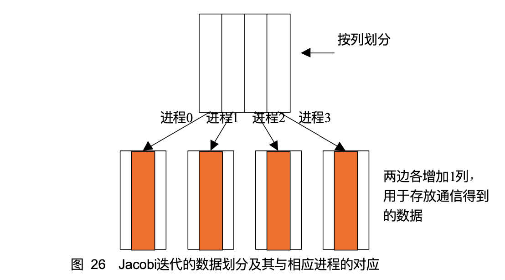


算法步骤

1. 对数组赋值
2. 每一个从相邻进程得到对应数据块，每一个进程向相邻进行提供数据块。
3. 计算更新


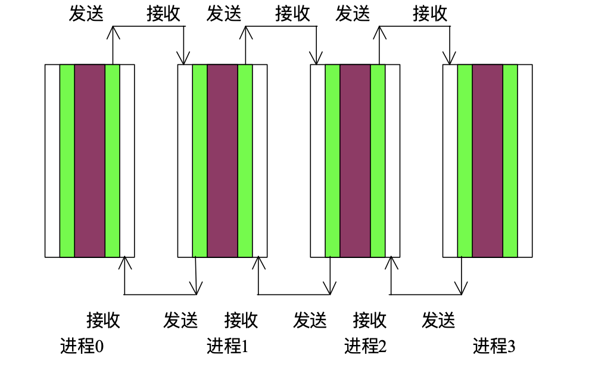


使用sendrecv同一个语句+MPI_PROC_NULL从而让编程更简单


* example jocobin w. comm and comp at same time


算法步骤

1. 计算下次要通信的数据
2. 启动非阻塞通信，传递数据
3. 计算剩下部分
4. 完成wait非阻塞通信


* example jacobi w. comm and comp overlapa nd repeteno n-blocking


算法步骤

1. 初始化非阻塞通信 MPI_SEND_INIT, MPI_RECV_INIT
2. 迭代
   1. 计算要通信部分
   2. MPI_START_ALL 启动非阻塞通信
   3. 计算剩余迭代部分
   4. WAIT 完成非阻塞通信
3. MPI_REQUEST_FREE释放非阻塞通信对象


##### 主从模式


### Data Parallel 

> reference
>
> 1. Berkeley CS267 L2
>
> 2. Berkeley CS 267 L8


* 实现data parallel的方法

1. SIMD
2. CUDA
3. MapReduce
4. MPI Collectives


* 是什么

perform the same operation on multiple values ( often array of values )


* 想法步骤

1. 首先使用ideal cost model找到不同算法parallel的span / work，这个是independent of number of processor的
2. 然后再考虑如何把algorithm map到硬件上


#### Ideal Cost Model

做了一些假设，用来说明algorithm在across hardware platform上面的cost lower bound


* 假设

1. 无限的processor：也就代表cost model is independent of number of processor
2. control没有overhead
3. processor之间的communication overhead为0


* Span代表什么

使用上面假设的machine，需要走多少个iteration才能得到结果

也可以当做time on unbounded number of processor 


* work代表什么

总共进行的binary operation数量

也可以当做time on one processor

例如，serial的时候，reduction是O(n)的work。tree based的时候，reduction的work超过O(n)


##### 分析 GEMM

span来自于sum n element into 1，根据下面对broadcast部分的分析，知道这个span一定是 O( log n )


#### Common Computation Pattern


##### binary operators

array A -> binary operator -> array B

加减乘除


* ideal cost model analysis

O(1) span


##### broadcast

scalar A broadcast + array B -> binary operator -> array C


* ideal cost model analysis

O(log n) span. 是一个lower bound，不可能再低


可以推导function of n input variable and 1 output variable, binary operation for each number, span lower bound 一定是 O( log n )


##### scatter & gather


##### mask

只对mask=1的部分进行操作，其余的部分mask off


##### reduce

是什么：从多个输入中产生一个输出。 Reduce an array to a value with + or any associative op

注意：因为数据的计算顺序发生改变，可能导致串行结果和并行结果有查表，因为浮点运算不满足结合律与分配率。

为什么使用：dot product最后取一个结果，经常需要这个操作。

work: O(log n) 因为是binary operator


* ideal cost model analysis

O( log n ) 使用一个tree的结构


##### scan

是什么：前缀和


* 通用方法
1. 每个worker计算一部分的sum
2. 汇聚每个worker部分的sum （也可以是max，就变成了max scan)
3. 把汇聚的sum给每个对应的worker，worker基于汇聚的sum(starting value)来计算local scan


inclusive 和 exclusive 两种类型


* serial analysis

O(n) work

O(n) span


#### Parallel Scan

##### Recursive exclusive scan


* ideal cost model analysis

span : 2 log n

work : 2 n

注意：这里尽管parallize了，但是at cost of more work


* map to hardware

实际上会分为多个processor处理，每个processor内部计算，汇总

processor内部是serial的


##### Non-recursive exclusive scan

Algorithm by Blelloch


* ideal cost model analysis

span : 2 log n

work : 2n

这里的work与serial 版本的prefix scan是相同 O(n)


#### Parallel Scan Application


TODO: 具体application/算法用到的时候再看讲义补充


#### SIMD

* 是什么

single control processor control multiple IMU


##### x86

avx2 : 256 bits register, 16 register 

avx512 : 512 btis register, 32 register

AVX2 与 AVX512 register底层是同一个物理寄存器。之所以AVX2只有16个是因为出AVX2指令集的时候只出了这么多（当时没有512的硬件支持）

AVX2 AVX512 SSE的向量化操作有些需要内存对齐(e.g. load store有对其版本和不对齐版本，速度差异会很大)

x86里向量化操作的clock cycle是与scalar一致的


##### arm

TODO 有空补充

arm里向量化操作的clock cycle不一定与scalar一致，经常比scalar要大一点

